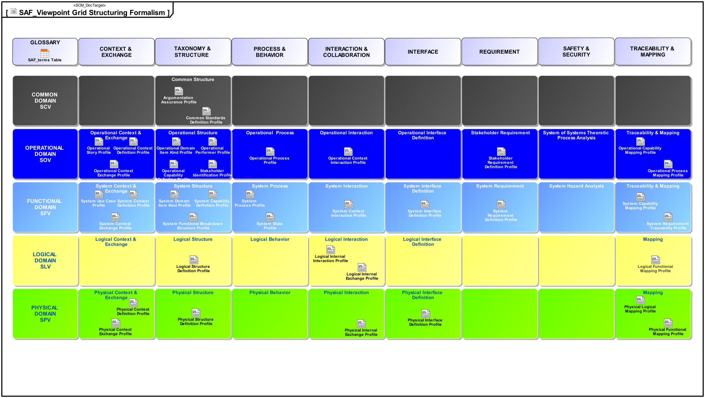

# SAF Specification
Disclaimer: System Architecture Framework Specification  **is work in progress**

This repository contains both documentation for users of SAF and developers of SAF. To understand how we develop SAF, see **[how SAF is developed](developing-saf/development.md). We always welcome contributions from our MBSE community to improve SAF, see [how to contribute to SAF](contributing.md).**

The System Architecture Framework Specification application is demonstrated using the **Fire Forest Detection System (FFDS)** example, courtesy of Tim Weilkiens. The Fire Forest Detection System example is based on the publication **SYSMOD - The Systems Modeling Toolbox, 3rd edition Pragmatic MBSE with SysML, Tim Weilkiens**

## Versions
This is the main branch that reflects the current state of development and it is updated as required. The following SAF releases are available, each of which is managed in a separate branch:
* [Initial Release](https://github.com/GfSE/SAF-Specification/tree/Initial-Release)
* [TdSE2022](https://github.com/GfSE/SAF-Specification/tree/TdSE2022)
* [TdSE2023](https://github.com/GfSE/SAF-Specification/tree/TdSE2023)

## SysML Tool Implementations
The SAF specification is implemented by 3 tool specific profiles which are available in separate github repositories:

* [Cameo Systems Modeler (by Dassault Systèmes)](https://github.com/GfSE/SAF-Cameo-Profile)
* [Engineering Systems Design Rhapsody (by IBM)](https://github.com/GfSE/SAF-Rhapsody-Profile)
* [Enterprise Architect (by Sparx Systems)](https://github.com/GfSE/SAF-EA-Profile)

# Viewpoint Grid

The Viewpoints are organized as a Grid featuring [Domains](domains.md) as rows and [Aspects](aspects.md) as columns.

The subsequent sections give an overview about the SAF viewpoint specifications, grouped by [Domains](domains.md). The specifications of the SAF viewpoints are available as [PDF format](./pdfs), too.

## Operational Domain

### Operational Domain Objective

The SAF Operational Domain aims to get an understanding of required organizational or operational entity capabilities, as a foundation and reasoning for to systems to be acquired or developed. The SAF Operational Domain supports the model-based development of a [CONOPS](https://www.sebokwiki.org/wiki/Concept_of_Operations_(ConOps)_(glossary)) - as well as an [OPSCON](https://www.sebokwiki.org/wiki/Business_or_Mission_Analysis) and related life cycle concepts - for an organization or operational entity seeking for an improvement of existing capabilities or in establishing new ones. By identifying Stakeholders and their Requirements the SAF Operational Domain supports the derivation of a complete and consolidated set of Stakeholder Requirements based on operational stories, operational processes, operational capabilities, and operational exchanges.

### Operational Domain Viewpoints

#### Operational Domain Aspect Context

* [Operational Story Viewpoint](viewpoints/Operational-Story-Viewpoint.md)
* [Operational Context Definition Viewpoint](viewpoints/Operational-Context-Definition-Viewpoint.md)
* [Operational Context Exchange Viewpoint](viewpoints/Operational-Context-Exchange-Viewpoint.md)

#### Operational Domain Aspect Structure

* [Operational Performer Viewpoint](viewpoints/Operational-Performer-Viewpoint.md)
* [Operational Domain Item Kind Viewpoint](viewpoints/Operational-Domain-Item-Kind-Viewpoint.md)
* [Operational Capability Viewpoint](viewpoints/Operational-Capability-Viewpoint.md)
* [Stakeholder Identification Viewpoint](viewpoints/Stakeholder-Identification-Viewpoint.md)

#### Operational Domain Aspect Behavior

* [Operational Process Viewpoint](viewpoints/Operational-Process-Viewpoint.md)

#### Operational Domain Aspect Interaction and Collaboration

* [Operational Interaction Viewpoint](viewpoints/Operational-Interaction-Viewpoint.md)

#### Operational Domain Aspect Requirement

* [Stakeholder Requirement Viewpoint](viewpoints/Stakeholder-Requirement-Viewpoint.md)

#### Operational Domain Aspect Traceability & Mapping

* [Operational Capability Mapping Viewpoint](viewpoints/Operational-Capability-Mapping-Viewpoint.md)
* [Operational Process Mapping Viewpoint](viewpoints/Operational-Process-Mapping-Viewpoint.md)

## Functional Domain

### Functional Domain Objective

The SAF Functional Domain assumes a conceptual black box perspective onto the system to be developed. It translates Operational Domain usage into the notion of System Functions defining the demanded system behavior and quality attributes - performance, safety, security, etc.; the demanded system behavior as it is perceived by the User or other Entities at the System Boundary (known as usage behavior). The result of the elaboration of the viewpoints in the Functional Domain is a comprehensive System Specification.

### Functional Domain Viewpoints

#### Functional Domain Aspect Context

* [System Use Case Viewpoint](viewpoints/System-Use-Case-Viewpoint.md)
* [System Context Definition Viewpoint](viewpoints/System-Context-Definition-Viewpoint.md)
* [System Context Exchange Viewpoint](viewpoints/System-Context-Exchange-Viewpoint.md)

#### Functional Domain Aspect Structure

* [System Domain Item Kind Viewpoint](viewpoints/System-Domain-Item-Kind-Viewpoint.md)
* [System Capability Viewpoint](viewpoints/System-Capability-Viewpoint.md)
* [System Functional Breakdown Structure Viewpoint](viewpoints/System-Functional-Breakdown-Structure-Viewpoint.md)

#### Functional Domain Aspect Behavior

* [System Process Viewpoint](viewpoints/System-Process-Viewpoint.md)
* System Functional Refinement Viewpoint
* [System State Viewpoint](viewpoints/System-State-Viewpoint.md)

#### Functional Domain Aspect Interaction and Collaboration

* [System Context Interaction Viewpoint](viewpoints/System-Context-Interaction-Viewpoint.md)

#### Functional Domain Aspect Interface

* [System Interface Definition Viewpoint](viewpoints/System-Interface-Definition-Viewpoint.md)

#### Functional Domain Aspect Requirement

* [System Requirement Viewpoint](viewpoints/System-Requirement-Viewpoint.md)

#### Functional Domain Aspect Traceability & Mapping

* [System Capability Mapping Viewpoint](viewpoints/System-Capability-Mapping-Viewpoint.md)
* [System Requirement Traceability Viewpoint](viewpoints/System-Requirement-Traceability-Viewpoint.md)

## Logical Domain

### Logical Domain Objective

The SAF Logical Domain assume a conceptual white box perspective onto the system to be developed. The Logical Domain Viewpoints describe the Logical Structure and the distribution of responsibilities for the Functionality of the SOI by means of a network of interacting Logical Elements that are responsible for a set of desired Functions. These Logical Elements and their Interactions are arranged in the Logical Architecture of the SOI. The structure of the Logical Architecture is in general influenced by nonfunctional criteria, e.g., maintainability, safety, and reliability. The Logical Domain is not a different abstraction level - compared to the Functional Domain, but a white box perspective on the same abstraction level.

### Logical Domain Viewpoints

#### Logical Domain Aspect Structure

* [Logical Structure Definition Viewpoint](viewpoints/Logical-Structure-Viewpoint.md)

#### Logical Domain Aspect Interaction and Collaboration

* [Logical Internal Interaction Viewpoint](viewpoints/Logical-Internal-Interaction-Viewpoint.md)
* [Logical Internal Exchange Viewpoint](viewpoints/Logical-Internal-Exchange-Viewpoint.md)

#### Logical Domain Aspect Traceability & Mapping

* [Logical Functional Mapping Viewpoint](viewpoints/Logical-Functional-Mapping-Viewpoint.md)

## Physical Domain

### Physical Domain Objective

The SAF Physical Domain diagrams may be used to represent the Product Breakdown Structure, to identify external and internal physical interfaces, to provide diagrams for the system overview, to support the integration planning, to support production planning and to depict the features and variations implied in the system. The physical architecture typically is a combination of re-use elements, COTS elements and make-items for HW as well as for SW. The properties of the selected physical components and their provided resources are identified and modelled. A major concern of the Physical Domain are the physical interfaces, their identification and definition. For that purpose, the Physical Domain provides the diagrams to model interface with different level of detail considering the actual needs for the point of time in the project life cycle. For traceability the Physical Domain defines diagrams showing the mapping of the functional elements and their interfaces to physical elements and their interfaces.

### Physical Domain Viewpoints

#### Physical Domain Aspect Context

* [Physical Context Definition Viewpoint](viewpoints/Physical-Context-Definition-Viewpoint.md)
* [Physical Context Exchange Viewpoint](viewpoints/Physical-Context-Exchange-Viewpoint.md)

#### Physical Domain Aspect Structure

* [Physical Structure Viewpoint](viewpoints/Physical-Structure-Viewpoint.md)

#### Physical Domain Aspect Behavior
#### Physical Domain Aspect Interaction and Collaboration

* [Physical Internal Exchange Viewpoint](viewpoints/Physical-Internal-Exchange-Viewpoint.md)

#### Physical Domain Aspect Interface

* [Physical Interface Definition Viewpoint](viewpoints/Physical-Interface-Definition-Viewpoint.md)
* Physical Protocol Stack Definition Viewpoint

#### Physical Domain Aspect Traceability & Mapping

* [Physical Functional Mapping Viewpoint](viewpoints/Physical-Functional-Mapping-Viewpoint.md)
* [Physical Logical Mapping Viewpoint](viewpoints/Physical-Logical-Mapping-Viewpoint.md)

## Common Domain

### Common Domain Objective

The SAF Common Domain provides viewpoints addressing model information that is common to all other domains or that are applicable throughout the model.

### Common Domain Viewpoints

* [Argumentation Assurance Viewpoint](viewpoints/Argumentation-Assurance-Viewpoint.md)
* Common Standards Definition Viewpoint
* Common Terms & Abbreviations Viewpoint
* [Grid Definition Viewpoint](viewpoints/Grid-Definition-Viewpoint.md)

# Stakeholder Definition

* [List of Stakeholders](stakeholders.md)

# Concern Overview

* [List of Concerns](concerns.md)

# Profile Model

* [List of Stereotypes](stereotypes.md)
