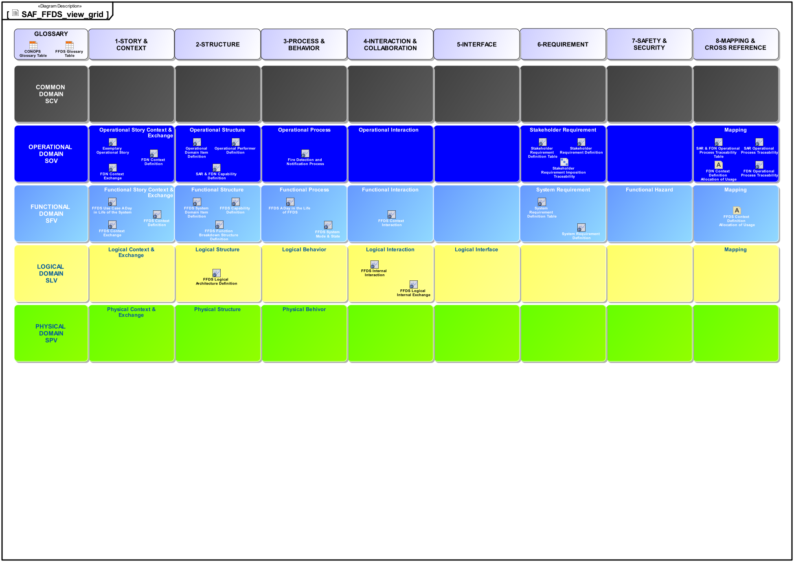

# SAF Specification Dev Branch
System Architecture Framework Specification  **Work in progress**

**We always welcome contributions from our MBSE community to make SAF better, see [how to contribute to SAF](contributing.md). To understand how we develop SAF, please look at [how SAF is developed](developing-saf/development.md).**

The System Architecture Framework Specification application is demonstrated using the Fire Forest Detection System example by courtesy of Tim Weilkiens. The Fire Forest Detection System example is based on the publication **SYSMOD - The Systems Modeling Toolbox, 3rd edition Pragmatic MBSE with SysML, Tim Weilkiens**

# Viewpoint Grid
The Viewpoints are organized as a Grid featuring [Domains](domains.md) as rows and [Aspects](aspects.md) as columns.

The subsequent chapters give an overview over the SAF viewpoints. The specifications of the SAF viewpoints are available as [PDF](./pdfs) format, too.

## Operational Domain

### Operational Domain Objective

The SAF Operational Domain aims to get an understanding of required organizational or operational entity capability(s), as a foundation for to systems to be acuired or developed. The viewpoints of the SAF Operational Domain assist the "Business or Mission Analysis Process" and the "Stakeholder Needs and Requirements Definition Process" activities of the INCOSE SYSTEMS ENGINEERING HANDBOOK 2015 [§ 4.1, § 4.2].

The SAF Operational Domain supports the model-based development of a [CONOPS](https://www.sebokwiki.org/wiki/Concept_of_Operations_(ConOps)_(glossary)) - as well as an [OPSCON](https://www.sebokwiki.org/wiki/Business_or_Mission_Analysis) and related life cycle concepts - for an organization or operational entity seeking for an improvement of existing capability(s) or in establishing new ones.

By identifying Stakeholders and their Requirements the SAF Operational Domain supports the derivation of a complete and consolidated set of Stakeholder Requirements based on operational activities and exchanges.

### Operational Domain Concerns

* Gain a comprehensive understanding of the operating environment that an intended solution needs to support
* Promote the freedom of development by preventing premature commitment to solutions
* Capture all information necessary for subsequent requirement and system architecture definition activities

### Operational Domain Viewpoints

#### Operational Domain Aspect Context
* [Operational Story Viewpoint](viewpoints/Operational-Story-Viewpoint.md)
* [Operational Context Definition Viewpoint](viewpoints/Operational-Context-Definition-Viewpoint.md)
* [Operational Context Exchange Viewpoint](viewpoints/Operational-Context-Exchange-Viewpoint.md)
#### Operational Domain Aspect Structure
* [Operational Performer Viewpoint](viewpoints/Operational-Performer-Viewpoint.md)
* [Operational Domain Item Kind Viewpoint](viewpoints/Operational-Domain-Item-Kind-Viewpoint.md)
* [Operational Capability Viewpoint](viewpoints/Operational-Capability-Viewpoint.md)
#### Operational Domain Aspect Behavior
* [Operational Process Viewpoint](viewpoints/Operational-Process-Viewpoint.md)
#### Operational Domain Aspect Interaction and Collaboration
* Operational Interaction Viewpoint
#### Operational Domain Aspect Requirement
* [Stakeholder Requirement Viewpoint](viewpoints/Stakeholder-Requirement-Viewpoint.md)
#### Operational Domain Aspect Crossreference
* [Operational Capability Traceability Viewpoint](viewpoints/Operational-Capability-Traceability-Viewpoint.md)
* [Operational Process Traceability Viewpoint](viewpoints/Operational-Process-Traceability-Viewpoint.md)

## Functional Domain

### Functional Domain Objective

The Functional Domain Viewpoints translate Operational Domain usage into the notion of System Functions defining the demanded system behavior and quality attributes - performance, safety, security, etc.; the demanded system behavior as it is perceived by the User or other Entitys at the System Boundary (known as usage behavior). The result of the elaboration of the viewpoints in the Functional Domain is a comprehensive System Specification.

### Functional Domain Concerns

* Defining the System Boundary
  * identifcation of interaction partners and functional interfaces
* Consolidating Functional Requirements: 
  * formally specifying the requirements of the system behavior using a black box approach
* Mastering functional dependency: 
  * detection and resolution of inconsistencies within the Functional Requirements (known as feature interaction)
* Reducing functional complexity: 
  * structuring the functionality from the System's point of view
* Understanding functional interrelationships: 
  * collecting and analyzing the exchange between different functionalities

### Functional Domain Viewpoints

#### Functional Domain Aspect Context
* [System Use Case Viewpoint](viewpoints/System-Use-Case-Viewpoint.md)
* [System Context Definition Viewpoint](viewpoints/System-Context-Definition-Viewpoint.md)
* [System Context Exchange Viewpoint](viewpoints/System-Context-Exchange-Viewpoint.md)
#### Functional Domain Aspect Structure
* [System Domain Item Kind Viewpoint](viewpoints/System-Domain-Item-Kind-Viewpoint.md)
* [System Capability Viewpoint](viewpoints/System-Capability-Viewpoint.md)
* [System Functional Breakdown Structure Viewpoint](viewpoints/System-Functional-Breakdown-Structure-Viewpoint.md)
#### Functional Domain Aspect Behavior
* [System Process Viewpoint](viewpoints/System-Process-Viewpoint.md)
* [System Functional Refinement Viewpoint](viewpoints/System-Functional-Refinement-Viewpoint.md)
* [System State Viewpoint](viewpoints/System-State-Viewpoint.md)
#### Functional Domain Aspect Interaction and Collaboration
* [System Context Interaction Viewpoint](viewpoints/System-Context-Interaction-Viewpoint.md)
#### Functional Domain Aspect Requirement
* [System Requirement Viewpoint](viewpoints/System-Requirement-Viewpoint.md)
#### Functional Domain Aspect Crossreference
* [System Requirement Traceability Viewpoint](viewpoints/System-Requirement-Traceability-Viewpoint.md)

## Logical Domain

### Logical Domain Objective

The Logical Domain Viewpoints describe the Logical Structure and the distribution of responsibilitys for the Functionality of the SOI by means of a network of interacting Logical Elements that are responsible for a set of desired Function(s). These Logical Elements and their Interactions are arranged in the Logical Architecture of the SOI. The structure of the Logical Architecture is in general influenced by nonfunctional criteria, e.g., maintainability, safety, and reliability.
The Logical Domain is not a different abstraction level - compared to the Functional Domain, but a white box perspective on the same abstraction level.

### Logical Domain Concern

* Describing the Internal Logical Structure of the SOI by partitioning the SOI into communicating Logical Elements
* Describing the Logical Interface(s) & Data Exchange(s) between the interacting Logical Elements in a way that the Logical Interface(s) are independent from their implementation
* Allocating desired Function(s) to cohesive Logical Elements
* Supporting the reuse of already existent Logical Elements and designing Logical Elements such that future reuse is facilitated
* Defining the emerging behavior of the system (in contrast to the partial behavior specified in the of Functional Domain Viewpoints) and enabling a complete simulation of the entire system

### Logical Domain Viewpoints

#### Logical Domain Aspect Structure
* [Logical Structure Definition Viewpoint](viewpoints/Logical-Structure-Viewpoint.md)
#### Logical Domain Aspect Interaction and Collaboration
* [Logical Internal Interaction Viewpoint](viewpoints/Logical-Internal-Interaction-Viewpoint.md)
* [Logical Internal Exchange Viewpoint](viewpoints/Logical-Internal-Exchange-Viewpoint.md)
#### Functional Domain Aspect Crossreference
* [Logical Functional Assignment Viewpoint](viewpoints/Logical-Functional-Assignment-Viewpoint.md)

## Physical Domain

### Physical Domain Objective

The diagrams generated in the Physical Domain may be used to represent the Product Breakdown Structure, to identify external and internal physical interfaces, to provide diagrams for the system overview, to support the integration planning, to support production planning and to depict the features and variations implied in the system.

The physical architecture typically is a combination of re-use elements, COTS elements and make-items for HW as well as for SW. The properties of the selected physical components and their provided resources are identified and modelled.

A major concern of the Physical Domain are the physical interfaces, their identification and definition. For that purpose, the Physical Domain provides the diagrams to model interface with different level of detail considering the actual needs for the point of time in the project life cycle.

For traceability the Physical Domain defines diagrams showing the mapping of the physical items and their interfaces to physical items and their interfaces as well as to applicable requirements.

### Physical Domain Concerns

#### Structure
* Show the decomposition of the system into system elements down the hierarch and provide configuration meta data.
#### Interfaces
* Identify external interfaces and the information and data items that are exchanged or transferred via an interface together with related documentation.
* Identify applicable interface standards and allocate the standards to physical interfaces.
* Provide an overview on all physical interfaces of a given element with detailed information on the interfaces.
* Provide an overview on all physical interconnections between the internal elements of the system.
* Provide a detailed view on the physical interfaces and the interconnection between the system elements.
* Define a physical interface type in detail including compatibility rules.
#### Allocations
* Show the allocation of logical blocks from the logical architecture to elements of the physical architecture.
* Show the allocation of logical interfaces from the logical architecture to interfaces of the physical architecture.
* Allocate functional or non-functional requirements to the elements of the physical architecture.
* Allocate functional or non-functional requirements to the interfaces of the physical architecture.
* Allocate a safety criticality to the elements of the physical architecture.

### Physical Domain Viewpoints
#### Physical Domain Aspect Context
* [Physical Context Definition Viewpoint](viewpoints/Physical-Context-Definition-Viewpoint.md)
* [Physical Context Exchange Viewpoint](viewpoints/Physical-Context-Exchange-Viewpoint.md)
#### Physical Domain Aspect Structure
* [Physical Structure Viewpoint](viewpoints/Physical-Structure-Viewpoint.md)
#### Physical Domain Aspect Behavior

#### Physical Domain Aspect Interaction and Collaboration
* [Physical Internal Exchange Viewpoint](viewpoints/Physical-Internal-Exchange-Viewpoint.md)
#### Physical Domain Aspect Interface
* Physical Interface Definition Viewpoint
* Physical Protocol Stack Definition Viewpoint
#### Physical Domain Aspect Crossreference
* [Physical Functional Assignment Viewpoint](viewpoints/Physical-Functional-Assignment-Viewpoint.md)
## Common Domain
### Common Domain Objective
The SAF Common Domain provides viewpoints addressing model information that is common to all other domains or that are applicable throughout the model.

### Common Domain Concerns
* Provides information on standards and documents that are applicable or are referred to within the model.

### Common Domain Viewpoints
* [Argumentation Assurance Viewpoint](viewpoints/Assurance-Definition-Viewpoint.md)

# Stakeholder Definition
[Stakeholders](stakeholders.md)

# Concern Overview
[Concerns](concerns.md)

# Profile Model
[Stereotypes](stereotypes.md)

