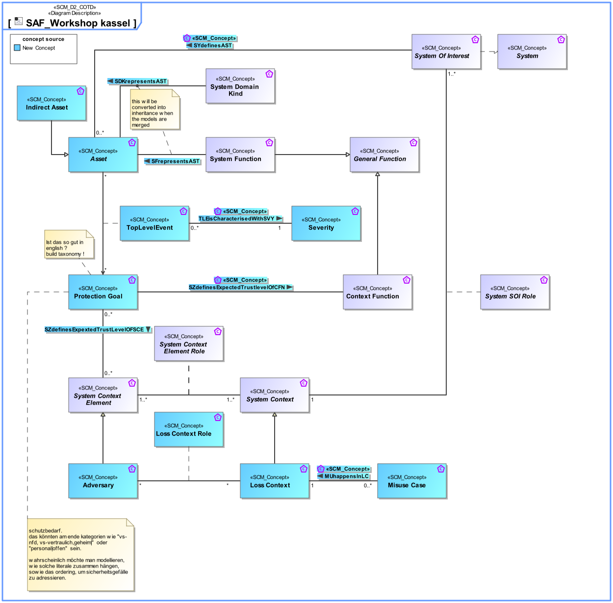

# SAF Development Documentation : Concepts : SAF_Workshop kassel 

|Concept|Documentation|
| --- | --- |
| Adversary | |
| Asset | |
| Context Function | Specifies the fact that a fundamental action or task is expected to be carried out by an External Entity.  Note: The intention is to capture the expectations and to explicitly dissect the functionality. This must not be interpreted as an attempt for a behavior specification of an External Entity. Capturing this valuable information is the basis to reach agreement on the functionality at the System boundary by clarifying the expectations about what is performed by Context Elements.|
| General Function | Specifies a General Function. It is used as base Class for specific System or Context Functions, or Partial Functions.|
| Indirect Asset | |
| Loss Context | |
| Loss Context Role | |
| MUhappensInLC | |
| Misuse Case | |
| Protection Goal | |
| SYdefinesAST | |
| SZdefinesExpectedTrustlevelOfCFN | |
| Severity | |
| System | An abstract element representing a System.|
| System Context | Specifies the fact that a context for a System of Interest is defined.|
| System Context Element | An abstract element representing a System Context Element. Base class for specific kinds of Context Elements.|
| System Context Element Role | Specifies the fact that a System Context Element exists in a given System Context.|
| System Domain Kind | Specification for any kind of conceptual item (energy, material, information, etc.) to be exchanged on Functional or Logical Level. The System Domain Kind is agnostic to any realization on Physical Level.|
| System Function | Specifies the fundamental action or task that have to take place in the System in accepting and processing the inputs and in processing and generating the outputs. A System Function  * accepts input from the System boundary   * exposes its output at the System boundary  * changes the System's State  * is dependent on System's State Note: A System Function does not need to expose observable output, when it changes the System's state in a way that is observable by other system functions. Furthermore, a System Function does not need to accept any input from the system boundary, when it is dependent on the System State, which in turn is changeable by other System Functions.|
| System Of Interest | An abstract element representing a SOI. Base class for specific kinds of SOIs.|
| System SOI Role | Specifies the fact that a System SOI exists in a given System Context.|
| TLEisCharacterisedWithSVY | |
| TopLevelEvent | |
