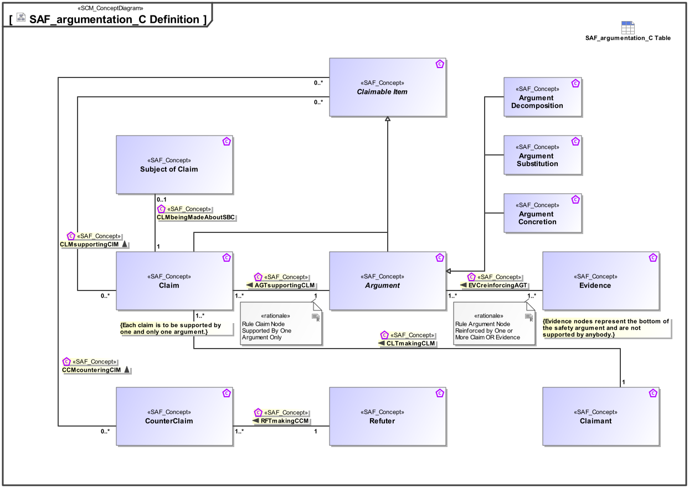

# SAF Development Documentation : Concepts : SAF_argumentation_C Definition 

|Concept|Documentation|
| --- | --- |
| AGTsupportingCLM | Specifies the fact that a claim is supported by one or more arguments via a claim-argument relation.|
| Argument | An argument is a rule that provides the bridge between what we know or are assuming (sub-claims, evidence) and the claim we are investigating. The argument used depends on the type, trustworthiness and extent of available evidence and the nature of the claim.|
| Argument Concretion | This argument concept is used when a claim needs to be given a more precise definition or interpretation.|
| Argument Decomposition | This argument concept is used to claim that a conclusion about the whole object or property can be deduced from the claims or facts about constituent parts. Decomposition argument blocks can also be used to incorporate defeaters into the case.|
| Argument Substitution | This argument concept is used to claim that if a property holds for one object, then it holds for an equivalent object. Similarly, if a property holds for some object, then an equivalent property will also hold for the same object. The nature of the equivalence will vary with the object and property and will need to be defined.|
| CCMcounteringCIM | Specifies the fact that any claimable item, e.g., claim, argument, and evidence, is countered by one or more claims.|
| CLMbeingMadeAboutSBC | Specifies the fact that a claim is made about an identified subject matter.|
| CLMsupportingCIM | Specifies the fact that any claimable item, e.g., claim, argument, and evidence, is supported by one or more claims.|
| CLTmakingCLM | Specifies the fact that a claim is made by a defined claimant.|
| Claim | A claim is a true/false statement about a property of a particular object. A claim is just what you might consider it to be from common usage of the term; an idea that someone is trying to convince somebody else is true. An example claim could be made on a train, e.g., the train is safe.|
| Claimable Item | A claim, argument, and evidence are all types of the abstract concept of a claimable item. This allows a counter-claim to be made about any type of claimable item and a claim to support any type of claimable item.|
| Claimant | A party asserting claims.|
| CounterClaim | A party's claim is a counter-claim if one party asserts claims in response to the claims of another.|
| EVCreinforcingAGT | Specifies the fact that an argument is reinforced by one or more evidence via a argument-evidence relation.|
| Evidence | An evidence is an artifact that establishes facts that can be trusted and lead directly to a claim. In projects there can many sources of information, but what makes this evidence is the support or rebuttal it gives to a claim.|
| RFTmakingCCM | Specifies the fact that a counter-claim is made by a defined refuter.|
| Refuter | A party asserting counter-claims.|
| Subject of Claim | Note: A claim cannot be generic, it has to be about something, it has to have a defined subject, e.g., system safety.|
