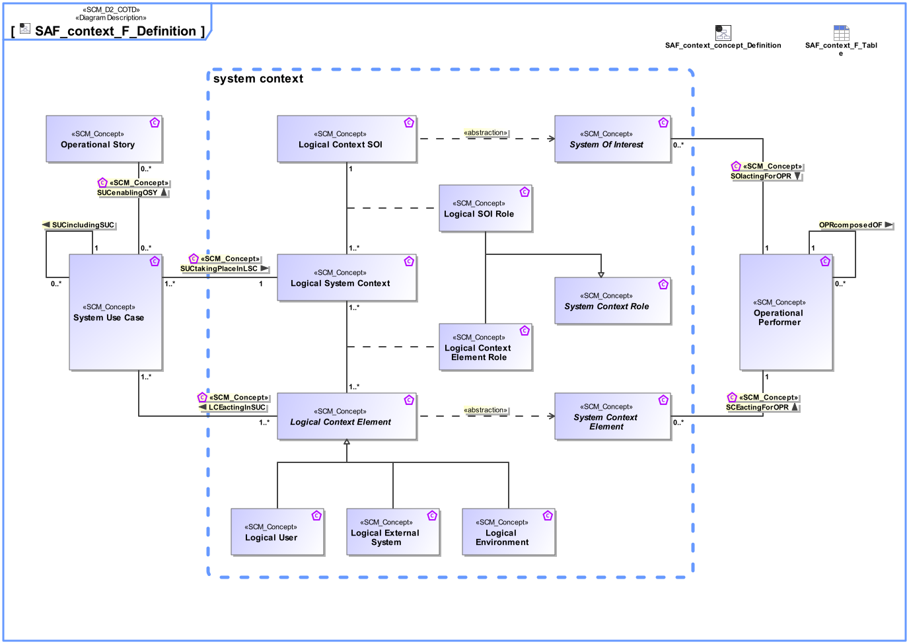

# SAF Development Documentation : Concepts : SAF_context_F_Definition 

|Concept|Documentation|
| --- | --- |
| LCEactingInSUC | Specifies the fact that a Logical Context Element acts in one or more System Use Cases.|
| Logical Context Element | Represents an abstract element in the given System Context on Logical Level, outside the SOI scope, interacting with the SOI.|
| Logical Context Element Role | Specifies the fact that a Logical Context Element exists in a given Logical System Context.|
| Logical Context SOI | Represents the Logical SOI in the System Context on Logical Level.|
| Logical Environment | A Logical Environment in the Logical Domain, outside the SOI scope, interacting with the SOI. E.g., air, dirt, sun, road.|
| Logical External System | A Logical External System in the Logical Domain, outside the SOI scope, interacting with the SOI. E.g., power grid, mobile network, fresh water system (in a house).|
| Logical SOI Role | Specifies the fact that a Logical Context SOI exists in a given Logical System Context.|
| Logical System Context | Specifies the fact that a System Context for a System of Interest is defined on Logical Level.|
| Logical User | The Logical User is the representation for a human in the Logical Domain, outside the SOI scope, interacting with the SOI.|
| OPRcomposedOF | Specifies the fact that an Operational Performer consists of one or more Operational Performers.|
| Operational Performer | An Operational Performer is an element of the Operational Context that is capable to perform Operational Process Activities contributing to a specific identified Operational Capability. An Operational Performer may be any kind of organization, person, or even a system playing a role in one or more Operational Contexts.  Aliases: UAF::OperationalPerformer|
| Operational Story | The Operational Story represents one or more Operational Use Cases in the Usage Scenario identified by the Operational Context. The Operational Story is described as narrative story-telling.|
| SCEactingForOPR | Specifies the fact that a System Context Element is acting for the benefit of an Operational Performer.|
| SOIactingForOPR | Specifies the fact that a SOI is acting for the benefit of an Operational Performer.|
| SUCenablingOSY | Specifies the fact that a System Use Case enables the realization of an Operational Story.|
| SUCincludingSUC | Specifies the fact that a System Use Case includes other System Use Cases. The included use case is then no longer a full System Use Case, but a partial System Use Case.|
| SUCtakingPlaceInLSC | Specifies the fact that a System Use Case takes place in a Logical System Context.|
| System Context Element | An abstract element representing a System Context Element. Base class for specific kinds of Context Elements.|
| System Context Role | General role of a Logical System Context.|
| System Of Interest | An abstract element representing a SOI. Base class for specific kinds of SOIs.|
| System Use Case | The System Use Cases are a table of content of the services provided by the System of Interest to its System Actors. A System Use Case is only the abstract of the depicted System behavior and represents the purpose. While the main System of Interest interaction actors participating in this Use Case are identified, the behavior itself is specified by a Use Case Activity,  Note: The intended use (and also misuse in so called "black use cases") of the System of Interest is captured in free text; story telling at a coarse level of detail which is understandable to Customers (non engineering stakeholders in general).|
