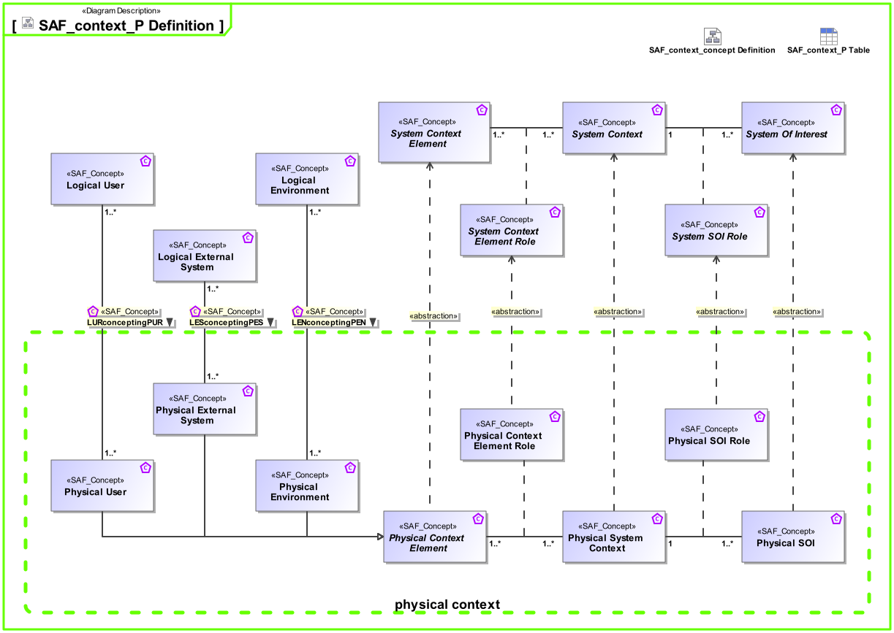

# SAF Development Documentation : Concepts : SAF_context_P Definition 

|Concept|Documentation|
| --- | --- |
| LENconceptingPEN | Specifies the fact that a logical Environment Entity is a concept for a Physical Environment Entity.|
| LESconceptingPES | Specifies that the Logical System is a concept for a Physical System.|
| LURconceptingPUR | Specifies that the Logical user is a concept for a Physical User.|
| Logical Environment | A Logical Environment in the Logical Domain, outside the SOI scope, interacting with the SOI. E.g., air, dirt, sun, road.|
| Logical External System | A Logical External System in the Logical Domain, outside the SOI scope, interacting with the SOI. E.g., power grid, mobile network, fresh water system (in a house).|
| Logical User | The Logical User is the representation for a human in the Logical Domain, outside the SOI scope, interacting with the SOI.|
| Physical Context Element | Abstract element of a System Context on Physical Level, outside the SOI scope, interacting with the SOI.|
| Physical Context Element Role | Specifies the fact that a Physical Context Element exists in a given Physical System Context.|
| Physical Environment | The Physical Environment in the Physical Domain, outside the SOI scope, interacting with the SOI. E.g. air, dirt, sun, road.|
| Physical External System | The Physical External System in the Physical Domain, outside the SOI scope, interacting with the SOI. E.g. power grid, mobile network, fresh water system (in a house).|
| Physical SOI | Represents the Physical SOI on Physical Level.|
| Physical SOI Role | Specifies the fact that a Physical SOI exists in a given Physical System Context.|
| Physical System Context | Specifies the fact that a context for a System of Interest is defined on Physical Level.|
| Physical User | The Physical User is the representation for a human in the physical domain, outside the SOI scope, interacting with the SOI.|
| System Context | Specifies the fact that a context for a System of Interest is defined.|
| System Context Element | An abstract element representing a System Context Element. Base class for specific kinds of Context Elements.|
| System Context Element Role | Specifies the fact that a System Context Element exists in a given System Context.|
| System Of Interest | An abstract element representing a SOI. Base class for specific kinds of SOIs.|
| System SOI Role | Specifies the fact that a System SOI exists in a given System Context.|
