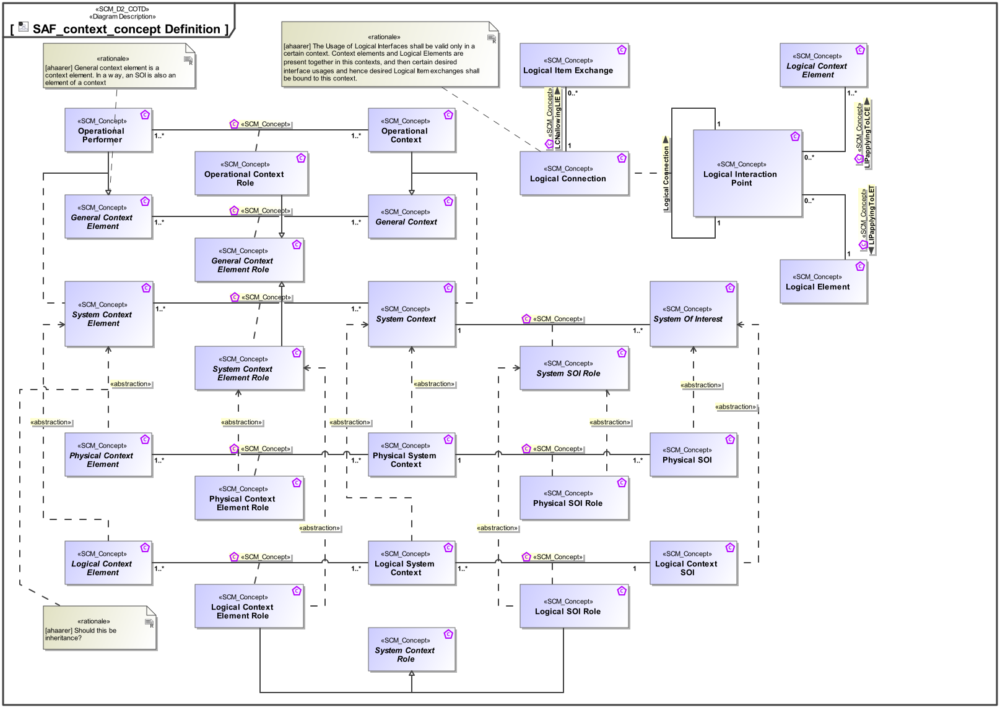

# SAF Development Documentation : Concepts : SAF_context_concept Definition 

|Concept|Documentation|
| --- | --- |
| General Context | Specifies a General Context.|
| General Context Element | Specifies a General Context Element.|
| General Context Element Role | Specifies the fact that a General Context Element exists in a given General Context.|
| LCNallowingLIE | Specifies the fact that a Logical Item Exchange is allowed on the Logical Connection.|
| LIPapplyingToLCE | Specifies the fact that a Logical Interaction Point applies to a Logical Context Element.|
| LIPapplyingToLET | Specifies the fact that a Logical Interaction Point applies to a Logical Element.|
| Logical Connection | Specifies the connection of two interaction points on Logical Level. Note: Connections between logical components indicate that item flows are passed from one output of a source component to one or more inputs of target components.|
| Logical Context Element | Represents an abstract element in the given System Context on Logical Level, outside the SOI scope, interacting with the SOI.|
| Logical Context Element Role | Specifies the fact that a Logical Context Element exists in a given Logical System Context.|
| Logical Context SOI | Represents the Logical SOI in the System Context on Logical Level.|
| Logical Element | Describes a conceptual Logical Element as specification for an implementation of a system, or system element.|
| Logical Interaction Point | Specifies the existence of an interaction point on Logical Level.|
| Logical Item Exchange | Specifies the exchange that is to take place on a connection of two interaction points on Logical Level.|
| Logical SOI Role | Specifies the fact that a Logical Context SOI exists in a given Logical System Context.|
| Logical System Context | Specifies the fact that a System Context for a System of Interest is defined on Logical Level.|
| Operational Context | An Operational Context is representing a separate Usage Scenario with a specific configuration of Operational Performers, these are interacting in the Scenario exhibiting a specific identified Operational Capability. One or more Operational Contexts meaningful for the Operational Domain are to be identified.   Aliases: UAF::HighLevelOperationalConcept|
| Operational Context Role | An Operational Context Role represents a participant in an Operational context. It is interacting with other roles of the given Operational Context. Specific characteristics and features or, in case of persons or organizational units, knowledge and skills are assigned to a role necessary for the execution of the performed Operational Processes.|
| Operational Performer | An Operational Performer is an element of the Operational Context that is capable to perform Operational Process Activities contributing to a specific identified Operational Capability. An Operational Performer may be any kind of organization, person, or even a system playing a role in one or more Operational Contexts.  Aliases: UAF::OperationalPerformer|
| Physical Context Element | Abstract element of a System Context on Physical Level, outside the SOI scope, interacting with the SOI.|
| Physical Context Element Role | Specifies the fact that a Physical Context Element exists in a given Physical System Context.|
| Physical SOI | Represents the Physical SOI on Physical Level.|
| Physical SOI Role | Specifies the fact that a Physical SOI exists in a given Physical System Context.|
| Physical System Context | Specifies the fact that a context for a System of Interest is defined on Physical Level.|
| System Context | Specifies the fact that a context for a System of Interest is defined.|
| System Context Element | An abstract element representing a System Context Element. Base class for specific kinds of Context Elements.|
| System Context Element Role | Specifies the fact that a System Context Element exists in a given System Context.|
| System Context Role | General role of a Logical System Context.|
| System Of Interest | An abstract element representing a SOI. Base class for specific kinds of SOIs.|
| System SOI Role | Specifies the fact that a System SOI exists in a given System Context.|
