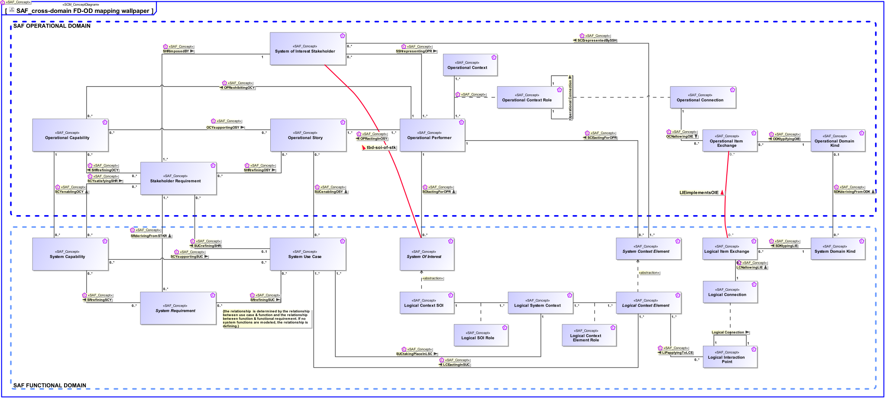

# SAF Development Documentation : Concepts : SAF_cross-domain FD-OD mapping wallpaper 

|Concept|Documentation|
| --- | --- |
| LCEactingInSUC | Specifies the fact that a Logical Context Element acts in one or more System Use Cases.|
| LCNallowingLIE | Specifies the fact that a Logical Item Exchange is allowed on the Logical Connection.|
| LIPapplyingToLCE | Specifies the fact that a Logical Interaction Point applies to a Logical Context Element.|
| Logical Connection | Specifies the connection of two interaction points on Logical Level. Note: Connections between logical components indicate that item flows are passed from one output of a source component to one or more inputs of target components.|
| Logical Context Element | Represents an abstract element in the given System Context on Logical Level, outside the SOI scope, interacting with the SOI.|
| Logical Context Element Role | Specifies the fact that a Logical Context Element exists in a given Logical System Context.|
| Logical Context SOI | Represents the Logical SOI in the System Context on Logical Level.|
| Logical Interaction Point | Specifies the existence of an interaction point on Logical Level.|
| Logical Item Exchange | Specifies the exchange that is to take place on a connection of two interaction points on Logical Level.|
| Logical SOI Role | Specifies the fact that a Logical Context SOI exists in a given Logical System Context.|
| Logical System Context | Specifies the fact that a System Context for a System of Interest is defined on Logical Level.|
| OCNallowingOIE | Specifies the fact that an Operational Item Exchange is allowed on the Operational Connection.|
| OCYsupportingOSY | Specifies the fact that an Operational Story is supported by Operational Capabilities.|
| ODKtypifyingOIE | Specifies the fact that an Operational Domain Kind typifies an Operational Item Exchange.|
| OPRactingInOSY | Specifies the fact that an Operational Performer acts in an Operational Story.|
| OPRexhibitingOCY | Specifies the fact that an Operational Performer exhibits an Operational Capability under specific environmental conditions.|
| Operational Capability | A Operational Capability is a high-level description or specification of an organizational unit's ability to execute a specified course of action, to implement a business process or to provide a service. Operational Capabilities typically require people, processes, infrastructure, technology and supporting systems to be implemented.  A Operational Capability is an enduring element, its implementation may change over time. A necessary or desired change of a Operational Capability triggers the updated of involved systems or the integration new systems.  Aliases: UAF::Capability NAF4::Capability|
| Operational Connection | Specifies the connection between Operational Context Roles in an Operational Context allowing Operational Item Exchange.  Aliases: UAF::OperationalConnector|
| Operational Context | An Operational Context is representing a separate Usage Scenario with a specific configuration of Operational Performers, these are interacting in the Scenario exhibiting a specific identified Operational Capability. One or more Operational Contexts meaningful for the Operational Domain are to be identified.   Aliases: UAF::HighLevelOperationalConcept|
| Operational Context Role | An Operational Context Role represents a participant in an Operational context. It is interacting with other roles of the given Operational Context. Specific characteristics and features or, in case of persons or organizational units, knowledge and skills are assigned to a role necessary for the execution of the performed Operational Processes.|
| Operational Domain Kind | Specifies the kind of Operational Item Exchange between Operational Context Roles or Operational Processes.|
| Operational Item Exchange | Specifies the Operational Item Exchange that is to take place on an Operational Connection.  Aliases: UAF::OperationalExchange|
| Operational Performer | An Operational Performer is an element of the Operational Context that is capable to perform Operational Process Activities contributing to a specific identified Operational Capability. An Operational Performer may be any kind of organization, person, or even a system playing a role in one or more Operational Contexts.  Aliases: UAF::OperationalPerformer|
| Operational Story | The Operational Story represents one or more Operational Use Cases in the Usage Scenario identified by the Operational Context. The Operational Story is described as narrative story-telling.|
| SCEactingForOPR | Specifies the fact that a System Context Element is acting for the benefit of an Operational Performer.|
| SCErepresentedBySSH | Specifies the fact that a System Context Element is represented by a SOI Stakeholder.|
| SCYenablingOCY | Specifies the fact that an Operational Capability integrates System Capabilities to produce a specific outcome to achieve a mission objective.|
| SCYsatisfyingSHR | Specifies the fact that a System Capability satisfies one or more Stakeholder Requirements.|
| SCYsupportingSUC | Specifies the fact that a System UseCase is supported by System Capabilities.|
| SDKderivingFromODK | Specifies the fact that a System Domain Kind on system level is derived from an Operational Domain Kind.|
| SDKtypingLIE | Specifies the fact that a System Domain Kind defines the type of a Logical Item Exchange.|
| SHRimposedBY | Specifies the fact that a Stakeholder Requirement is provided by Stakeholders.|
| SHRrefiningOCY | Specifies the fact that an Operational Capability is refined by Stakeholder Requirements.|
| SHRrefiningOSY | Specifies the fact that an Operational Story is refined by Stakeholder Requirements.|
| SOIactingForOPR | Specifies the fact that a SOI is acting for the benefit of an Operational Performer.|
| SRderivingFromSHR | Specifies the fact that a System Requirement is derived from a Stakeholder Requirement. Note: It may be used in a customer supplier relationship situation and supports the V Model concept of "External Unit Specification". See [VXT].|
| SRrefiningSCY | Specifies the fact that a System Capability is refined by System Requirements.|
| SRrefiningSUC | Specifies the fact that a System Use Case is refined by System Requirements.|
| SSHrepresentingOPR | Specifies the fact that a SOI Stakeholder is representing an Operational Performer.|
| SUCenablingOSY | Specifies the fact that a System Use Case enables the realization of an Operational Story.|
| SUCrefiningSHR | Specifies the fact that a Stakeholder Requirement is refined by System Use Cases.|
| SUCtakingPlaceInLSC | Specifies the fact that a System Use Case takes place in a Logical System Context.|
| Stakeholder Requirement | A Stakeholder Requirement is a Requirement imposed by a Stakeholder. Stakeholder Concerns are refined by Stakeholder Requirements applicable for the SOI. The Stakeholder Requirements are a result of discussions and agreements of how the SOI addresses the Concerns of the respective Stakeholder.|
| System Capability | 1) A System Capability is an operation or task that performs an action to produce a specific performance-based outcome. NOTE that a system capability represents the potential to perform an action. In contrast, an operational capability may integrate several physical system capabilities to produce a specific outcome to achieve a mission objective. [Wasson2006, SystemAnalysis+Design+Development] 2) System Capabilities, as system assets, characterize the mechanical, electrical, optical, or processing features that enable a system to function, process mission resources, make decisions, and achieve a required level of success based on performance. A system capability is broader in scope than simply a functional element (and performance bounding elements), especially in large, complex ecosystems. It represents a physical potential - strength, ability, endurance - to perform an outcome-based action for a given duration under a specified set of operating environment conditions. [Wasson2006, SystemAnalysis+Design+Development]  Aliases: UAF::Capability NAF4::Capability|
| System Context Element | An abstract element representing a System Context Element. Base class for specific kinds of Context Elements.|
| System Domain Kind | Specification for any kind of conceptual item (energy, material, information, etc.) to be exchanged on Functional or Logical Level. The System Domain Kind is agnostic to any realization on Physical Level.|
| System Of Interest | An abstract element representing a SOI. Base class for specific kinds of SOIs.|
| System Requirement | System Requirements specify System Functions, non-functional properties, or constraints of the System.|
| System Use Case | The System Use Cases are a table of content of the services provided by the System of Interest to its System Actors. A System Use Case is only the abstract of the depicted System behavior and represents the purpose. While the main System of Interest interaction actors participating in this Use Case are identified, the behavior itself is specified by a Use Case Activity,  Note: The intended use (and also misuse in so called "black use cases") of the System of Interest is captured in free text; story telling at a coarse level of detail which is understandable to Customers (non engineering stakeholders in general).|
| System of Interest Stakeholder | An individual, team, or organization (or classes thereof) with interests in, or concerns relative to, a system. It may be involved in any life cycle phase of the System. The Stakeholder represents a class or kind of Stakeholders. Stakeholders have a certain involvement: Stakeholder Involvement captures the influence of a project specific Stakeholder on the System. Stakeholder Involvement is characterized by * Contact Person * Kind of involvement * Life Cycle Phases involved * Relevance decision if and up to which degree Stakeholder is considered * Rationale for decision when Stakeholder is not considered|
