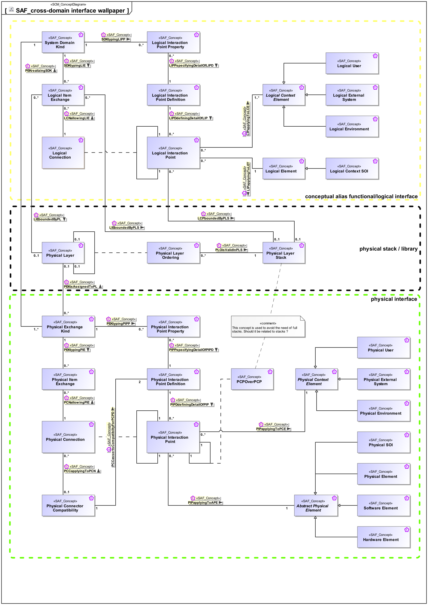

# SAF Development Documentation : Concepts : SAF_cross-domain-interface-wallpaper 

|Concept|Documentation|
| --- | --- |
| Abstract Physical Element | Abstract element representing physical structure items keeping properties and relations applicable to all physical items.|
| Hardware Element | Pure Hardware Elements. Similarity with the V-Model "hardware unit".|
| LCNallowingLIE | Specifies the fact that a Logical Item Exchange is allowed on the Logical Connection.|
| LCPboundedByPLS | Specifies the fact that a Logical Interaction Point is constrained to be implemented on a particular Physical Layer Stack.|
| LIEboundedByPL | Specifies the fact that a Logical Item Exchange is constrained to be implemented on a particular Physical Layer.|
| LIEboundedByPLS | Specifies the fact that a Logical Item Exchange is constrained to be implemented on a particular Physical Layer Stack.|
| LIPDdefiningDetailOfLIP | Specifies the fact that a Logical Interaction Point Definition defines the exchange capabilities of a Logical Interaction Point.|
| LIPPspecifyingDetailOfLIPD | Specifies the fact that a Logical Interaction Point Property is a detail of a Logical Interaction Point Definition.|
| LIPapplyingToLCE | Specifies the fact that a Logical Interaction Point applies to a Logical Context Element.|
| LIPapplyingToLET | Specifies the fact that a Logical Interaction Point applies to a Logical Element.|
| Logical Connection | Specifies the connection of two interaction points on Logical Level. Note: Connections between logical components indicate that item flows are passed from one output of a source component to one or more inputs of target components.|
| Logical Context Element | Represents an abstract element in the given System Context on Logical Level, outside the SOI scope, interacting with the SOI.|
| Logical Context SOI | Represents the Logical SOI in the System Context on Logical Level.|
| Logical Element | Describes a conceptual Logical Element as specification for an implementation of a system, or system element.|
| Logical Environment | A Logical Environment in the Logical Domain, outside the SOI scope, interacting with the SOI. E.g., air, dirt, sun, road.|
| Logical External System | A Logical External System in the Logical Domain, outside the SOI scope, interacting with the SOI. E.g., power grid, mobile network, fresh water system (in a house).|
| Logical Interaction Point | Specifies the existence of an interaction point on Logical Level.|
| Logical Interaction Point Definition | Specifies the exchange capabilities of an interaction point on Logical Level.|
| Logical Interaction Point Property | Specifies a detail of an interaction point on Logical Level.|
| Logical Item Exchange | Specifies the exchange that is to take place on a connection of two interaction points on Logical Level.|
| Logical User | The Logical User is the representation for a human in the Logical Domain, outside the SOI scope, interacting with the SOI.|
| PCCapplyingToPCN | Specifies the fact that a Physical Connector Compatibility Assertion shall apply to a Physical Connection.|
| PCCassertsCompatibiltyForPCPD | Specifies the Physical Interaction Point Definition the Physical Compatibility Assertion is valid for.|
| PCNallowingPIE | Specifies the fact that a Physical Item Exchange is allowed on the Physical Connection.|
| PCPOverPCP | Specifies the fact that a physical interaction point communicates / transfers / flows / over an other physical interaction point. Used to define layered physical interfaces, and show layer relationships between interfaces.|
| PEKisAssignedToPL | Specifies the fact that a Physical Exchange Kind is assigned to a particular Physical Layer.|
| PEKrealizingSDK | Specifies the fact that a System Domain Kind is realized by Physical Exchange Kinds.|
| PEKtypingPIE | Specifies the fact that a Physical Exchange Kind defines the type of a Physical Item Exchange.|
| PEKtypingPIPP | Specifies the fact that a Physical Exchange Kind defines the type of a Physical Interaction Point Property.|
| PIPDdefiningDetailOfPIP | Specifies the fact that a Physical Interaction Point Definition defines the exchange capabilities of a Physical Interaction  Point.|
| PIPPspecifyingDetailOfPIPD | Specifies the fact that a Physical Interaction Point Property is a detail of a Physical Interaction Point Definition.|
| PIPapplyingToAPE | Specifies the fact that a Physical Interaction Point applies to an Abstract Physical Element.|
| PIPapplyingToPCE | Specifies the fact that a Physical Interaction Point applies to a Physical Context Element.|
| PLOisValidInPLS | Specifies the fact that a Physical Layer Ordering is valid within a particular Physical Layer Stack.|
| Physical Connection | Specifies the connection of two physical interaction points. Note: Connections between physical components indicate that item flows are passed from one output of a source component to one or more inputs of target components.|
| Physical Connector Compatibility | Specifies the fact that two Physical Interaction Point Definitions are compatible and how the Physical Interaction Point Properties are mapped.|
| Physical Context Element | Abstract element of a System Context on Physical Level, outside the SOI scope, interacting with the SOI.|
| Physical Element | A composition of Hardware and Software Elements. Similarity with the V-Model segments and system. See [VXT].|
| Physical Environment | The Physical Environment in the Physical Domain, outside the SOI scope, interacting with the SOI. E.g. air, dirt, sun, road.|
| Physical Exchange Kind | Specification for any kind of physical item (energy, material, information, etc.) to be exchanged on Physical Level. This is the realization of the specification made by System Domain Kinds.|
| Physical External System | The Physical External System in the Physical Domain, outside the SOI scope, interacting with the SOI. E.g. power grid, mobile network, fresh water system (in a house).|
| Physical Interaction Point | Specifies the existence of an interaction point on Physical Level.|
| Physical Interaction Point Definition | Specifies the exchange capabilities of an interaction point on Physical Level.|
| Physical Interaction Point Property | Specifies a detail of an interaction point on Physical Level.|
| Physical Item Exchange | Specifies the exchange that is to take place on a Physical Connection.|
| Physical Layer | Specifies a Physical Layer, usually used for communication.|
| Physical Layer Ordering | Specifies an order among two physical layers. This order is valid within a Physical Layer Stack|
| Physical Layer Stack | Specifies a detail of an interaction point on Physical Level.|
| Physical SOI | Represents the Physical SOI on Physical Level.|
| Physical User | The Physical User is the representation for a human in the physical domain, outside the SOI scope, interacting with the SOI.|
| SDKtypingLIE | Specifies the fact that a System Domain Kind defines the type of a Logical Item Exchange.|
| SDKtypingLIPP | Specifies the fact that a System Domain Kind defines the type of a Logical Interaction Point Property.|
| Software Element | Pure Software Elements. Similarity with the V-Model "software unit".|
| System Domain Kind | Specification for any kind of conceptual item (energy, material, information, etc.) to be exchanged on Functional or Logical Level. The System Domain Kind is agnostic to any realization on Physical Level.|
