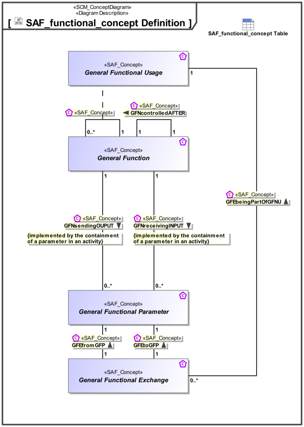

# SAF Development Documentation : Concepts : SAF_functional_concept Definition 

|Concept|Documentation|
| --- | --- |
| GFEbeingPartOfGFNU | Specifies the fact that a Functional Exchange appears within the usage of a General Function.|
| GFEfromGFP | Specifies the fact that a General Functional Exchange is coming from a General Functional Parameter.|
| GFEtoGFP | Specifies the fact that a General Functional Exchange is going to a General Functional Parameter.|
| GFNcontrolledAFTER | Specifies a sequential execution of Functions.|
| GFNreceivingINPUT | Specifies the Input of a System or Context Function.|
| GFNsendingOUPUT | Specifies the Output of a System or Context Function.|
| General Function | Specifies the fact that a General Function is used as base Class for specific System or Context Functions.|
| General Functional Exchange | Specifies the fact that an General Functional Exchange between General Function Parameters is taking place.|
| General Functional Parameter | A parameter of a System or Context Function.|
| General Functional Usage | Specifies the fact that a Function is used by one or more other Functions.|
