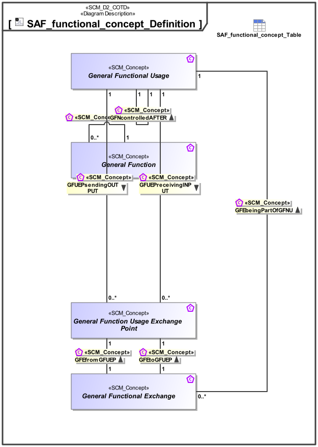

# SAF Development Documentation : Concepts : SAF_functional_concept_Definition 

|Concept|Documentation|
| --- | --- |
| GFEbeingPartOfGFNU | Specifies the fact that a Functional Exchange appears within a general Functiona Usage.|
| GFEfromGFUEP | Specifies the fact that a General Functional Exchange is coming from a General Functional Usage Exchange Point.|
| GFEtoGFUEP | Specifies the fact that a General Functional Exchange is going to a General Functional Usage Exchange Point.|
| GFNcontrolledAFTER | Specifies a sequential execution of Functions.|
| GFUEPreceivingINPUT | Specifies the Input of a Functional Usage.|
| GFUEPsendingOUTPUT | Specifies the Output of a Functional Usage.|
| General Function | Specifies a General Function. It is used as base Class for specific System or Context Functions, or Partial Functions.|
| General Function Usage Exchange Point | A parameter of a System or Context Function.|
| General Functional Exchange | Specifies the fact that an General Functional Exchange between General Function Parameters is taking place.|
| General Functional Usage | Specifies a General Usage of a General Function within  one or more other General Functions.|
