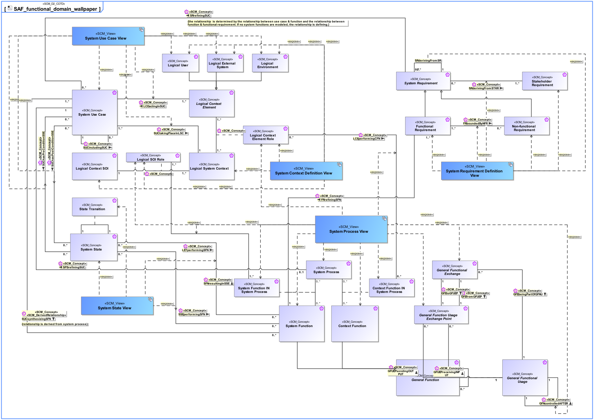

# SAF Development Documentation : Concepts : SAF_functional_domain_wallpaper 

|Concept|Documentation|
| --- | --- |
| Context Function | Specifies the fact that a fundamental action or task is expected to be carried out by an External Entity.  Note: The intention is to capture the expectations and to explicitly dissect the functionality. This must not be interpreted as an attempt for a behavior specification of an External Entity. Capturing this valuable information is the basis to reach agreement on the functionality at the System boundary by clarifying the expectations about what is performed by Context Elements.|
| Context Function IN System Process | Specifies the fact that a Context Function is used in a System Process.|
| FRboundedByNFR | Specifies the fact that a Non-Functional Requirement constrains Functional Requirements.|
| FRrefiningSFN | Specifies the fact that a System Function is refined by Functional Requirements.|
| Functional Requirement | Functional Requirements specify System Functions of the System.|
| GFEbeingPartOfGFNU | Specifies the fact that a Functional Exchange appears within the usage of a General Function.|
| GFEfromGFP | Specifies the fact that a General Functional Exchange is coming from a General Functional Parameter.|
| GFEtoGFP | Specifies the fact that a General Functional Exchange is going to a General Functional Parameter.|
| GFNcontrolledAFTER | Specifies a sequential execution of Functions.|
| GFNreceivingINPUT | Specifies the Input of a System or Context Function.|
| GFNsendingOUPUT | Specifies the Output of a System or Context Function.|
| General Function | Specifies the fact that a General Function is used as base Class for specific System or Context Functions.|
| General Functional Exchange | Specifies the fact that an General Functional Exchange between General Function Parameters is taking place.|
| General Functional Parameter | A parameter of a System or Context Function.|
| General Functional Usage | Specifies the fact that a Function is used by one or more other Functions.|
| LCEactingInSUC | Specifies the fact that a Logical Context Element acts in one or more System Use Cases.|
| LCEperformingCFN | Specifies the fact that a Context Function is expected to be carried out by the Logical Context Element in this System Context.|
| LETperformingSFN | Specifies the fact that a System Function is expected to be carried out by the SOI in this System Context.|
| Logical Context Element | Represents an abstract element in the given System Context on Logical Level, outside the SOI scope, interacting with the SOI.|
| Logical Context Element Role | Specifies the fact that a Logical Context Element exists in a given Logical System Context.|
| Logical Context SOI | Represents the Logical SOI in the System Context on Logical Level.|
| Logical Environment | A Logical Environment in the Logical Domain, outside the SOI scope, interacting with the SOI. E.g., air, dirt, sun, road.|
| Logical External System | A Logical External System in the Logical Domain, outside the SOI scope, interacting with the SOI. E.g., power grid, mobile network, fresh water system (in a house).|
| Logical SOI Role | Specifies the fact that a Logical Context SOI exists in a given Logical System Context.|
| Logical System Context | Specifies the fact that a System Context for a System of Interest is defined on Logical Level.|
| Logical User | The Logical User is the representation for a human in the Logical Domain, outside the SOI scope, interacting with the SOI.|
| Non-functional Requirement | Non-Functional Requirements specify the quality of System Functions, or non-functional requests like legal conformance.|
| SFNresultingInSSE | Specifies the fact that a System Function can perform a particular set of transitions, resulting in the related target System States.|
| SPSrefiningSUC | Specifies the fact that a System Use Case is refined by one System Process.|
| SRderivingFromSR | Specifies the fact that System Requirements are derived from a Stakeholder Requirement.  Note: This is the relationship of requirements of different architectural levels. When the team responsible for the subsystem has direct access to the full upstream requirements set, then no subcontractor relationship needs to be established.|
| SRderivingFromSTKR | Specifies the fact that a System Requirement is derived from a Stakeholder Requirement. Note: It may be used in a customer supplier relationship situation and supports the V Model concept of "External Unit Specification". See [VXT].|
| SRrefiningSUC | Specifies the fact that a System Use Case is refined by System Requirements.|
| SSEperformingSFN | Specifies the fact that the Function is only provided in distinct States. The state is a precondition for the Function to be able to perform.|
| SUChasPostConditionSSE | Specifies the fact that a System Use Case has a state as Postcondition.|
| SUChasPreConditionSSE | Specifies the fact that a System Use Case has a state as Precondition.|
| SUCincludingSUC | Specifies the fact that a System Use Case includes other System Use Cases. The included use case is then no longer a full System Use Case, but a partial System Use Case.|
| SUCsynthesizingSFN | Specifies the fact that a System Function is used in a System Use Case, e.g., as a Trigger, Action, or Task.  Note: This is a derived relationship.|
| SUCtakingPlaceInLSC | Specifies the fact that a System Use Case takes place in a Logical System Context.|
| Stakeholder Requirement | A Stakeholder Requirement is a Requirement imposed by a Stakeholder. Stakeholder Concerns are refined by Stakeholder Requirements applicable for the SOI. The Stakeholder Requirements are a result of discussions and agreements of how the SOI addresses the Concerns of the respective Stakeholder.|
| State Transition | Describes an allowed transition between two states of an item that can be in distinct States.|
| System Function | Specifies the fundamental action or task that have to take place in the System in accepting and processing the inputs and in processing and generating the outputs. A System Function  * accepts input from the System boundary   * exposes its output at the System boundary  * changes the System's State  * is dependent on System's State Note: A System Function does not need to expose observable output, when it changes the System's state in a way that is observable by other system functions. Furthermore, a System Function does not need to accept any input from the system boundary, when it is dependent on the System State, which in turn is changeable by other System Functions.|
| System Function IN System Process | Specifies the fact that a System Function is used in a System Process.|
| System Process | Specifies the fact that a System Process captures system behavior as a specific sequence of actions or tasks, and system exchanges including information, materials, energy, etc.|
| System Requirement | System Requirements specify System Functions, non-functional properties, or constraints of the System.|
| System State | Describes a state (or mode) of something that can have distinct states.|
| System Use Case | The System Use Cases are a table of content of the services provided by the System of Interest to its System Actors. A System Use Case is only the abstract of the depicted System behavior and represents the purpose. While the main System of Interest interaction actors participating in this Use Case are identified, the behavior itself is specified by a Use Case Activity,  Note: The intended use (and also misuse in so called "black use cases") of the System of Interest is captured in free text; story telling at a coarse level of detail which is understandable to Customers (non engineering stakeholders in general).|
