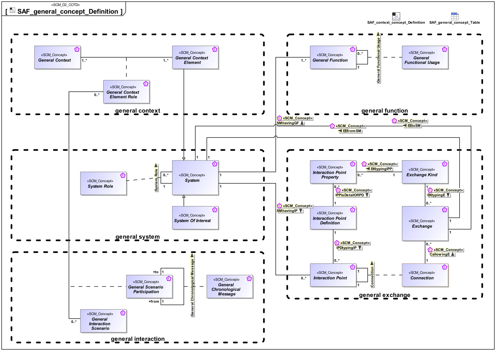

# SAF Development Documentation : Concepts : SAF_general_concept_Definition 

|Concept|Documentation|
| --- | --- |
| CallowingE | Specifies the fact that a connection allows Exchange to happen|
| Connection | Specifies the connection of two interaction points.|
| EEfromSM | Specifies that an exchange comes from a system|
| EEtoSM | Specifies that an exchange goes to a system|
| EKtypingE | Specifies the fact that a Exchange Kind defines the type of a Exchange.|
| EKtypingIPP | Specifies the fact that a Exchange Kind defines the type of a Interaction Point Property.|
| Exchange | Specification for general item exchange (energy, material, information, etc.).|
| Exchange Kind | Specification for a general kind of item (energy, material, information, etc.) to be exchanged.|
| General Chronological Message | Ordered sequential occurrence of exchanges between General Interaction Scenario Participants.|
| General Context | Specifies a General Context.|
| General Context Element | Specifies a General Context Element.|
| General Context Element Role | Specifies the fact that a General Context Element exists in a given General Context.|
| General Function | Specifies the fact that a General Function is used as base Class for specific System or Context Functions.|
| General Functional Usage | Specifies the fact that a Function is used by one or more other Functions.|
| General Interaction Scenario | Ordered sequence of exchanges of information, energy, or material between General Interaction Scenario Participants.|
| General Scenario Participation | Specifies the fact that a System Role participates in a General Interaction Scenario.|
| IPDtypingIP | Specifies the fact that an Interaction Point Definition defines the exchange capabilities of an Interaction Point.|
| IPPisDetailOfIPD | Specifies the fact that an Interaction Point Property is a detail of an Interaction Point Definition.|
| Interaction Point | Specifies the existence of an interaction point.|
| Interaction Point Definition | Specifies the exchange capabilities of an interaction point on Physical Level.|
| Interaction Point Property | Specifies a detail of an interaction point.|
| SMhavingGF | Specifies, that a system has general functions.|
| SMhavingIP | Specifies the fact that a System has one or more Interaction Points.|
| System | An abstract element representing a System.|
| System Of Interest | An abstract element representing a SOI. Base class for specific kinds of SOIs.|
| System Role | Specifies, that a system is part of a system.|
