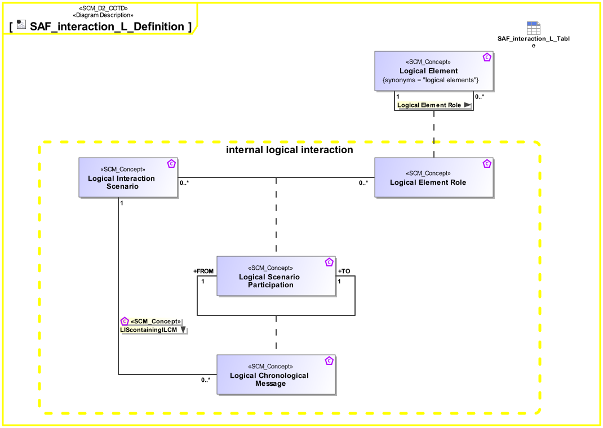

# SAF Development Documentation : Concepts : SAF_interaction_L_Definition 

|Concept|Documentation|
| --- | --- |
| LIScontainingILCM | Specifies the fact that an Internal Logical Interaction Scenario contains one or more Internal Logical Chronological Messages.|
| Logical Chronological Message | Ordered sequential occurrence of exchanges between Logical Interaction Scenario Participants.|
| Logical Element | Describes a conceptual Logical Element as specification for an implementation of a system, or system element.|
| Logical Element Role | Specifies the fact that a logical element comprises logical elements.|
| Logical Interaction Scenario | Ordered sequence of exchanges of information, energy, or material between Logical Interaction Scenario Participants.|
| Logical Scenario Participation | Specifies the fact that a Logical Element Role participates in a Logical Interaction Scenario.|
