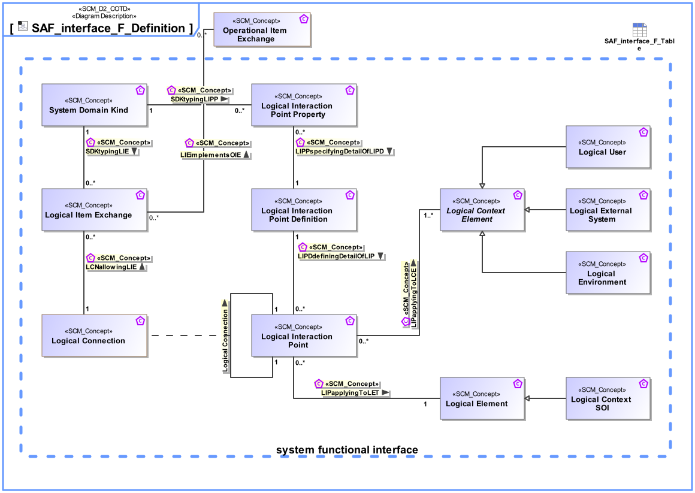

# SAF Development Documentation : Concepts : SAF_interface_F_Definition 

|Concept|Documentation|
| --- | --- |
| LCNallowingLIE | Specifies the fact that a Logical Item Exchange is allowed on the Logical Connection.|
| LIEimplementsOIE | specifies that this exchange in the FD implements (possibly partly) that exchange in the OD|
| LIPDdefiningDetailOfLIP | Specifies the fact that a Logical Interaction Point Definition defines the exchange capabilities of a Logical Interaction Point.|
| LIPPspecifyingDetailOfLIPD | Specifies the fact that a Logical Interaction Point Property is a detail of a Logical Interaction Point Definition.|
| LIPapplyingToLCE | Specifies the fact that a Logical Interaction Point applies to a Logical Context Element.|
| LIPapplyingToLET | Specifies the fact that a Logical Interaction Point applies to a Logical Element.|
| Logical Connection | Specifies the connection of two interaction points on Logical Level. Note: Connections between logical components indicate that item flows are passed from one output of a source component to one or more inputs of target components.|
| Logical Context Element | Represents an abstract element in the given System Context on Logical Level, outside the SOI scope, interacting with the SOI.|
| Logical Context SOI | Represents the Logical SOI in the System Context on Logical Level.|
| Logical Element | Describes a conceptual Logical Element as specification for an implementation of a system, or system element.|
| Logical Environment | A Logical Environment in the Logical Domain, outside the SOI scope, interacting with the SOI. E.g., air, dirt, sun, road.|
| Logical External System | A Logical External System in the Logical Domain, outside the SOI scope, interacting with the SOI. E.g., power grid, mobile network, fresh water system (in a house).|
| Logical Interaction Point | Specifies the existence of an interaction point on Logical Level.|
| Logical Interaction Point Definition | Specifies the exchange capabilities of an interaction point on Logical Level.|
| Logical Interaction Point Property | Specifies a detail of an interaction point on Logical Level.|
| Logical Item Exchange | Specifies the exchange that is to take place on a connection of two interaction points on Logical Level.|
| Logical User | The Logical User is the representation for a human in the Logical Domain, outside the SOI scope, interacting with the SOI.|
| Operational Item Exchange | Specifies the Operational Item Exchange that is to take place on an Operational Connection.  Aliases: UAF::OperationalExchange|
| SDKtypingLIE | Specifies the fact that a System Domain Kind defines the type of a Logical Item Exchange.|
| SDKtypingLIPP | Specifies the fact that a System Domain Kind defines the type of a Logical Interaction Point Property.|
| System Domain Kind | Specification for any kind of conceptual item (energy, material, information, etc.) to be exchanged on Functional or Logical Level. The System Domain Kind is agnostic to any realization on Physical Level.|
