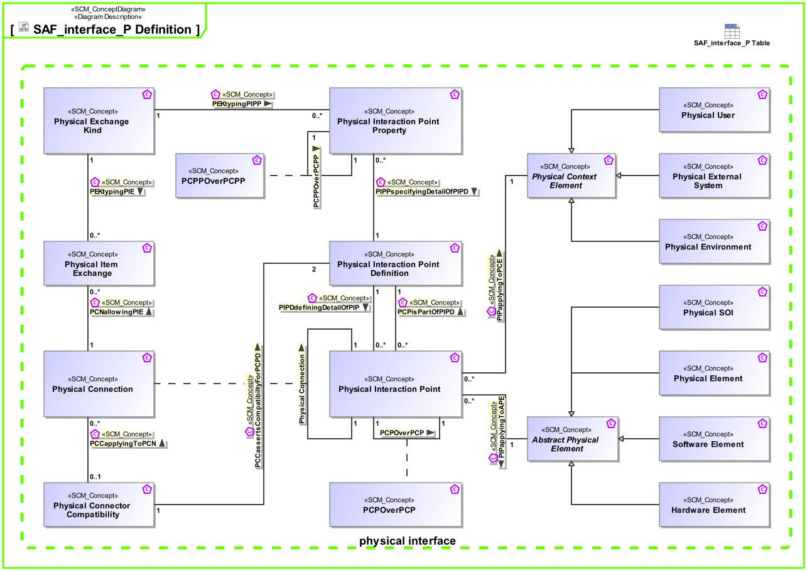

# SAF Development Documentation : Concepts : SAF_interface_P Definition 

|Concept|Documentation|
| --- | --- |
| Abstract Physical Element | Abstract element representing physical structure items keeping properties and relations applicable to all physical items.|
| Hardware Element | Pure Hardware Elements. Similarity with the V-Model "hardware unit".|
| PCCapplyingToPCN | Specifies the fact that a Physical Connector Compatibility Assertion shall apply to a Physical Connection.|
| PCCassertsCompatibiltyForPCPD | Specifies the Physical Interaction Point Definition the Physical Compatibility Assertion is valid for.|
| PCNallowingPIE | Specifies the fact that a Physical Item Exchange is allowed on the Physical Connection.|
| PCPOverPCP | Specifies the fact that a physical interaction point communicates / transfers / flows / over an other physical interaction point. Used to define layered physical interfaces, and show layer relationships between interfaces.|
| PCPPOverPCPP | Specifies the fact that a physical interaction point property communicates / transfers / flows / over an other physical interaction point property. Used to define layered physical interfaces, and show layer relationships between interface details.|
| PCPisPartOfPIPD | specifies that a physical interaction point can be a part of a physical interaction point definition. This fosters reuse and allows structuring of definitions.|
| PEKtypingPIE | Specifies the fact that a Physical Exchange Kind defines the type of a Physical Item Exchange.|
| PEKtypingPIPP | Specifies the fact that a Physical Exchange Kind defines the type of a Physical Interaction Point Property.|
| PIPDdefiningDetailOfPIP | Specifies the fact that a Physical Interaction Point Definition defines the exchange capabilities of a Physical Interaction  Point.|
| PIPPspecifyingDetailOfPIPD | Specifies the fact that a Physical Interaction Point Property is a detail of a Physical Interaction Point Definition.|
| PIPapplyingToAPE | Specifies the fact that a Physical Interaction Point applies to an Abstract Physical Element.|
| PIPapplyingToPCE | Specifies the fact that a Physical Interaction Point applies to a Physical Context Element.|
| Physical Connection | Specifies the connection of two physical interaction points. Note: Connections between physical components indicate that item flows are passed from one output of a source component to one or more inputs of target components.|
| Physical Connector Compatibility | Specifies the fact that two Physical Interaction Point Definitions are compatible and how the Physical Interaction Point Properties are mapped.|
| Physical Context Element | Abstract element of a System Context on Physical Level, outside the SOI scope, interacting with the SOI.|
| Physical Element | A composition of Hardware and Software Elements. Similarity with the V-Model segments and system. See [VXT].|
| Physical Environment | The Physical Environment in the Physical Domain, outside the SOI scope, interacting with the SOI. E.g. air, dirt, sun, road.|
| Physical Exchange Kind | Specification for any kind of physical item (energy, material, information, etc.) to be exchanged on Physical Level. This is the realization of the specification made by System Domain Kinds.|
| Physical External System | The Physical External System in the Physical Domain, outside the SOI scope, interacting with the SOI. E.g. power grid, mobile network, fresh water system (in a house).|
| Physical Interaction Point | Specifies the existence of an interaction point on Physical Level.|
| Physical Interaction Point Definition | Specifies the exchange capabilities of an interaction point on Physical Level.|
| Physical Interaction Point Property | Specifies a detail of an interaction point on Physical Level.|
| Physical Item Exchange | Specifies the exchange that is to take place on a Physical Connection.|
| Physical SOI | Represents the Physical SOI on Physical Level.|
| Physical User | The Physical User is the representation for a human in the physical domain, outside the SOI scope, interacting with the SOI.|
| Software Element | Pure Software Elements. Similarity with the V-Model "software unit".|
