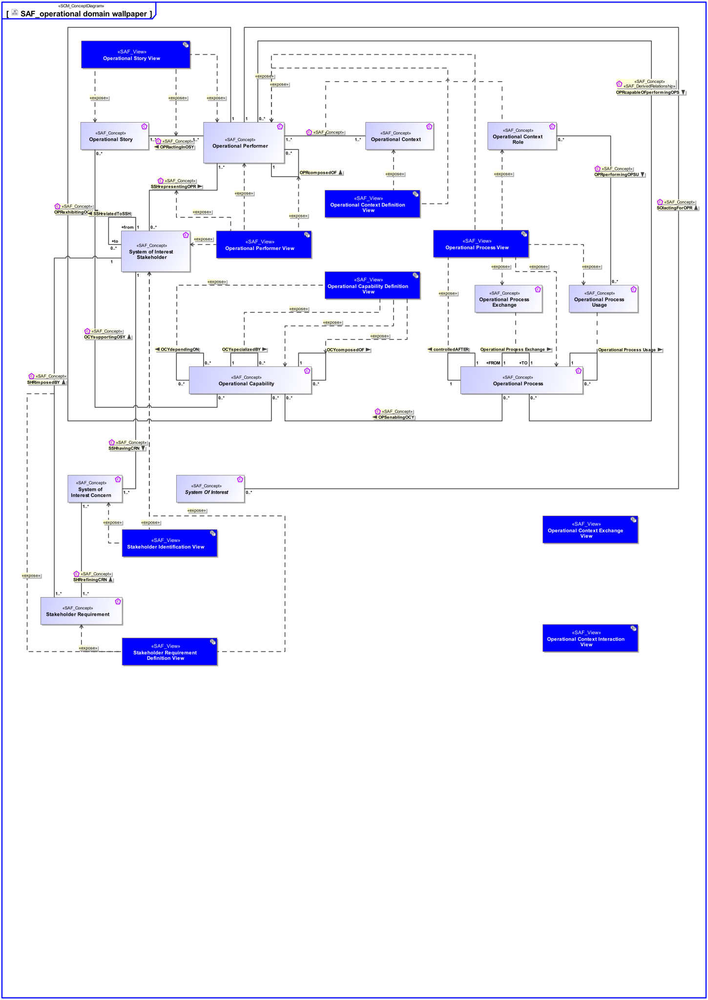

# SAF Development Documentation : Concepts : SAF_operational domain wallpaper 

|Concept|Documentation|
| --- | --- |
| OCYcomposedOF | Specifies the fact that an Operational Capability consists of other Operational Capabilites.|
| OCYdependingON | Specifies the fact that an Operational Capability depends on another Operational Capability.  Aliases: UAF::CapabilityDependency|
| OCYspecializedBY | Specifies the fact that an Operational Capability is specialized by other Operational Capability.   Aliases: UAF::CapabilityGeneralization|
| OCYsupportingOSY | Specifies the fact that an Operational Story is supported by Operational Capabilities.|
| OPRactingInOSY | Specifies the fact that an Operational Performer acts in an Operational Story.|
| OPRcapableOFperformingOPS | Specifies the fact that an Operational Performer performs an Operational Activity. Traceability from Operational Activities to Operational Performers is derived via assignment of Operational Action to Operational Roles.  Aliases: UAF::IsCapableToPerform|
| OPRcomposedOF | Specifies the fact that an Operational Performer consists of one or more Operational Performers.|
| OPRexhibitingOCY | Specifies the fact that an Operational Performer exhibits an Operational Capability under specific environmental conditions.|
| OPRperformingOPSU | Specifies that an Operational Context Role uses an Operational Process in the context of an other Operational Process.|
| OPSenablingOCY | Specifies the fact that an Operational Process contributes to the provision of one or more Operational Capabilities in the field.  Aliases: UAF::MapsToCapability|
| Operational Capability | A Operational Capability is a high-level description or specification of an organizational unit's ability to execute a specified course of action, to implement a business process or to provide a service. Operational Capabilities typically require people, processes, infrastructure, technology and supporting systems to be implemented.  A Operational Capability is an enduring element, its implementation may change over time. A necessary or desired change of a Operational Capability triggers the updated of involved systems or the integration new systems.  Aliases: UAF::Capability NAF4::Capability|
| Operational Context | An Operational Context is representing a separate Usage Scenario with a specific configuration of Operational Performers, these are interacting in the Scenario exhibiting a specific identified Operational Capability. One or more Operational Contexts meaningful for the Operational Domain are to be identified.   Aliases: UAF::HighLevelOperationalConcept|
| Operational Context Role | An Operational Context Role represents a participant in an Operational context. It is interacting with other roles of the given Operational Context. Specific characteristics and features or, in case of persons or organizational units, knowledge and skills are assigned to a role necessary for the execution of the performed Operational Processes.|
| Operational Performer | An Operational Performer is an element of the Operational Context that is capable to perform Operational Process Activities contributing to a specific identified Operational Capability. An Operational Performer may be any kind of organization, person, or even a system playing a role in one or more Operational Contexts.  Aliases: UAF::OperationalPerformer|
| Operational Process | An Operational Process captures activity-based operational behavior including scenarios, activity actions, and operational exchange flows, e.g., including information, materials, natural resources, etc.  Aliases: UAF::Operational Activity NAF::Logical Activity|
| Operational Process Exchange | Specifies the fact that an Operational Process has an exchange with another Operational Process.|
| Operational Process Usage | Specifies the fact that an Operational Process is used in context of another Operational Process.  Aliases: UAF::OperationalAction|
| Operational Story | The Operational Story represents one or more Operational Use Cases in the Usage Scenario identified by the Operational Context. The Operational Story is described as narrative story-telling.|
| SHRimposedBY | Specifies the fact that a Stakeholder Requirement is provided by Stakeholders.|
| SHRrefiningCRN | Specifies the fact that a Stakeholder Concern is refined by Stakeholder Requirements.|
| SOIactingForOPR | Specifies the fact that a SOI is acting for the benefit of an Operational Performer.|
| SSHhavingCRN | Specifies the fact that a Stakeholder has certain Concerns.|
| SSHrelatedToSSH | Explains relations between the Stakeholders of the System and other relevant System parties. It helps to understand the Stakeholder community and to approach the right point of contact for clarification of project relevant issues.|
| SSHrepresentingOPR | Specifies the fact that a SOI Stakeholder is representing an Operational Performer.|
| Stakeholder Requirement | A Stakeholder Requirement is a Requirement imposed by a Stakeholder. Stakeholder Concerns are refined by Stakeholder Requirements applicable for the SOI. The Stakeholder Requirements are a result of discussions and agreements of how the SOI addresses the Concerns of the respective Stakeholder.|
| System Of Interest | An abstract element representing a SOI. Base class for specific kinds of SOIs.|
| System of Interest Concern | Any kind of interest a Stakeholder has.  Note: Redundant with the meaning of "Need"?|
| System of Interest Stakeholder | An individual, team, or organization (or classes thereof) with interests in, or concerns relative to, a system. It may be involved in any life cycle phase of the System. The Stakeholder represents a class or kind of Stakeholders. Stakeholders have a certain involvement: Stakeholder Involvement captures the influence of a project specific Stakeholder on the System. Stakeholder Involvement is characterized by * Contact Person * Kind of involvement * Life Cycle Phases involved * Relevance decision if and up to which degree Stakeholder is considered * Rationale for decision when Stakeholder is not considered|
| controlledAFTER | Specifies the sequencing of Operational Processes in time.|
