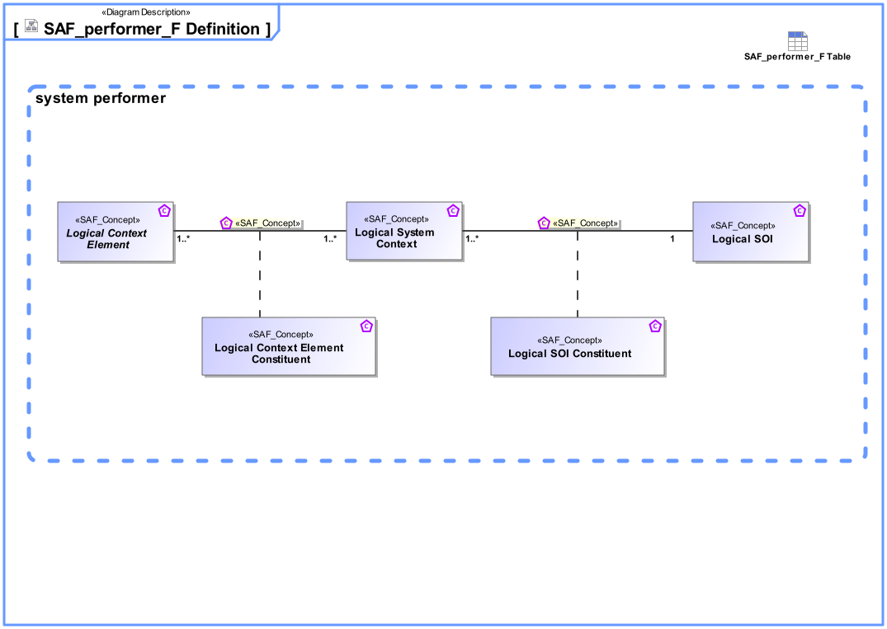

# SAF Development Documentation : Concepts : SAF_performer_F Definition 

|Concept|Documentation|
| --- | --- |
| Logical Context Element | Represents an abstract element in the given System Context on Logical Level, outside the SOI scope, interacting with the SOI.|
| Logical Context Element Role | Specifies the fact that a Logical Context Element exists in a given Logical System Context.|
| Logical Context SOI | Represents the Logical SOI in the System Context on Logical Level.|
| Logical SOI Role | Specifies the fact that a Logical Context SOI exists in a given Logical System Context.|
| Logical System Context | Specifies the fact that a System Context for a System of Interest is defined on Logical Level.|
