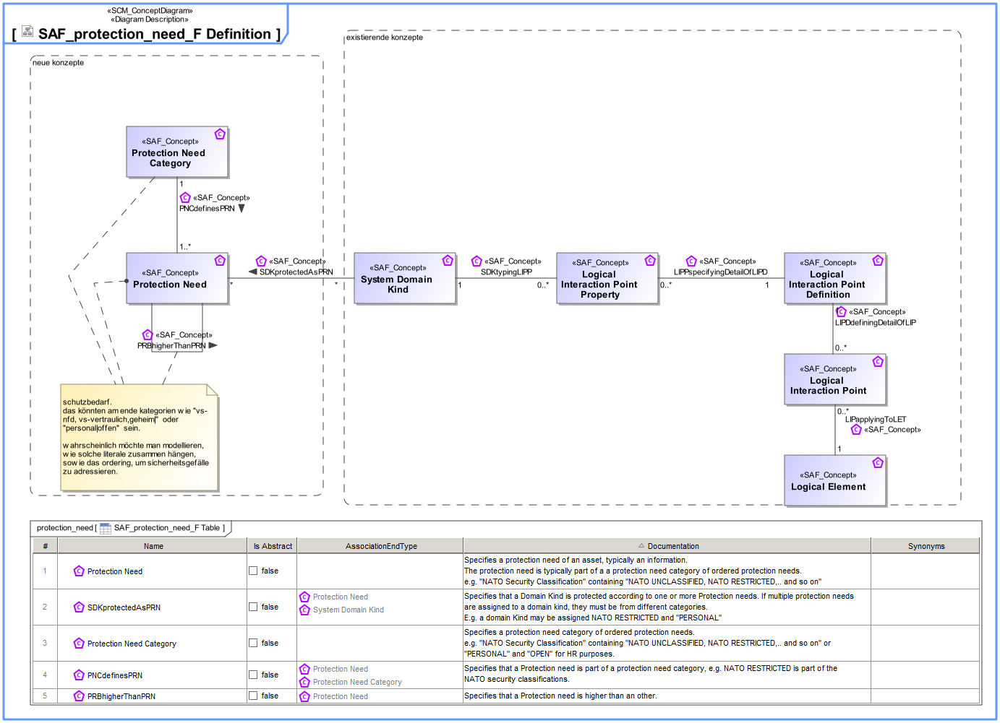

# SAF Development Documentation : Concepts : SAF_protection_need_F Definition 

|Concept|Documentation|
| --- | --- |
| APEimplementingGFN | |
| Abstract Physical Element | Abstract element representing physical structure items keeping properties and relations applicable to all physical items.|
| GFNreceivingINPUT | Specifies the Input of a System or Context Function.|
| GFNsendingOUPUT | Specifies the Output of a System or Context Function.|
| General Function | Specifies the fact that a General Function is used as base Class for specific System or Context Functions.|
| General Functional Parameter | A parameter of a System or Context Function.|
| LETimplementingGFN | Specifies the fact that a Logical Element is responsible to implement a System Function. Note: Logical Elements don't "implement" anything, they pass the function implementation task to Physical Elements.|
| LIPDdefiningDetailOfLIP | Specifies the fact that a Logical Interaction Point Definition defines the exchange capabilities of a Logical Interaction Point.|
| LIPPspecifyingDetailOfLIPD | Specifies the fact that a Logical Interaction Point Property is a detail of a Logical Interaction Point Definition.|
| LIPapplyingToLET | Specifies the fact that a Logical Interaction Point applies to a Logical Element.|
| Logical Element | Describes a conceptual Logical Element as specification for an implementation of a system, or system element.|
| Logical Interaction Point | Specifies the existence of an interaction point on Logical Level.|
| Logical Interaction Point Definition | Specifies the exchange capabilities of an interaction point on Logical Level.|
| Logical Interaction Point Property | Specifies a detail of an interaction point on Logical Level.|
| PNCdefinesPRN | Specifies that a Protection need is part of a protection need category, e.g. NATO RESTRICTED is part of the NATO security classifications.|
| PRBhigherThanPRN | Specifies that a Protection need is higher than an other.|
| Protection Need | Specifies a protection need of an asset, typically an information. The protection need is typically part of a a protection need category of ordered protection needs. e.g. "NATO Security Classification" containing "NATO UNCLASSIFIED, NATO RESTRICTED,.. and so on"|
| Protection Need Category | Specifies a protection need category of ordered protection needs. e.g. "NATO Security Classification" containing "NATO UNCLASSIFIED, NATO RESTRICTED,.. and so on" or "PERSONAL" and "OPEN" for HR purposes.|
| SDKtypingFPM | Specifies the fact that a System Domain Kind defines the type of a Function Parameter.|
| SDKtypingLIPP | Specifies the fact that a System Domain Kind defines the type of a Logical Interaction Point Property.|
| SSRAprotectedAsPRN | Specifies that an Asset is protected according to one or more Protection needs. If multiple protection needs are assigned to an Asset, they must be from different categories. E.g. a System domain Kind may be assigned NATO RESTRICTED and "PERSONAL"|
| SSRAsset | Asset in Terms of Safety Security or Relieability that needs to be protected to avoid undesirable loss.|
| System Domain Kind | Specification for any kind of conceptual item (energy, material, information, etc.) to be exchanged on Functional or Logical Level. The System Domain Kind is agnostic to any realization on Physical Level.|
| System Function | Specifies the fundamental action or task that have to take place in the System in accepting and processing the inputs and in processing and generating the outputs. A System Function  * accepts input from the System boundary   * exposes its output at the System boundary  * changes the System's State  * is dependent on System's State Note: A System Function does not need to expose observable output, when it changes the System's state in a way that is observable by other system functions. Furthermore, a System Function does not need to accept any input from the system boundary, when it is dependent on the System State, which in turn is changeable by other System Functions.|
