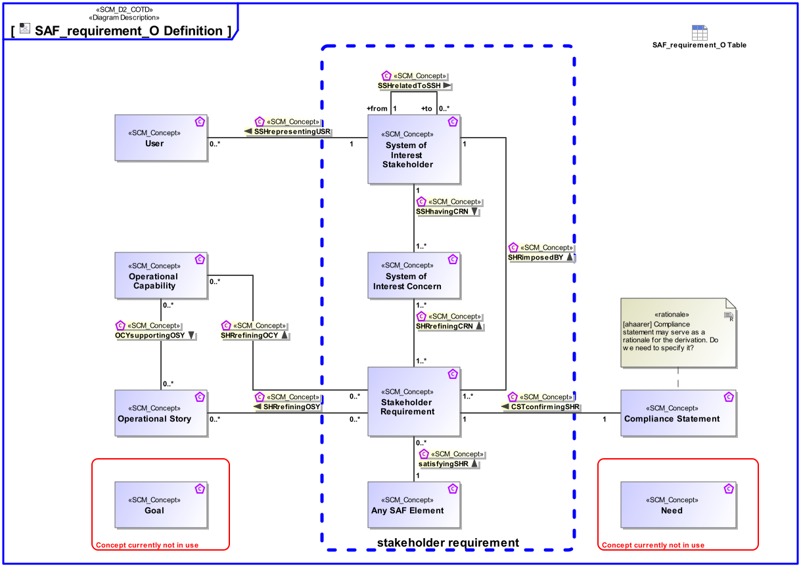

# SAF Development Documentation : Concepts : SAF_requirement_O Definition 

|Concept|Documentation|
| --- | --- |
| Any SAF Element | |
| CSTconfirmingSHR | Specifies the fact that a Stakeholder Requirement has certain States of Compliance.|
| Compliance Statement | Used in the communication between Stakeholder (Customer) and Contractor. Compliance Statements are the first answer to the Stakeholder Requirements and are usually together with the Stakeholder Requirements part of the contract. They are valuable input for the System development and System Requirement elicitation. Information status: * not compliant (with explanation / rationale) * partially compliant (with explanation / rationale) * fully compliant|
| Goal | A Goal is defined as an end state that a Stakeholder intends to achieve. Goals are generally expressed using qualitative words; e.g., “increase”, “improve”, or “easier”. Goals can also be decomposed; e.g., “increase profit” can be decomposed into the Goals “reduce cost” and “increase sales”. However, it is also very common to associate concrete objectives with Goals, which can be used to describe both the quantitative and time-related measures which are essential to describe the desired state, and when it should be achieved.|
| Need | A User has a Need in order to reach a certain Goal. Note: "Buying sugar to bake a birthday cake".|
| OCYsupportingOSY | Specifies the fact that an Operational Story is supported by Operational Capabilities.|
| Operational Capability | A Operational Capability is a high-level description or specification of an organizational unit's ability to execute a specified course of action, to implement a business process or to provide a service. Operational Capabilities typically require people, processes, infrastructure, technology and supporting systems to be implemented.  A Operational Capability is an enduring element, its implementation may change over time. A necessary or desired change of a Operational Capability triggers the updated of involved systems or the integration new systems.  Aliases: UAF::Capability NAF4::Capability|
| Operational Story | The Operational Story represents one or more Operational Use Cases in the Usage Scenario identified by the Operational Context. The Operational Story is described as narrative story-telling.|
| SHRimposedBY | Specifies the fact that a Stakeholder Requirement is provided by Stakeholders.|
| SHRrefiningCRN | Specifies the fact that a Stakeholder Concern is refined by Stakeholder Requirements.|
| SHRrefiningOCY | Specifies the fact that an Operational Capability is refined by Stakeholder Requirements.|
| SHRrefiningOSY | Specifies the fact that an Operational Story is refined by Stakeholder Requirements.|
| SSHhavingCRN | Specifies the fact that a Stakeholder has certain Concerns.|
| SSHrelatedToSSH | Explains relations between the Stakeholders of the System and other relevant System parties. It helps to understand the Stakeholder community and to approach the right point of contact for clarification of project relevant issues.|
| SSHrepresentingUSR | Specifies the fact that an User is represented by Stakeholders.|
| Stakeholder Requirement | A Stakeholder Requirement is a Requirement imposed by a Stakeholder. Stakeholder Concerns are refined by Stakeholder Requirements applicable for the SOI. The Stakeholder Requirements are a result of discussions and agreements of how the SOI addresses the Concerns of the respective Stakeholder.|
| System of Interest Concern | Any kind of interest a Stakeholder has.  Note: Redundant with the meaning of "Need"?|
| System of Interest Stakeholder | An individual, team, or organization (or classes thereof) with interests in, or concerns relative to, a system. It may be involved in any life cycle phase of the System. The Stakeholder represents a class or kind of Stakeholders. Stakeholders have a certain involvement: Stakeholder Involvement captures the influence of a project specific Stakeholder on the System. Stakeholder Involvement is characterized by * Contact Person * Kind of involvement * Life Cycle Phases involved * Relevance decision if and up to which degree Stakeholder is considered * Rationale for decision when Stakeholder is not considered|
| User | Representation for a human in the Logical Domain, outside the SOI scope, interacting with the SOI. Note: This seems to be highly redundant with definition of "Role".|
| satisfyingSHR | Specifies the fact that a Stakeholder Requirement is satisfied by SAF Model Elements.|
