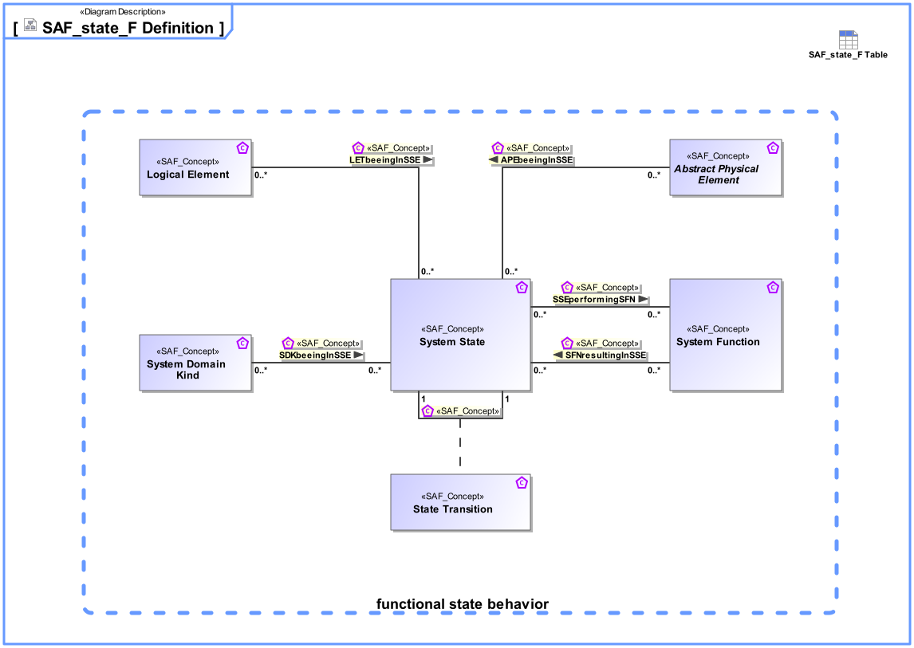

# SAF Development Documentation : Concepts : SAF_state_F Definition 

|Concept|Documentation|
| --- | --- |
| APEbeeingInSSE | Specifies the fact that a Physical System Element can be in distinct states.|
| Abstract Physical Element | Abstract element representing physical structure items keeping properties and relations applicable to all physical items.|
| LETbeeingInSSE | Specifies the  System States a Logical Element can be in.|
| Logical Element | Describes a conceptual Logical Element as specification for an implementation of a system, or system element.|
| SDKbeeingInSSE | Specifies that a System Domain Kind can have certain states. Note: Of course an item is in only one distinct state at a certain time. The multiplicity means that an Item can have a set of possible states, and a state can be used to specify possible States for several domain items.|
| SFNresultingInSSE | Specifies the fact that a System Function can perform a particular set of transitions, resulting in the related target System States.|
| SSEperformingSFN | Specifies the fact that the Function is only provided in distinct States. The state is a precondition for the Function to be able to perform.|
| State Transition | Describes an allowed transition between two states of an item that can be in distinct States.|
| System Domain Kind | Specification for any kind of conceptual item (energy, material, information, etc.) to be exchanged on Functional or Logical Level. The System Domain Kind is agnostic to any realization on Physical Level.|
| System Function | Specifies the fundamental action or task that have to take place in the System in accepting and processing the inputs and in processing and generating the outputs. A System Function  * accepts input from the System boundary   * exposes its output at the System boundary  * changes the System's State  * is dependent on System's State Note: A System Function does not need to expose observable output, when it changes the System's state in a way that is observable by other system functions. Furthermore, a System Function does not need to accept any input from the system boundary, when it is dependent on the System State, which in turn is changeable by other System Functions.|
| System State | Describes a state (or mode) of something that can have distinct states.|
