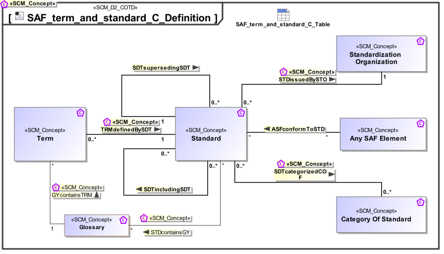

# SAF Development Documentation : Concepts : SAF_term_and_standard_C_Definition 

|Concept|Documentation|
| --- | --- |
| Any SAF Element | A concept used only together with relational concepts to specify that the relation goes to any other SAF Concept.|
| GYcontainsTRM | specifies that a glossary contains a number of terms. A term is contained only in one glossary. |
| Glossary | specifies a coherent set of terms.|
| SDTcoveringSBS | Specifies the fact that a standard covers one or more specific subject of standardization, e.g., data exchange format or protocol.|
| SDTincludingSDT | Specifies the fact that a standard is part of another standard.|
| SDTsupersedingSDT | Specifies the fact that a standard supersedes one or more other standards.|
| STDcontainsGY | specifies that a standard may contain one or more glossaries.|
| STDissuedBySTO | Specifies the fact that a standard is issued by an organization of standardization.|
| Standard | An international standard is a technical standard developed by one or more international standards organizations. International standards are available for consideration and use worldwide.|
| Standardization Organization | An organization of standardization, e.g., International Organization for Standardization (ISO), Object Management Group (OMG), etc.|
| Subject of Standardization | Specifies a certain topic which the standard covers, e.g.,  a data exchange format or a protocol.|
| TRMdefinedBySDT | Specifies the fact that a term is defined by a standard.|
| Term | Specifies the fact that a term is usually defined by a standard, but can also be defined as part of system development work.|
