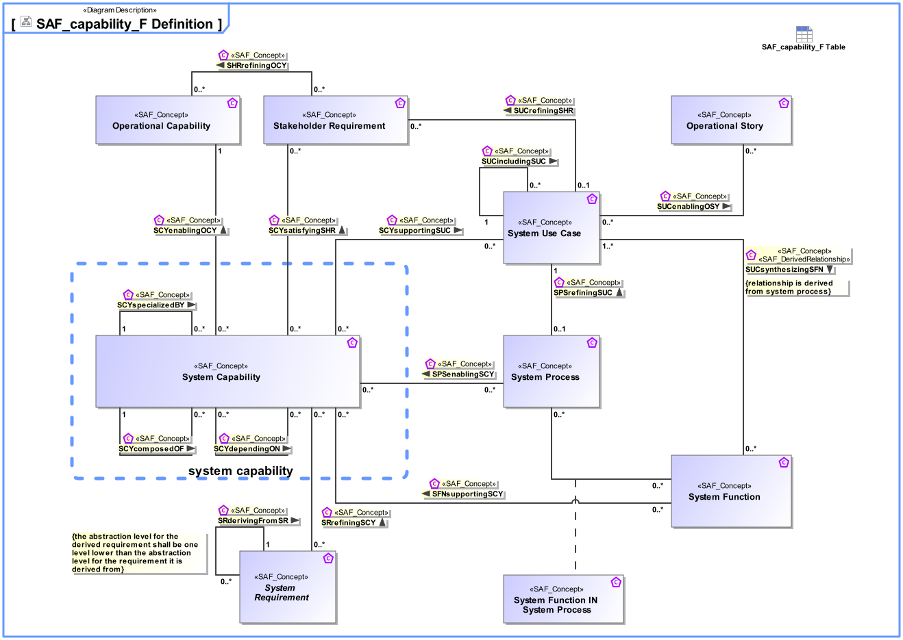

# SAF Development Documentation : Concepts : capability_F 

|Concept|Documentation|
| --- | --- |
| Operational Capability | A Operational Capability is a high-level description or specification of an organizational unit's ability to execute a specified course of action, to implement a business process or to provide a service. Operational Capabilities typically require people, processes, infrastructure, technology and supporting systems to be implemented.  A Operational Capability is an enduring element, its implementation may change over time. A necessary or desired change of a Operational Capability triggers the updated of involved systems or the integration new systems.  Aliases: UAF::Capability NAF4::Capability|
| Operational Story | The Operational Story represents one or more Operational Use Cases in the Usage Scenario identified by the Operational Context. The Operational Story is described as narrative story-telling.|
| SCYcomposedOF | Specifies the fact that a System Capability consists of other System Capabilities.|
| SCYdependingON | Specifies the fact that a System Capability requires another System Capability.  Aliases: UAF::CapabilityDependency|
| SCYenablingOCY | Specifies the fact that an Operational Capability integrates System Capabilities to produce a specific outcome to achieve a mission objective.|
| SCYsatisfyingSHR | Specifies the fact that a System Capability satisfies one or more Stakeholder Requirements.|
| SCYspecializedBY | Specifies the fact that a System Capability is specialized by another System Capability. A CapabilityGeneralization is a taxonomic relationship between a more general Capability and a more specific Capability.  Aliases: UAF::CapabilityGeneralization|
| SCYsupportingSUC | Specifies the fact that a System UseCase is supported by System Capabilities.|
| SFNsupportingSCY | Specifies the fact that a System Function supports one or more System Capabilities.|
| SHRrefiningOCY | Specifies the fact that an Operational Capability is refined by Stakeholder Requirements.|
| SPSenablingSCY | Specifies the fact that a System Process contributes to the provision of one or more System Capabilities in the field.|
| SPSrefiningSUC | Specifies the fact that a System Use Case is refined by one System Process.|
| SRderivingFromSR | Specifies the fact that System Requirements are derived from a Stakeholder Requirement.  Note: This is the relationship of requirements of different architectural levels. When the team responsible for the subsystem has direct access to the full upstream requirements set, then no subcontractor relationship needs to be established.|
| SRrefiningSCY | Specifies the fact that a System Capability is refined by System Requirements.|
| SUCenablingOSY | Specifies the fact that a System Use Case enables the realization of an Operational Story.|
| SUCincludingSUC | Specifies the fact that a System Use Case includes other System Use Cases. The included use case is then no longer a full System Use Case, but a partial System Use Case.|
| SUCrefiningSHR | Specifies the fact that a Stakeholder Requirement is refined by System Use Cases.|
| SUCsynthesizingSFN | Specifies the fact that a System Function is used in a System Use Case, e.g., as a Trigger, Action, or Task.  Note: This is a derived relationship.|
| Stakeholder Requirement | A Stakeholder Requirement is a Requirement imposed by a Stakeholder. Stakeholder Concerns are refined by Stakeholder Requirements applicable for the SOI. The Stakeholder Requirements are a result of discussions and agreements of how the SOI addresses the Concerns of the respective Stakeholder.|
| System Capability | 1) A System Capability is an operation or task that performs an action to produce a specific performance-based outcome. NOTE that a system capability represents the potential to perform an action. In contrast, an operational capability may integrate several physical system capabilities to produce a specific outcome to achieve a mission objective. [Wasson2006, SystemAnalysis+Design+Development] 2) System Capabilities, as system assets, characterize the mechanical, electrical, optical, or processing features that enable a system to function, process mission resources, make decisions, and achieve a required level of success based on performance. A system capability is broader in scope than simply a functional element (and performance bounding elements), especially in large, complex ecosystems. It represents a physical potential - strength, ability, endurance - to perform an outcome-based action for a given duration under a specified set of operating environment conditions. [Wasson2006, SystemAnalysis+Design+Development]  Aliases: UAF::Capability NAF4::Capability|
| System Function | Specifies the fundamental action or task that have to take place in the System in accepting and processing the inputs and in processing and generating the outputs. A System Function  * accepts input from the System boundary   * exposes its output at the System boundary  * changes the System's State  * is dependent on System's State Note: A System Function does not need to expose observable output, when it changes the System's state in a way that is observable by other system functions. Furthermore, a System Function does not need to accept any input from the system boundary, when it is dependent on the System State, which in turn is changeable by other System Functions.|
| System Function IN System Process | Specifies the fact that a System Function is used in a System Process.|
| System Process | Specifies the fact that a System Process captures system behavior as a specific sequence of actions or tasks, and system exchanges including information, materials, energy, etc.|
| System Requirement | System Requirements specify System Functions, non-functional properties, or constraints of the System.|
| System Use Case | The System Use Cases are a table of content of the services provided by the System of Interest to its System Actors. A System Use Case is only the abstract of the depicted System behavior and represents the purpose. While the main System of Interest interaction actors participating in this Use Case are identified, the behavior itself is specified by a Use Case Activity,  Note: The intended use (and also misuse in so called "black use cases") of the System of Interest is captured in free text; story telling at a coarse level of detail which is understandable to Customers (non engineering stakeholders in general).|
