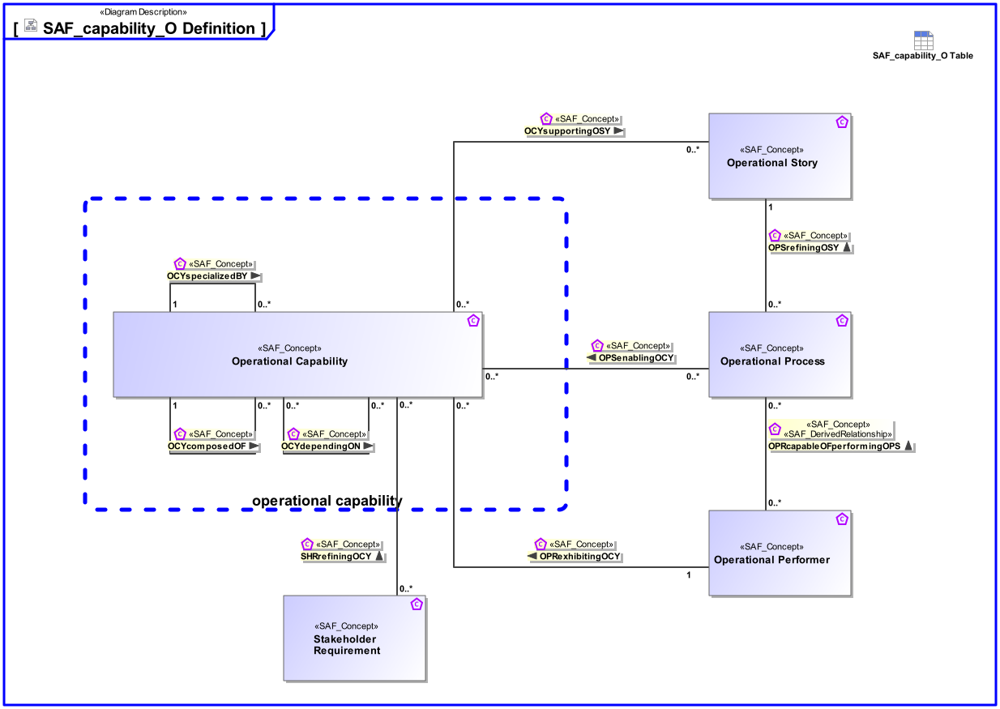

# SAF Development Documentation : Concepts : capability_O 

|Concept|Documentation|
| --- | --- |
| OCYcomposedOF | Specifies the fact that an Operational Capability consists of other Operational Capabilites.|
| OCYdependingON | Specifies the fact that an Operational Capability depends on another Operational Capability.  Aliases: UAF::CapabilityDependency|
| OCYspecializedBY | Specifies the fact that an Operational Capability is specialized by other Operational Capability.   Aliases: UAF::CapabilityGeneralization|
| OCYsupportingOSY | Specifies the fact that an Operational Story is supported by Operational Capabilities.|
| OPRcapableOFperformingOPS | Specifies the fact that an Operational Performer performs an Operational Activity. Traceability from Operational Activities to Operational Performers is derived via assignment of Operational Action to Operational Roles.  Aliases: UAF::IsCapableToPerform|
| OPRexhibitingOCY | Specifies the fact that an Operational Performer exhibits an Operational Capability under specific environmental conditions.|
| OPScontributingToOCY | Specifies the fact that an Operational Process contributes to providing Operational Capabilities.  Aliases: UAF::MapsToCapability|
| OPSrefiningOSY | Specifies the fact that an Operational Story is refined by Operational Processes.|
| Operational Capability | A Operational Capability is a high-level description or specification of an organizational unit's ability to execute a specified course of action, to implement a business process or to provide a service. Operational Capabilities typically require people, processes, infrastructure, technology and supporting systems to be implemented.  A Operational Capability is an enduring element, its implementation may change over time. A necessary or desired change of a Operational Capability triggers the updated of involved systems or the integration new systems.  Aliases: UAF::Capability NAF4::Capability|
| Operational Performer | An Operational Performer is an element of the Operational Context that is capable to perform Operational Process Activities contributing to a specific identified Operational Capability. An Operational Performer may be any kind of organization, person, or even a system playing a role in one or more Operational Contexts.  Aliases: UAF::OperationalPerformer|
| Operational Process | An Operational Process captures operational behaviors including scenarios, activity actions, and operational exchanges including information, materials, natural resources, etc.  Aliases: UAF::Operational Activity NAF::Logical Activity|
| Operational Story | The Operational Story represents one or more Operational Use Cases in the Usage Scenario identified by the Operational Context. The Operational Story is described as narrative story-telling.|
