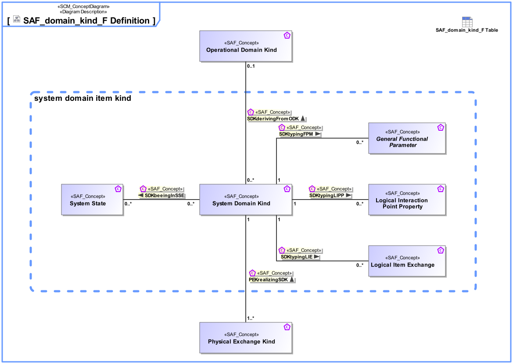

# SAF Development Documentation : Concepts : domain_kind_F 

|Concept|Documentation|
| --- | --- |
| General Functional Parameter | A parameter of a System or Context Function.|
| Logical Interface Property | Specifies a detail of an interaction point on a Logical Level.|
| Logical Item Exchange | Specifies the exchange that is supposed to happen on a Logical Interface Connection.|
| Operational Domain Kind | Specifies the kind of exchange between Operational Context Constituents or between Operational Processes.|
| PEKrealizingSDK | Specifies the fact that a System Domain Kind is realized by a Physical Exchange Kind.|
| Physical Exchange Kind | Specifies the Physical Level realization of a System Domain Kind. It is both used to define exchange on Physical Interfaces.|
| SDKbeeingInSS | Specifies that a System Domain Kind can have certain states.  Note: Of course an item is in only one distinct state at a certain time. The multiplicity means that an Item can have a set of possible states, and a state can be used to specify possible States for several domain items.|
| SDKderivingFromODK | Specifies the fact that a System Domain Kind on system level is derived from an Operational Domain Kind.|
| SDKtypingFPM | Specifies the fact that a System Domain Kind defines the type of a Function Parameter.|
| SDKtypingLIE | Specifies the fact that a System Domain Kind defines the type of a Logical Item Exchange.|
| SDKtypingLIP | Specifies the fact that a System Domain Kind defines the type of a Logical Interface Exchange Property.|
| System Domain Kind | Specification for any kind of exchange on Functional, and Logical Level, focus on what kind of information is exchanged (information, material, energy).The Domain Item Kind is agnostic to any Physical realization.|
| System State | Describes a state (or mode) of something that can have distinct states.|
