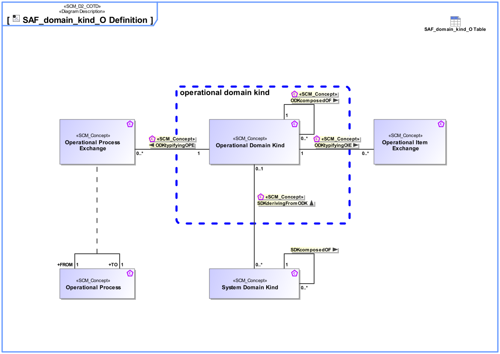

# SAF Development Documentation : Concepts : domain_kind_O 

|Concept|Documentation|
| --- | --- |
| ODKcomposedOF | Specifies the fact that an Operational Domain Kind consists of one or more Operational Domain Kinds.|
| ODKtypifyingOIE | Specifies the fact that an Operational Domain Kind typifies an Operational Item Exchange.|
| ODKtypifyingOPE | Specifies the fact that an Operational Domain Kind typifies an Operational Process Exchange.|
| Operational Domain Kind | Specifies the kind of exchange between Operational Context Constituents or between Operational Processes.|
| Operational Item Exchange | Specifies the exchange that is supposed to happen on an Operational Connection between Operational Context Constituents.  Aliases: UAF::OperationalExchange|
| Operational Process | An Operational Process captures operational behaviors including scenarios, activity actions, and operational exchanges including information, materials, natural resources, etc.  Aliases: UAF::Operational Activity NAF::Logical Activity|
| Operational Process Exchange | Specifies the fact that an Operational Process has an exchange with another Operational Process.|
| SDKcomposedOF | Specifies the fact that a System Domain Kind consists of one or more System Domain Kinds.|
| SDKderivingFromODK | Specifies the fact that a System Domain Kind on system level is derived from an Operational Domain Kind.|
| System Domain Kind | Specification for any kind of exchange on Functional, and Logical Level, focus on what kind of information is exchanged (information, material, energy).The Domain Item Kind is agnostic to any Physical realization.|
