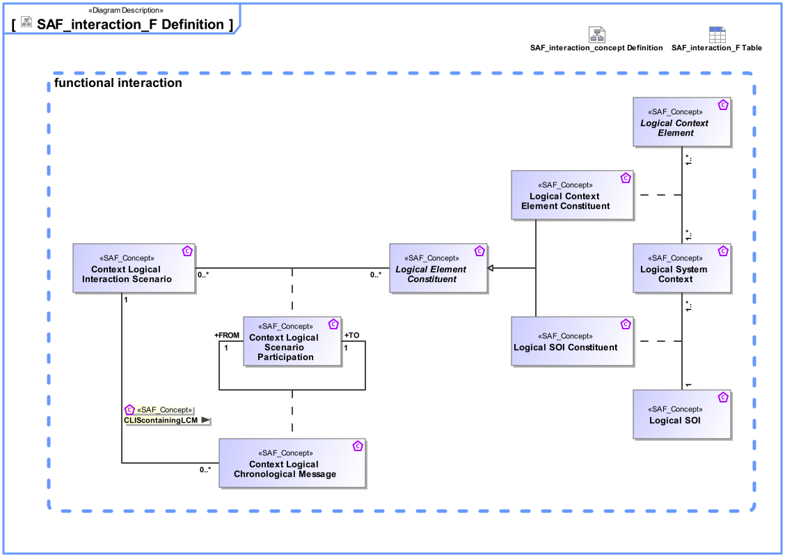

# SAF Development Documentation : Concepts : interaction_F 

|Concept|Documentation|
| --- | --- |
| Logical Context Element | Represents an abstract element in the given System Context on Logical Level, outside the SOI scope, interacting with the SOI.|
| Logical Context Element Role | Specifies the fact that a Logical Context Element exists in a given Logical System Context.|
| Logical Context SOI | Represents the Logical SOI in the System Context on Logical Level.|
| Logical SOI Role | Specifies the fact that a Logical Context SOI exists in a given Logical System Context.|
| Logical System Context | Specifies the fact that a System Context for a System of Interest is defined on Logical Level.|
| SCIScontainingLCM | Specifies the fact that a System Context Interaction Scenario contains one or more System Context Chronological Messages.|
| System Context Chronological Message | Ordered sequential occurrence of exchanges between System Context Interaction Scenario Participants.|
| System Context Interaction Scenario | Ordered sequence of exchanges of information, energy, or material between System Context Interaction Scenario Participants.|
| System Context Role | General role of a Logical System Context.|
| System Context Scenario Participation | Specifies the fact that a System Context Role participates in a System Context Interaction Scenario.|
