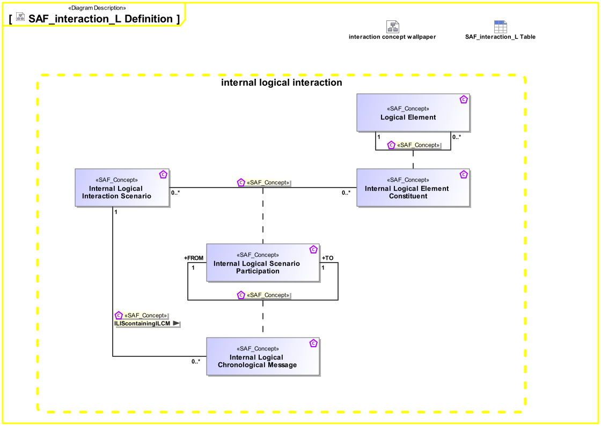

# SAF Development Documentation : Concepts : interaction_L 

|Concept|Documentation|
| --- | --- |
| ILIScontainingILCM | Specifies, that Internal Logical Interaction Scenario contains a Internal Logical Chronological Message|
| Internal Logical Chronological Message | The sequential occurrence of exchange between Internal Logical Interaction Scenario Participations.|
| Internal Logical Element Constituent | Specifies the fact that a Logical Element contains any number of Logical Elements.|
| Internal Logical Interaction Scenario | Ordered sequence of exchanges of information, energy or material between Scenario Participants.|
| Internal Logical Scenario Participation | Specifies the fact that a Logical Element role participates in an Internal Logical Interaction Scenario.|
| Logical Element | Describes a logical, conceptual system as specification for an implementation of a system, or system part.|
