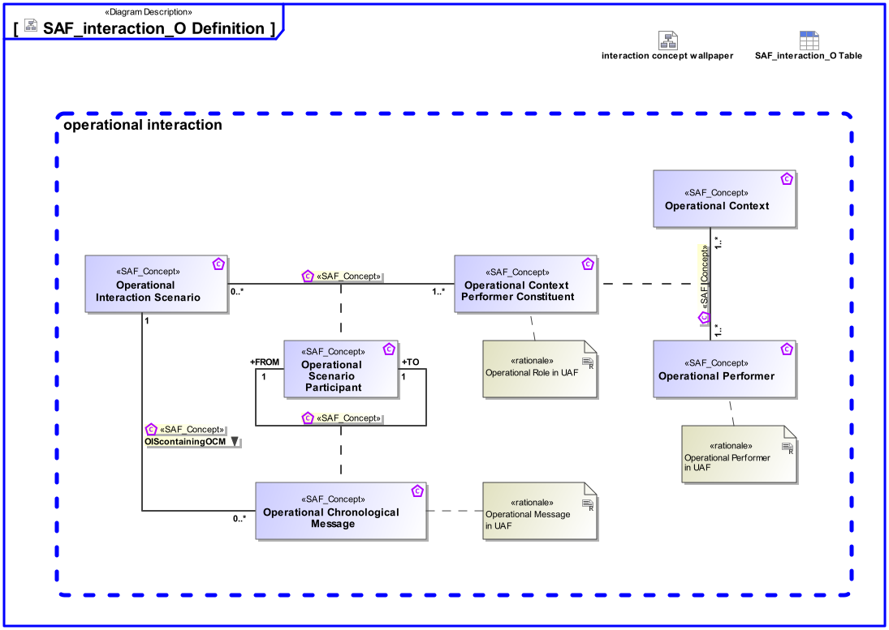

# SAF Development Documentation : Concepts : interaction_O 

|Concept|Documentation|
| --- | --- |
| OIScontainingOCM | Specifies, that an operational interaction scenario contains one or more chronological messages.|
| Operational Chronological Message | The sequential occurrence of exchange between Operational Scenario Participations|
| Operational Context | An Operational Context is representing a separate Usage Scenario with a specific configuration of Operational Performers, these are interacting in the Scenario exhibiting a specific identified Operational Capability. One or more Operational Contexts meaningful for the Operational Domain are to be identified.   Aliases: UAF::HighLevelOperationalConcept|
| Operational Context Performer Constituent | An Operational Context Constituent represents a participant in the Operational Activity executing one or more of its atomic actions interacting with other constituents of the identified Operational Context. Specific characteristics and features or, in case of persons or organizational units, knowledge and skills are assigned to a constituent necessary for the execution of the allocated actions.|
| Operational Interaction Scenario | Ordered sequence of exchanges of information, energy or material between Operational Scenario Participants.|
| Operational Performer | An Operational Performer is an element of the Operational Context that is capable to perform Operational Process Activities contributing to a specific identified Operational Capability. An Operational Performer may be any kind of organization, person, or even a system playing a role in one or more Operational Contexts.  Aliases: UAF::OperationalPerformer|
| Operational Scenario Participant | Specifies the fact that an Operational Role participates in an Operational Interaction Scenario.|
