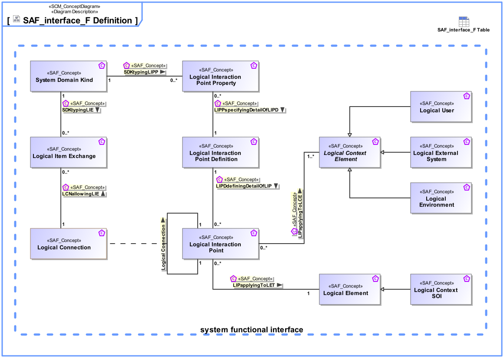

# SAF Development Documentation : Concepts : interface_F 

|Concept|Documentation|
| --- | --- |
| LCNallowingLIE | Specifies the fact that a Logical Item Exchange is allowed on the Logical Connection.|
| LCPDdefiningDetailOfLCP | Specifies the fact that a Logical Interface Connection Point Definition defines the exchange capabilities of a Logical Interface Connection Point.|
| LCPPspecifyingDetailOfLCPD | Specifies the fact that a Logical Connection Point Property is a detail of a Logical Connection Point Definition.|
| LCPapplyingToLCE | Specifies the fact that a Logical Interface Connection Point applies to a Logical Context Element.|
| LCPapplyingToLET | Specifies the fact that a Logical Interface Connection Point applies to a Logical Element.|
| Logical Connection | Specifies the connection of two interaction points on Logical Level. Note: Connections between logical components indicate that item flows are passed from one output of a source component to one or more inputs of target components.|
| Logical Connection Point | Specifies the existence of an interaction point on Logical Level.|
| Logical Connection Point Definition | Specifies the exchange capabilities of an interaction point on Logical Level.|
| Logical Connection Point Property | Specifies a detail of an interaction point on Logical Level.|
| Logical Context Element | Abstract element of a System Context in the Logical Domain, outside the SOI scope, interacting with the SOI.|
| Logical Element | Describes a logical, conceptual system as specification for an implementation of a system, or system part.|
| Logical Environment | A Logical Environment in the Logical Domain, outside the SOI scope, interacting with the SOI. E.g., air, dirt, sun, road.|
| Logical External System | A Logical External System in the Logical Domain, outside the SOI scope, interacting with the SOI. E.g., power grid, mobile network, fresh water system (in a house).|
| Logical Item Exchange | Specifies the exchange that is to take place on a connection of two interaction points on Logical Level.|
| Logical SOI | A SOI representation in the Logical Domain.|
| Logical User | The Logical User is the representation for a human in the Logical Domain, outside the SOI scope, interacting with the SOI.|
| SDKtypingLCPP | Specifies the fact that a System Domain Kind defines the type of a Logical Connection Point Property.|
| SDKtypingLIE | Specifies the fact that a System Domain Kind defines the type of a Logical Item Exchange.|
| System Domain Kind | Specification for any kind of conceptual item (energy, material, information, etc.) to be exchanged on Functional or Logical Level. The System Domain Kind is agnostic to any realization on Physical Level.|
