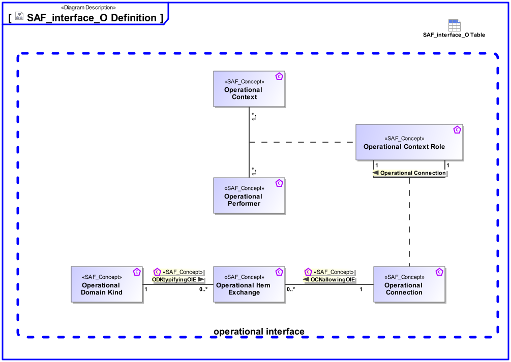

# SAF Development Documentation : Concepts : interface_O 

|Concept|Documentation|
| --- | --- |
| OCNallowingOIE | Specifies the fact that an Operational Item Exchange is allowed on the Operational Connection.|
| ODKtypifyingOIE | Specifies the fact that an Operational Domain Kind typifies an Operational Item Exchange.|
| Operational Connection | Specifies the connection between Operational Context Constituents in an Operational Context allowing Operational Item Exchange.  Aliases: UAF::OperationalConnector|
| Operational Context | An Operational Context is representing a separate Usage Scenario with a specific configuration of Operational Performers, these are interacting in the Scenario exhibiting a specific identified Operational Capability. One or more Operational Contexts meaningful for the Operational Domain are to be identified.   Aliases: UAF::HighLevelOperationalConcept|
| Operational Context Performer Constituent | An Operational Context Constituent represents a participant in the Operational Activity executing one or more of its atomic actions interacting with other constituents of the identified Operational Context. Specific characteristics and features or, in case of persons or organizational units, knowledge and skills are assigned to a constituent necessary for the execution of the allocated actions.|
| Operational Domain Kind | Specifies the kind of exchange between Operational Context Constituents or between Operational Processes.|
| Operational Item Exchange | Specifies the exchange that is to take place on an Operational Connection.  Aliases: UAF::OperationalExchange|
| Operational Performer | An Operational Performer is an element of the Operational Context that is capable to perform Operational Process Activities contributing to a specific identified Operational Capability. An Operational Performer may be any kind of organization, person, or even a system playing a role in one or more Operational Contexts.  Aliases: UAF::OperationalPerformer|
