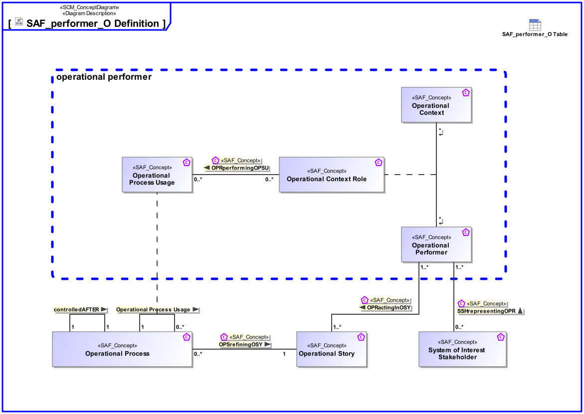

# SAF Development Documentation : Concepts : performer_O 

|Concept|Documentation|
| --- | --- |
| OPRactingInOSY | Specifies the fact that an Operational Performer acts in an Operational Story.|
| OPRperformingOPSU | Specifies that an Operational Context Constituent performs an Operational Action in the context of an other Operational Activity.|
| OPSrefiningOSY | Specifies the fact that an Operational Story is refined by one or more Operational Processes.|
| Operational Context | An Operational Context is representing a separate Usage Scenario with a specific configuration of Operational Performers, these are interacting in the Scenario exhibiting a specific identified Operational Capability. One or more Operational Contexts meaningful for the Operational Domain are to be identified.   Aliases: UAF::HighLevelOperationalConcept|
| Operational Context Performer Constituent | An Operational Context Constituent represents a participant in the Operational Activity executing one or more of its atomic actions interacting with other constituents of the identified Operational Context. Specific characteristics and features or, in case of persons or organizational units, knowledge and skills are assigned to a constituent necessary for the execution of the allocated actions.|
| Operational Performer | An Operational Performer is an element of the Operational Context that is capable to perform Operational Process Activities contributing to a specific identified Operational Capability. An Operational Performer may be any kind of organization, person, or even a system playing a role in one or more Operational Contexts.  Aliases: UAF::OperationalPerformer|
| Operational Process | An Operational Process captures operational behaviors including scenarios, activity actions, and operational exchanges including information, materials, natural resources, etc.  Aliases: UAF::Operational Activity NAF::Logical Activity|
| Operational Process Usage | Specifies the fact that an Operational Process is used in context of another Operational Process.  Aliases: UAF::OperationalAction|
| Operational Story | The Operational Story represents one or more Operational Use Cases in the Usage Scenario identified by the Operational Context. The Operational Story is described as narrative story-telling.|
| SSHrepresentingOPR | Specifies the fact that a SOI Stakeholder represents an Operational Performer.|
| System of Interest Stakeholder | An individual, team, or organization (or classes thereof) with interests in, or concerns relative to, a system. It may be involved in any life cycle phase of the System. The Stakeholder represents a class or kind of Stakeholders. Stakeholders have a certain involvement: Stakeholder Involvement captures the influence of a project specific Stakeholder on the System. Stakeholder Involvement is characterized by * Contact Person * Kind of involvement * Life Cycle Phases involved * Relevance decision if and up to which degree Stakeholder is considered * Rationale for decision when Stakeholder is not considered|
| controlledAFTER | Specifies an ordering of Operational Processes in time.|
