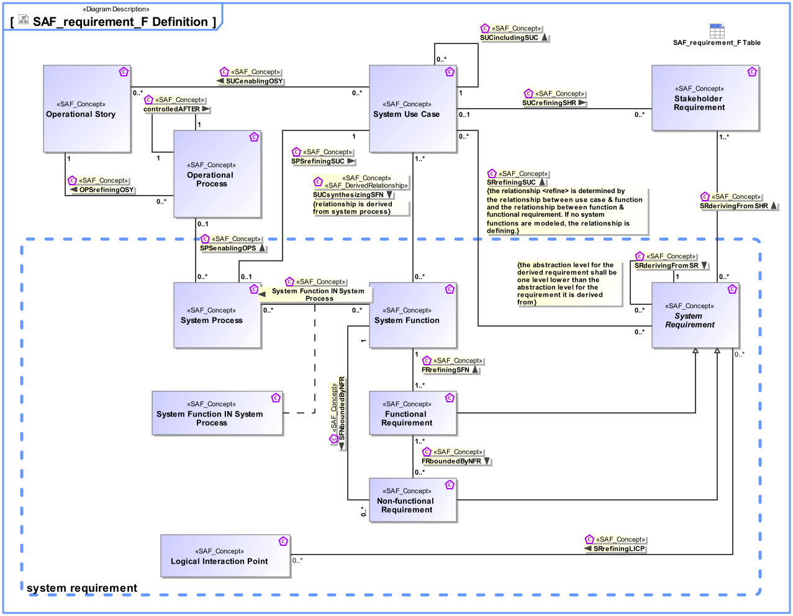

# SAF Development Documentation : Concepts : requirement_F 

|Concept|Documentation|
| --- | --- |
| FRboundedByNFR | Specifies the fact that a Non-Functional Requirement constrains Functional Requirements.|
| FRrefiningSFN | Specifies the fact that a System Function is refined by Functional Requirements.|
| Functional Requirement | Functional Requirements specify System Functions of the System.|
| Non-functional Requirement | Non-Functional Requirements specify the quality of System Functions, or non-functional requests like legal conformance.|
| OPSrefiningOSY | Specifies the fact that an Operational Story is refined by one or more Operational Processes.|
| Operational Process | An Operational Process captures activity-based operational behavior including scenarios, activity actions, and operational exchange flows, e.g., including information, materials, natural resources, etc.  Aliases: UAF::Operational Activity NAF::Logical Activity|
| Operational Story | The Operational Story represents one or more Operational Use Cases in the Usage Scenario identified by the Operational Context. The Operational Story is described as narrative story-telling.|
| SFNboundedByNFR | Specifies the fact that a Non-functional Requirement constrains System Functions.|
| SPSenablingOPS | Specifies the fact that a System Process enables the accomplishment of an Operational Process.|
| SPSrefiningSUC | Specifies the fact that a System Use Case is refined by one System Process.|
| SRderivingFromSHR | Specifies the fact that a System Requirement is derived from a Stakeholder Requirement. Note: It may be used in a customer supplier relationship situation and supports the V Model concept of "External Unit Specification". See [VXT].|
| SRderivingFromSR | Specifies the fact that System Requirements are derived from a Stakeholder Requirement.  Note: This is the relationship of requirements of different architectural levels. When the team responsible for the subsystem has direct access to the full upstream requirements set, then no subcontractor relationship needs to be established.|
| SRrefiningSUC | Specifies the fact that a System Use Case is refined by System Requirements.|
| SUCenablingOSY | Specifies the fact that a System Use Case enables the realization of an Operational Story.|
| SUCincludingSUC | Specifies the fact that a System Use Case includes other System Use Cases. The included use case is then no longer a full System Use Case, but a partial System Use Case.|
| SUCrefiningSHR | Specifies the fact that a Stakeholder Requirement is refined by System Use Cases.|
| SUCsynthesizingSFN | Specifies the fact that a System Function is used in a System Use Case, e.g., as a Trigger, Action, or Task.  Note: This is a derived relationship.|
| Stakeholder Requirement | A Stakeholder Requirement is a Requirement imposed by a Stakeholder. Stakeholder Concerns are refined by Stakeholder Requirements applicable for the SOI. The Stakeholder Requirements are a result of discussions and agreements of how the SOI addresses the Concerns of the respective Stakeholder.|
| System Function | Specifies the fundamental action or task that have to take place in the System in accepting and processing the inputs and in processing and generating the outputs. A System Function  * accepts input from the System boundary   * exposes its output at the System boundary  * changes the System's State  * is dependent on System's State Note: A System Function does not need to expose observable output, when it changes the System's state in a way that is observable by other system functions. Furthermore, a System Function does not need to accept any input from the system boundary, when it is dependent on the System State, which in turn is changeable by other System Functions.|
| System Function IN System Process | Specifies the fact that a System Function is used in a System Process.|
| System Process | Specifies the fact that a System Process captures system behavior as a specific sequence of actions or tasks, and system exchanges including information, materials, energy, etc.|
| System Requirement | System Requirements specify System Functions, non-functional properties, or constraints of the System.|
| System Use Case | The System Use Cases are a table of content of the services provided by the System of Interest to its System Actors. A System Use Case is only the abstract of the depicted System behavior and represents the purpose. While the main System of Interest interaction actors participating in this Use Case are identified, the behavior itself is specified by a Use Case Activity,  Note: The intended use (and also misuse in so called "black use cases") of the System of Interest is captured in free text; story telling at a coarse level of detail which is understandable to Customers (non engineering stakeholders in general).|
| controlledAFTER | Specifies the sequencing of Operational Processes in time.|
