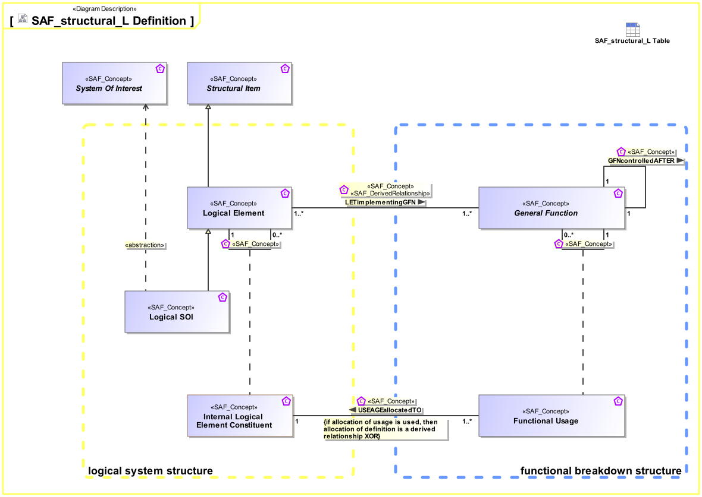

# SAF Development Documentation : Concepts : structural_L 

|Concept|Documentation|
| --- | --- |
| GFNcontrolledAFTER | Specifies a sequential execution of Functions.|
| General Function | Specifies the fact that a General Function is used as base Class for specific System or Context Functions.|
| General Functional Usage | Specifies the fact that a Function is used by one or more other Functions.|
| LETbeeingInSSE | Specifies the  System States a Logical Element can be in.|
| LETimplementingGFN | Specifies the fact that a Logical Element is responsible to implement a System Function. Note: Logical Elements don't "implement" anything, they pass the function implementation task to Physical Elements.|
| Logical Context SOI | Represents the Logical SOI in the System Context on Logical Level.|
| Logical Element | Describes a conceptual Logical Element as specification for an implementation of a system, or system element.|
| Logical Element Role | Specifies the fact that a logical element comprises logical elements.|
| System | An abstract element representing a System.|
| System Of Interest | An abstract element representing a SOI. Base class for specific kinds of SOIs.|
| System State | Describes a state (or mode) of something that can have distinct states.|
| USAGEallocatedTo | Specifies the fact that a Usage of Function is allocated to a Usage of System Element.|
