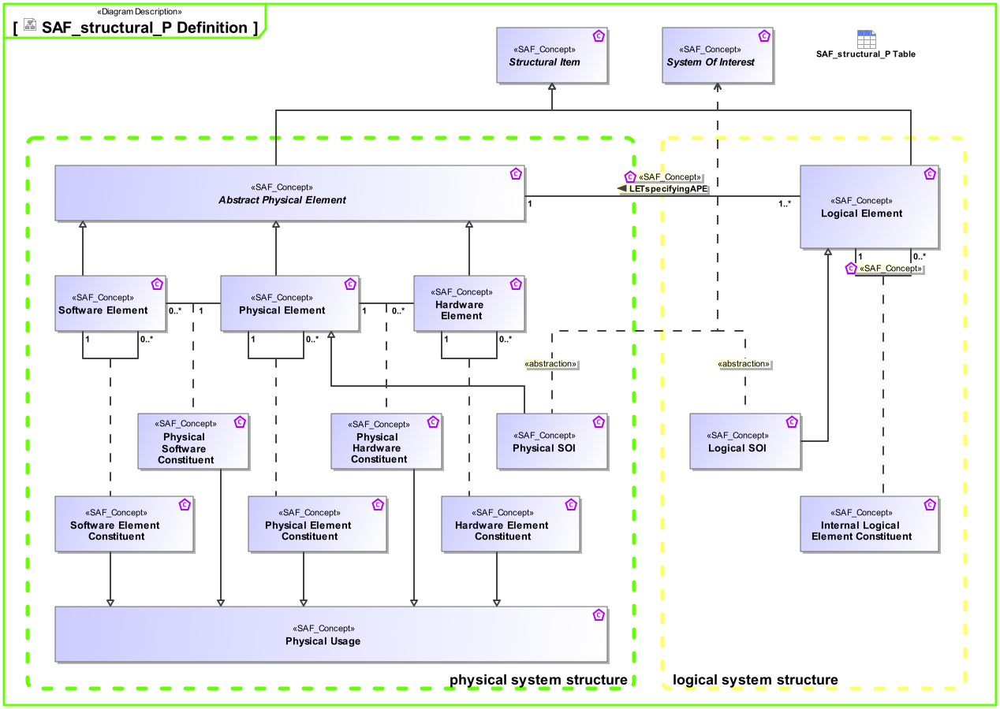

# SAF Development Documentation : Concepts : structural_P 

|Concept|Documentation|
| --- | --- |
| Abstract Physical Element | Abstract element representing physical structure items keeping properties and relations applicable to all physical items.|
| General Physical Role | General concept of usage of system elements in the context of other system elements on physical level.|
| Hardware Element | Pure Hardware Elements. Similarity with the V-Model "hardware unit".|
| Hardware Element Role | Specifies the fact that a hardware structure comprises hardware elements.|
| ILERspecifyingAPR | Specifies that a usage of a logical element specifies functions for the usage of a physical element.|
| Internal Logical Element Role | Specifies the fact that a logical structure comprises logical elements.|
| LETspecifyingAPE | Specifies the fact that one or more Logical Element specifies exactly one Physical Element.  Rationale: If more than one Physical Element would offer to realize the functionality specified by a Logical Element the responsibility would be ambiguous. It is okay to assign several Logical Elements to one Physical Element. This means all specified functionality assigned to the Logical Elements is to be implemented by the Physical Element.  Note, that typically the usage of logical elements in a context is mapped to the usage of physical elements in a context (allocation of usage). Thus this relationship between the definitions is derived.|
| Logical Element | Describes a logical, conceptual system as specification for an implementation of a system, or system part.|
| Logical SOI | A SOI representation in the Logical Domain.|
| Physical Element | A composition of Hardware and Software Elements. Similarity with the V-Model segments and system. See [VXT].|
| Physical Element Role | Specifies the fact that a physical structure comprises physical elements.|
| Physical Hardware Role | Specifies the fact that a physical structure comprises hardware elements.|
| Physical SOI | Represents the Physical SOI in the Physical Domain.|
| Physical Software Role | Specifies the fact that a physical structure comprises software elements.|
| Software Element | Pure Software Elements. Similarity with the V-Model "software unit".|
| Software Element Role | Specifies the fact that a software structure comprises software elements.|
| System | An abstract element representing a system.|
| System Of Interest | An abstract element representing the SOI. Base for specific perspectives on SOI (logical , physical)|
