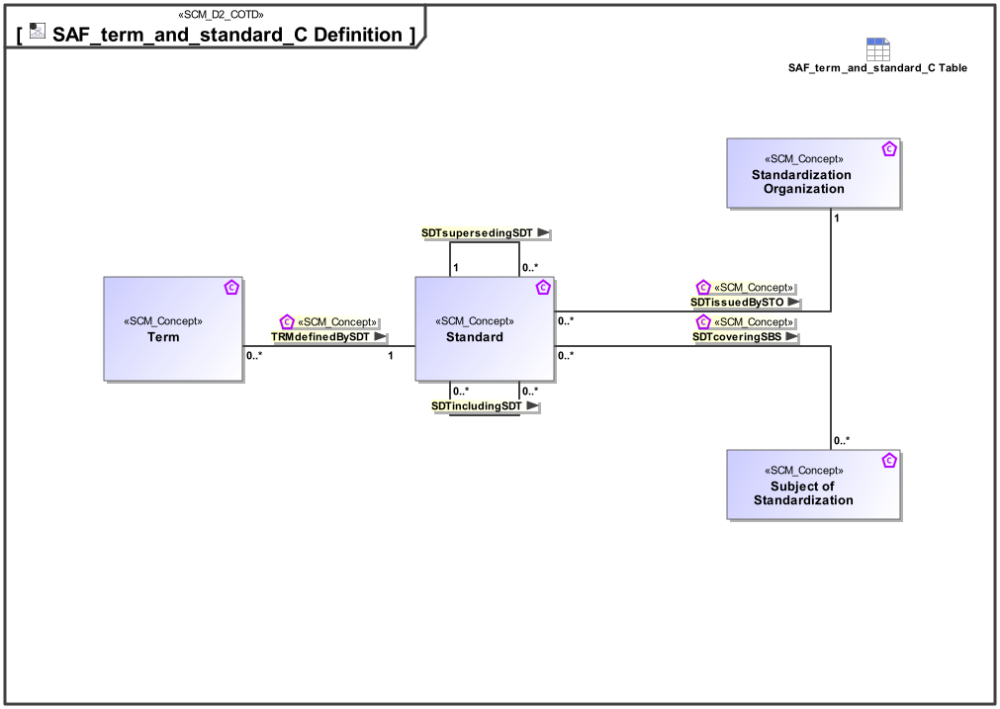

# SAF Development Documentation : Concepts : term_and_standard_C 

|Concept|Documentation|
| --- | --- |
| SDTcoveringSBS | Specifies the fact that a standard covers a specific subject of standardization, e.g., Data Exchange Format or Protocol.|
| SDTincludingSDT | Specifies the fact that a standard is part of another standard.|
| SDTissuedBySTO | Specifies the fact that a standard is issued by an organization of standardization.|
| SDTsupersedingSDT | Specifies the fact that a standard supersedes one or more other standards.|
| Standard | An international standard is a technical standard developed by one or more international standards organizations. International standards are available for consideration and use worldwide.|
| Standardization Organization | An organization of standardization, e.g., International Organization for Standardization (ISO), Object Management Group (OMG), etc.|
| Subject of Standardization | The goal of standardization is to ensure uniformity to certain practices within the industry. Standardization focuses on the product creation process, operations of businesses, technology in use, and how specific compulsory processes are instituted or carried out. Subject of standardization may be  a Data Exchange Format or a Protocol.|
| TRMdefinedBySDT | Specifies the fact that a term is defined by a standard.|
| Term | Specifies the fact that a term is usually defined by a standard, but can also be defined as part of system development work.|
