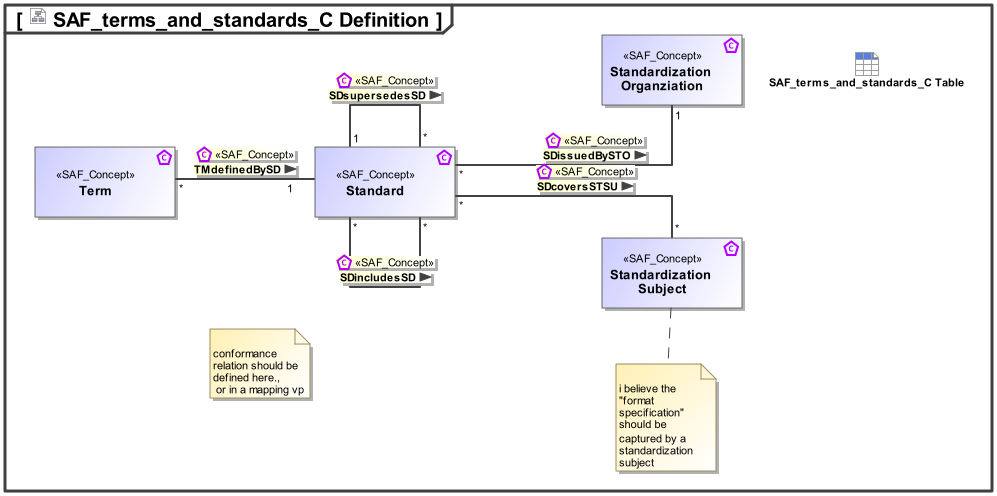

# SAF Development Documentation : Concepts : terms_and_standards_C 

|Concept|Documentation|
| --- | --- |
| SDcoversSTSU | Specifies that a standard covers certain subjects or topics.|
| SDincludesSD | Specifies that a Standard is part of an other Standard |
| SDissuedBySTO | |
| SDsupersedesSD | Specifies that a standard supersedes one or more other standards.|
| Standard | A Standard is issued by a standardization orgization, e.g ISO, OMG. E.g. JPEG, ISO 15288.|
| Standardization Organziation | A Standard is issued by a standardization orgization, e.g ISO, OMG.|
| Standardization Subject | Subject of standardization of a standard, e.g. File Format or Protocol.|
| TMdefinedBySD | Specifies that a Term is defined by a Standard.|
| Term | A Term is usually defined  by some Standard, but may also be definen within a systems engineering effort.|
