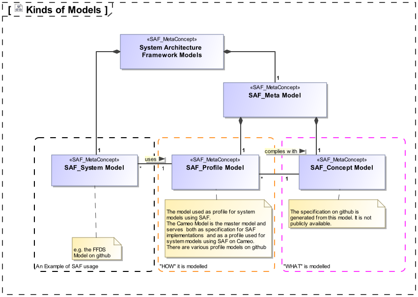
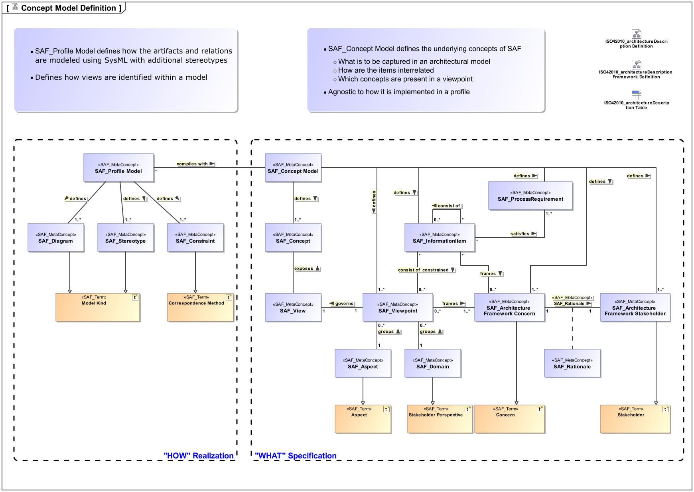

# How SAF is Developed?

SAF is developed to foster Model Based Systems Engineering, and itself is developed using also a model based approach. To avoid confusion among the different kinds of models, they are explained in the next chapter.

## Kinds of Models

There are several kinds of models around SAF serving a certain purpose

* **SAF System Model** 
  This is a model dedicated to the development of one or more systems. It is a model that users of SAF create and maintain. It may be maintained in one of the Tools supported by a SAF Profile Implementation Model. The SAF example models are System Models.
* **SAF Profile Implementation Model** 
  This is a model needed to create a SAF System Model. It is tool specific and (hopefully) compliant to the SAF Specification. There are currently several contributed models:

  * [SAF-Cameo-Profile](https://github.com/GfSE/SAF-Cameo-Profile)
  * [SAF-Rhapsody-Profile](https://github.com/GfSE/SAF-Rhapsody-Profile)
  * [SAF-EA-Profile](https://github.com/GfSE/SAF-EA-Profile)

  The Repositories usually also contain an example System Model
* **Conceptual Model** 
  The conceptual model contains the definitions serving as foundation for SAF development. See the following chapter for details

## Conceptual Model

The conceptual model is the foundation of SAF development.
It governs, which items SAF consist of and how these items are related.

The inner architecture follows the concepts of ISO 42010.

Within the conceptual model the following elements can be recognized (many of them are specializations of ISO 42010 Concepts):

* **SAF Architecture Framework Stakeholders**  are classes of users having an interest on the information that is maintained in a SAF System Model.
* **SAF Architecture Framework Concerns**  sketch out the information need of SAF Architecture Framework Stakeholders, which in turn should be adressed by a SAF System Model.
* **SAF Rationale**  expains why a SAF Architectur Framework Stakeholder has abovementionend information need resulting in a SAF Architecture Framework Concern
* **SAF Concepts**  are the conceptual definition of items and their relationships forming an information network to be kept in a SAF System Model, in order to give answers to the SAF Architecture Framework Stakeholders Concerns.
* **SAF Viewpoints**  select a set of SAF Concepts in order to adress the information need expressed by a certain set of abovementioned Stakeholers Concerns.
  In SAF the size of Viewpoints should be optimized to support tailoring by selection of viewpoints appropriate to the engineering problem at hand. This  means that SAF Viewpoints should adress only a small number of well defined Concerns.
  
* **SAF Information Items**  are like SAF Viewpoints but at a larger scale. They can group SAF Viewpoints while constraining them further. They also can be nested.
  This allows to specify Information Items like e.g. an ISO 29148 SyRS by breaking it down into smaller Information Items and finally into Viewpoints.
  This allows to define which concerns are to be adressed e.g. by a SyRS document and which viewpoints are needed for it.
  The goal is, to precisely define the needed model work for certain points in an engieering project.

# How is SAF documented ?
The documentation of SAF is needs to support different use cases of different personae:
## SAF Users::SEMP Author
The author of a SEMP for a system in a certain project context wants to know:
- which viewpoints are relevant for the systems engineering
- how will we use the viewpoints and what is the benefit
- which viewpoints will we need additionally
- what do we potentially lose if we omit viewpoints
- what is the recommended workflow through the viewpoints[^1]

Those questions need an answer in order to plan the MBSE appoach. Every project is different, and the focus of modeling should be set accordingly. One needs to know where in the Lifecycle, and for which processes activities ( we use ISO15288) the the viewpoints will provide a benefit.

Most of the questions are supported by the following "steckbrief" characteristics of the viewpoint description.
- Purpose
  (motivation and selling point of VP)
- Applicability
  (where in the life cyle, which iso process, chapter in SE Handbook, usage in Reviews)
- Stakeholders
  (Architecture Framework Stakeholders having a rationale founded concern)
- Concerns
  (Rationale founded concerns )
- Dependencies to other VP
  - hard dependencies (required vp is needed, otherwise this vp cant be filled)
  - soft dependencies (recommended vp supports this vp but could be omitted without breaking things)

## SAF Users::Model User
The user of a model (author or reader) wants to know:
- how do i read a viewpoint
- how do i create/fill a viewpoint
- what is the order to fill viewpoints
- what diagrams and model elements do i use
- what is the minimum content of the viewpoint
- what is the recommended workflow through the viewpoints[^1]

This is supported by the following "steckbrief" characteristics of the viewpoint description.
- Iconic Primary Example
  - showing key concepts of the VP, recognizing fullfilment of concerns
  - one for each presentation
- further Examples
  (showing variations of usage, togehter with explanations)
- Presentations
  (alternate forms how the VP is presented, e.g. Diagram and Table)
- Dependencies to other VP
  - hard dependencies (required vp is needed, otherwise this vp cant be filled)
  - soft dependencies (recommended vp supports this vp but could be omitted without breaking things)
- Used stereotypes
  (List of stereotypes to be used in the VP)

## SAF Developers::Framework Developer
The framework developer wants to know:
- how can i extend the framework by new viewpoints ?
- what is needed for a viewpoint specification ?
- how can i use the SAF Documentation as a base for my company MBSE framework ?
Those questions arise within the development of SAF by the working group and also by third parties when they want to contribute to the framework.

The development documentation aims to answer those questions. See next chapter.

## Development Documentation
The Development Documentation is separated from the User Documentation. 
It consists of 
* [Development Guideline](saf-dev-guideline.md)
* [List of Concepts](concept/concepts.md)
* [Concept Overview Diagrams](concept/concept-overview.md)
* [Development view on SAF Viewpoints](viewpoints/viewpoint-dev.md)

[^1]: The question about the recommended workflow cannot be answered by a single viewpoint description, this is an overarcing topic, which is currently not covered by the SAF documentation. [See issue 14](https://github.com/GfSE/SAF-Specification/issues/14)
