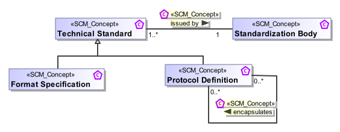
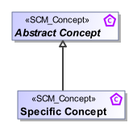
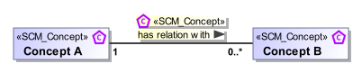
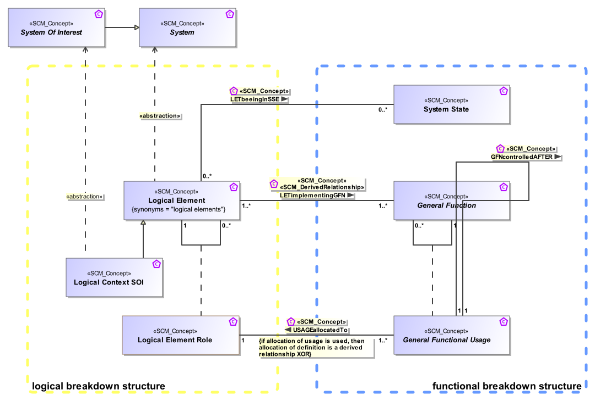
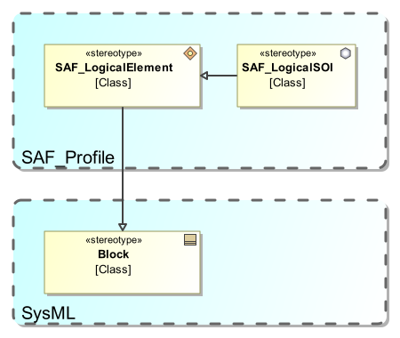
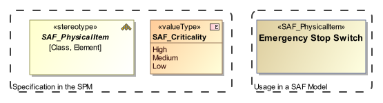
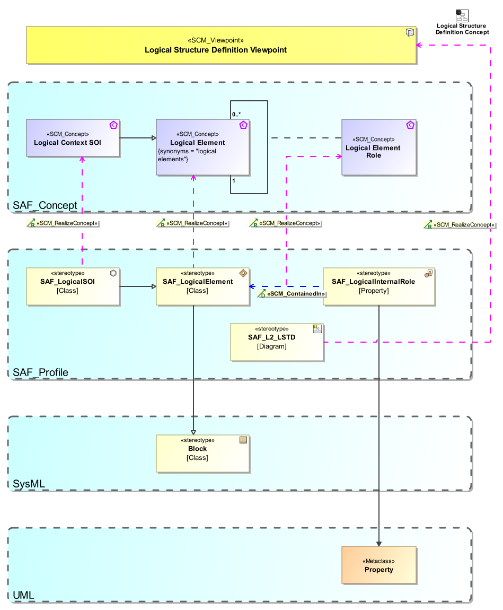
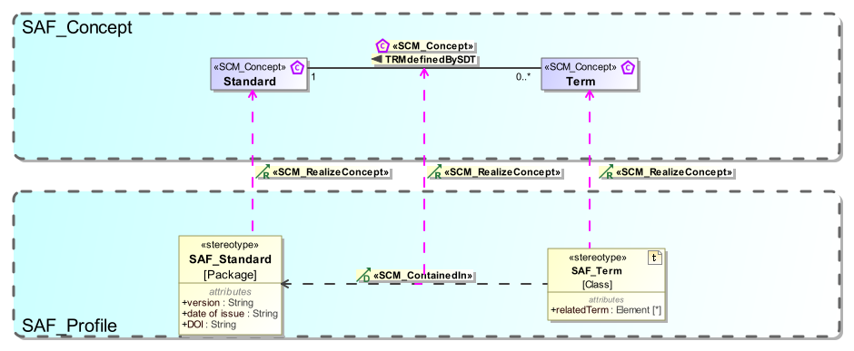
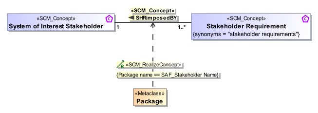
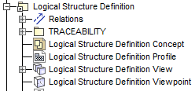

# Concept and Profile Modeling Guideline
## General
The backbone of the SAF is the SAF Metamodel. The SAF Metamodel is dedicated to model based systems engineering and reflects the SE ontology in this domain. It ensures the inherent consistency of the system of interests' model generated according to the SAF.
The SAF Metamodel consists of two specialized models: the abstract SAF Conceptual Model describing the concepts used in the systems engineering domain, and the Viewpoints of SAF and the SAF Profile Model focusing on the implementation of those concepts in a profile.

The SAF Profile Model serves as a specification for any SAF Profile Implementations in Modelling Tools.
Both Model parts are captured in the Tool MagicDraw. (This is a decision of the SAF Working group – it could have been any Tool)

For defining terms used in the SAF and assuring the consistency across their usage in the architecture description, the SAF Conceptual Metamodel (SCM) is used. The SCM defines the terms and concepts used and the relations between them. These terms and concepts match with common understanding as described by ISO15288 and INCOSE handbook. The SCM specifies WHAT is captured in the system of interests model. It is limited to the scope of what is considered in the SAF and is not a complete description of all the concerns of systems engineering. 

SCM also specifies the views (diagrams, tables, matrixes and other work products) that could be generated and their content i.e. the concept model elements and information contained on a diagram, or the queries on the model generating a view content.

The second metamodel, the SAF Profile Model (SPM), depicts HOW the terms and concepts together with their relations are defined the SAF using the SysML modelling language. The SPM identifies which SysML Elements and sterotypes are to be used to represent the system architecture and their organization in the model repository. The SPM traces back to the SCM for compliance demonstration.

The specific system model contains the views, which are specified by the SCM, using the SysML Elements and Sterotypes specified by SPM to capture information about the system and its surrounding. Based on the SPM the tool specific extensions, i.e. the profiles, are provided.
The SCM is independent from tools and SysML language version, while implementations of the SPM depend on the SysML language verion and to a certain degree to the implementation of the SysML standard in available tools and their possibility to automate the modelling, model validation or document generation.

For defining the SCM and the SPM only a few simple model elements are used to ease understanding, clarity, portability and exchange. These elements are defined in the following.

##	Model Elements in the SAF Conceptual Model (SCM)
`Rule: 	You shall not add attributes and types to concepts. For the conceptual metamodel a textual description shall be enough.`

`Rule: 	Every conceptual item shall be described.`

See the actual [Documentation of the concept elements](../concept/concept-overview.md) for more examples of use.

Following model elements are used in the SAF Conceptual Model.
###	Classes 
Classes stereotyped as **<<SAF_Concept>>** represent any concept or term in the SAF Conceptual Model (SCM).

Example:

The following rules apply:
* Every class needs a description.
* No attributes are modelled, put everything in the description.

###	Generalization
Inheritance i.e. generalization / specialization relations are used to indicate that a specific concept is a kind or a variant of a more general concept. 

Following semantics apply:
* The general concept is used in the model to represent the set of different variants of that kind. 
* Whenever the general concept is used in the model, it may be replaced with one of the more specific concepts.
* Any property or relation defined for the general concept applies for the specific concepts as well.
* Any property or relation defined for the specific concept does not apply to the general concept nor to the other specific concepts of the same kind.
* Avoid overly complicated inheritance. Sometimes using a constraint may be more appropriate.

Example:

A Format Specification is a kind of Technical Standard and has all the attributes and properties of the Technical Standard but may define additional properties.
The Protocol Definition is also a Technical Standard but has different properties as the Format Specification.

The Format Specification and the Protocol Definition are both issued by a Standardization Body, but only the Protocol Definition can encapsulate further protocol definitions.

###	Abstract Concepts
Note, that a concept can be marked as “Abstract”. This means that the abstract concept is not used directly but typically inherited concepts are used.

Example:

`Rule: Use abstract metamodel items if appropriate.`

###	Composition and Aggregation
Composition and Aggregation relationships are not used. Use undirected associations instead.

`Rule: Do not use composition or aggregation.`
###	Associations
Undirected associations are used to model the relations between two concepts. 
They get the stereotype **<<SAF_Concept>>**.

Example:

The Concept A has a relationship to Concept B. 

`Rule: Use only undirected association`

####	Naming of Associations
The name for the association indicates how the two concepts are related. The reading direction of the association name is necessary to understand the semantics, and must be set.
One should be able to assemble a sentence like:

**“Concept A”     “CA has relation with CB”   “Concept B”**.

Include shortended Pre and Postfixes to indicate which concepts are related

`Rule: Name every association.`

`Rule: Association names must be unique.`

`Rule: Use direction arrow on association name.`

####	Multiplicity
For the sake of simplicity, the multiplicity at both ends of the association may be used as appropriate. It is preferred to specify the multiplicities explicitly.

Example:

 

In this example case a Physical System Context contains at least one, but maybe more Context elements. However, the Context Element may be used in several Physical System Contexts, or not at all. 
####	Role Names
Role names at the ends of the association are usually not used. However, in some cases it is necessary to distinguish roles, especially if the same concept is involved in different roles. In these cases, the role names are mandatory.

Example:
 
 

The example shows a Concept “State”, and the relationship between “State” in the role “source state” and the role “target state”.
####	Association Classes
If the Association represents a valuable concept; it may be worth to model it as an association class. Since an association class can be part of other associations, an association class may be the only way to 
express elaborated concept relationships.

Example:

 

In the example a Requirement refines a state transition of a state model.
####	Derived Relationships
In SAF certain viewpoints represent analysis results from queries spanning several concepts and their relationships.

E.g. A viewpoint could compute a requirement to state mapping by following the relations from “requirement” over “transits to state” to “state”.

In order to specify such queries, a new derived relationship between state and requirement is drawn and marked by the stereotype **<<SAF_derived_relationship>>**. The description of the derived relationship must contain sufficient information how the information is to be derived.

Example:

 

Since SAF is customizable in terms of “skipping” viewpoints and taking “shortcuts”, a viewpoints specification may change a derived relationship into a defining relationship.

Regarding the abovementioned example this would mean, if no transitions were in the model, it would be allowed to trace requirements to states manually, instead to have the relationship computed from the model. 
It is up to a viewpoint specification to define such constraints.

`Rule: 	Redundancy is fine`

Redundant relationships can show different perspectives on information that can be derived from the model. It should then be specified which information is derived. Having seemingly redundant relationships can avoid hard understanding constraints.
###	Constraints
Constraints should be used to express restrictions to concepts. Sometimes a simple constraint can avoid an overly complex inheritance hierarchy.  
Care should be taken to balance the overall readability of the SAF Conceptual Model.

Example for constraints
**XOR One or the other but not both (mutual exclusion)**

`Rule: 	Use constraints sparsely, only easy constraints, but use them if necessary.`
 

###	Comments and Notes
Comments and notes may be placed on a diagram and may be anchored to each element or relation in the conceptual model.
Use Notes for explanation, use comments only for model management.

Example:

 
 
###	Graphical Elements
The conceptual model is important for communication. Therefore, the diagrams may contain additional graphical elements like dashed boxes or coloured boxes to support the understanding of the concepts.

In the Example, a dashed box is used to separate logical and functional concepts.

 

##	Model Elements in the SAF Profile Model
The SAF Profile Model (SPM) defines the stereotypes used for SAF Models. SPM reuses UML/SysML wherever practical to satisfy the requirements and leverage features from both UML and SysML.

Reusing SysML and UML Element in the SAF Profile implies that they may be used at will by a SAF user. Wherever SAF constrains the usage of SysML or UML this is specified explicitly by means of constraints.

The SPM stereotypes either extend UML metaclasses, or specialize SysML stereotypes.

Additionally, the SPM contains library elements to be used in SAF models. These can be types for tagged values used by SAF and base model elements to be used in SAF models (e.g. a set of common stakeholders).

The SPM uses the following Elements:
##	UML metaclass 
Identifies an original UML Element from the UML metamodel. 
Note that the origin of the Element should be shown by a graphical element (dashed box). Tbd: Update Example.

Example:
 
  
##	UML Metaclass extension relationship
Specifies that a stereotype extends an UML metaclass.
Note that the origin of the Element should be shown by a graphical element (dashed box). Tbd: Update Example.
 
Example:

   

The stereotype “SAF_SystemFunction” from the SAF Profile extends the UML metaclass “Activity”
##	SysML Stereotype
Identifies a Stereotype from the SysML profile.
Note that the origin of the Element should be shown by a graphical element (dashed box). Tbd: Update Example.

Example:

##	Generalization relationship
Specifies that a stereotype specializes another stereotype.
Note that the origin of the Element should be shown by a graphical element (dashed box). Tbd: Update Example.

Example

SAF_LogicalElement specializes “Block” from the SysML profile and SAF_LogicalSOI specializes SAF_LogicalElement even further.   
##	SPM Stereotypes 
A SPM Stereotype can be 
* an extension of an UML metaclass
* a specialization of a SysML or UML stereotype
* a specialization of another SPM stereotype

`Rule: 	A SPM_Stereotype is either specialized from one SysML stereotype or another SPM stereotype or an extension of an UML metaclass.`

`Rule: 	Relations between SysML Elements are not neccessarily shown even though they exist. Relations between SPM Elements are to be shown.`
##	Tagged values of SPM stereotypes
Tagged values are either 
* specified as properties of SPM stereotypes, or 
* as relationships between SPM stereotypes and other stereotypes, or
* As relationships between SPM stereotypes and UML metaclasses.

For the types of SPM stereotype properties, the basic types from the UML profile shall be used. SPM may introduce own types (e.g. enumerations) when appropriate.

Example:

 
The stereotype SAF_PhysicalElement has a tagged value criticality of an enumeration type “SAF_Criticality“ wich is also defined in SPM. In a project model using SAF an “Emergency Stop Switch” is modelled with the criticality set to “high”

TBD: give examples for relations

##	Traceability to SAF Concept Model (SCM)
The implementation of SAF concepts by SAF profile elements is shown by an UML “abstraction ” stereotyped to **<<SAF_RealizeConcept>>** relationship from the implementing element to the concept element.

Example:

 
In the above example the concept “Logical Elemen” is implemented by a stereotype SAF_LogicalElement from the SAF Profile which inherits from SysML Block. The Itnernal Logical Element Role implemented by a plain UML “Property” element.

The Viewpoint itself traces from the Diagram Stereotype SAF_SLV02a_View.

Note the colored boxes to indicate where a definition is located. 

### Traceability to Attribute specifications
The example shows three attribute specifications made by SCM_Attribute dependencies:
* two of them implement relations between System Use Case and State, capturing pre and postconditions. They are implemented as attributes of the SAF_SystemUseCase stereotype. The SCM Attribute dependencies go from the SAF Stereotype to the metaclass State, to specify that plain states shall be referred to.
* the third attribute specification goes from the MetaClass UseCase to SAF_LogicalContext, and specifies that the existing Use Case attribute **subject** shall be used to implement the relation between the SAF Concepts System Use Case and Logical System Context.

### Traceability to "is type of" specifications
tbd: add examples
### Traceability to "is contained in" specifications
The Example shows how the concept Logical Context SOI Role is implemented by the fact that a SAF_LogicalContextRole element is contained in a SAF_LogicalContext element.

 
##	Implementation Constraints
Constraints in the SAF Profile Model should be used to restrict the usage of UML or SysML elements further, or to specify more precisely what is meant.

 

Example : constraint  on implementation relationship

**Note, that many constraints can be replaced by the formally more precise r <<SCM_Attribute>>, <<SCM_typeOf>> and <<SCM_containedIn>> relations.**

Example: constraint on stereotype

 

In the example a constraint is imposed on the sterotype, to further specify the intended direction of the stereotyped dependency.

`Rule:Use constraints sparsely, only easy constraints, but use them if necessary to maintain correctness of the model.`
##	 Abstract Stereotypes
Stereotypes can be marked as “abstract”. This means that they are not intended to be applied to any SAF system of interest model.
The use of abstract stereotypes is recommended only if tagged values are to be bound to them and other non-abstract stereotype inherit those tagged values.

Example 

 

The Example shows an abstract stereotype SAF_PhysicalElement with a tagged value criticality, which is inherited by the stereotypes used for software elements, hardware elements and assemblies in the physical architecture.
 
The following diagram shows an example usage in a system of interest model

  

`Rule: Use abstract stereotypes only to pass tagged values to inheriting stereotypes`

##	View and Viewpoint Specifications
Major elements in the SAF Metamodel are the Viewpoint specifications, I.e. the specification what information and model elements should be presented in in system models, and how the information is presented (e.g. as a diagram, in a table, in a matrix or other work products).

For  Viewpoint elements the <<SAF_Viewpoint>> stereotype shall be used.

 
A **SAF_Viewpoint** specifies 
* how a view onto the system model is to be constructed and presented (Diagrams, Queries, Tables..) by a textual description the presentation attribute. Note, that several presentation entries are possible and used for alternate presentations.
* what the purpose of the viewpoint is, in the purpose attribute.
* what the applicability of the viewpoint is, in the applicability attribute.
* Which concerns of engineering stakeholders it addresses, by references in the concernlist attribute.
* Which engineering stakeholders the viewpoint is made for, by references in the interested_stakeholder attribute. Note, that this attribute is derived from assigned concerns, and then the relationship between stakeholders and concerns.
* The Aspect and Domain of the SAF Matrix, by references in the Saf_aspect and Saf_domain attributes
* Wich other viewpoints are needed as a precondition, by references in the saf_required_vp attribute
* Which other viewpoints are recommended by references in the saf_recommended_vp attribute

A **SAF_View**
Note, that the SAF_Views define what concepts are shown in the viewpoint. Since this is the specification of a Framework, we must expose SAF concepts, not elements of a system model.
* Conforms to exactly one **SAF_Viewpoint** by a conform relationship (the newer generalization type of conform shall be used).
* Exposes certain Concept Model elements by an expose relationship.

In the SAF Metamodel the following conventions are used
`Rule:	A View is always related one to one to a Viewpoint`
`Rule:	A View exposes SAF Concepts from the SAF Conceptual Model.`

Example of a view specification in the SAF Metamodel

 
In the example a view SLV1 “Logical Structure Viewpoint is specified by means of the SAF_View and SAF_Viewpoint elements. The View exposes the relevant concepts of the SAF Conceptual model.
Additionally, to view specification a diagram showing the viewpoint implementation is provided.

The example shows how the concepts that are exposed in a view are implemented in the SAF Profile

In the SCM these elements are grouped in one package per Viewpoint specification:
 
The naming convention is as follows: 
 
* A view specification shall have a common prefix <name>, e.g. “Logical Structure in the abovementioned example.
* The concept model diagrams name shall be"<name> Concept"
* The profile model diagram name shall be a profile diagram "<name> Profile"
* The  viewpoint elements name shall be "<name> Viewpoint"
* The view elements name shall be "<name> View"

##	Package structure of SCM
The package structure is as follows
 
Packages
* SAF Library contains concept model items, stakeholders and concerns
* SAF Viewpoint contains the view specifications grouped by SAF domains:
* A viewpoint specification consists of a view, a viewpoint, a class diagram showing the concept model, and a profile diagram showing the profile specification for the viewpoint. Additional traceability may be provided.
 
 

