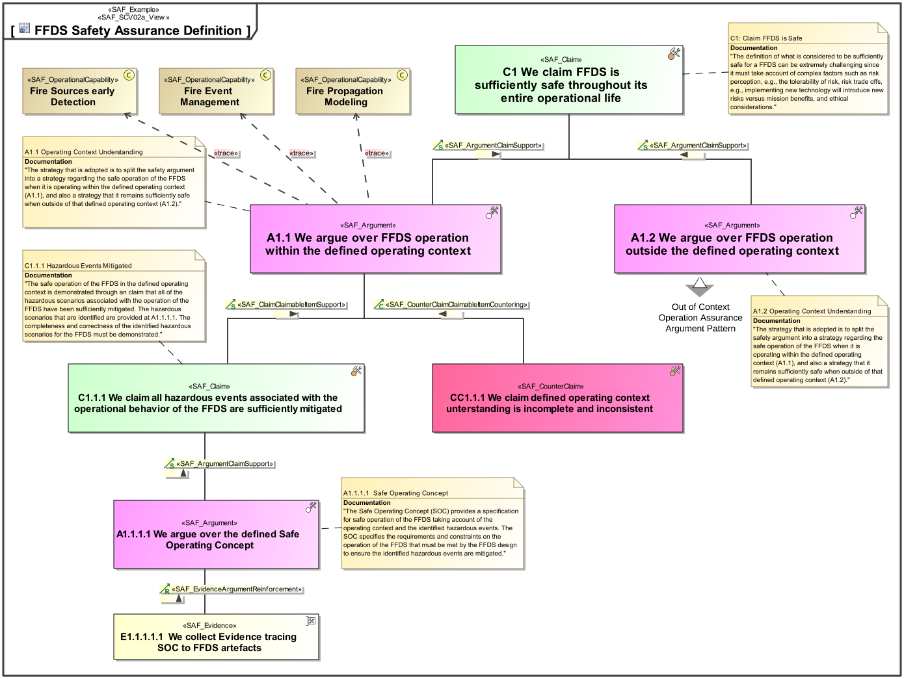
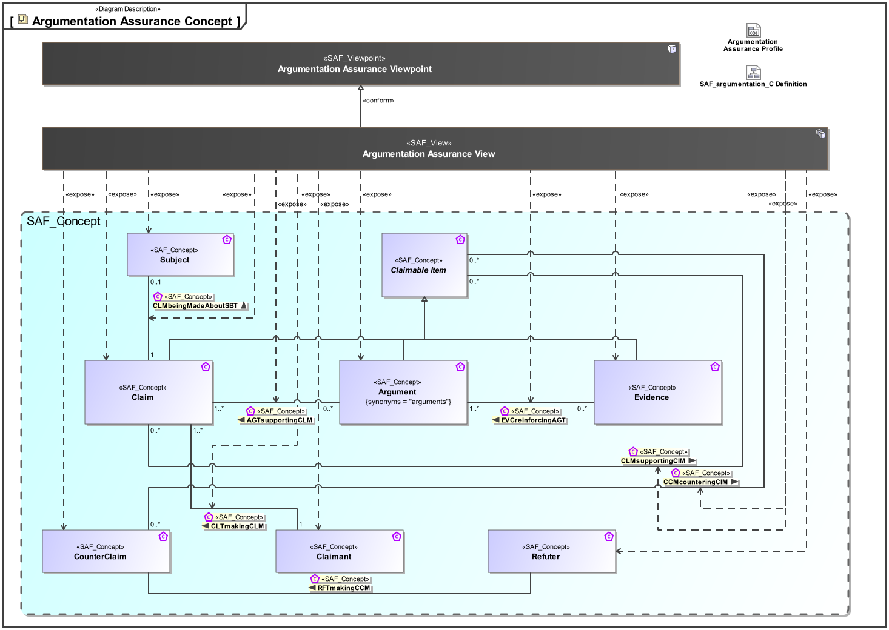
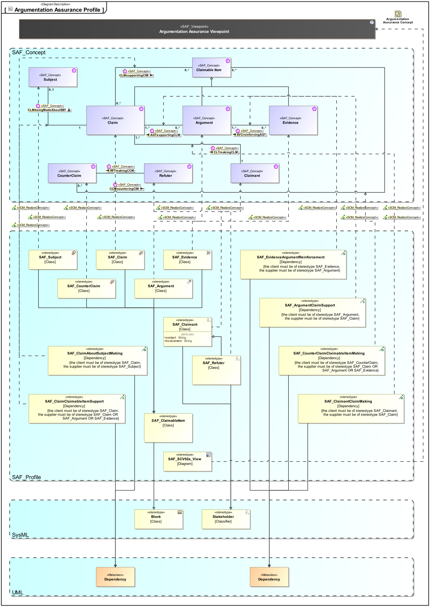

# SAF Development Documentation : Argumentation Assurance Viewpoint
|**Domain**|**Aspect**|**Maturity**|
| --- | --- | --- |
|[Common](../../domains.md#Domain-Common)|[Taxonomy & Structure](../../aspects.md#Aspect-Taxonomy-&-Structure)|[released](../../using-saf/maturity.md#released)|
## Example

## Purpose
The Argumentation Assurance Viewpoint presents claims backed up by arguments that are supported by evidence, together with the possibility to counter such claims in a similar manner.
## Applicability
The Argumentation Assurance Viewpoint supports the ability to present an evidence pattern, a structure of claims, arguments, and evidence, which is a common need in systems engineering. It applies equally to the establishment of traceability, definition of safety cases, and even the presentation of business cases.
## Stakeholder
## Concern
* How is a evidence-based claim supported?
## Presentation
A block definition diagram (BDD) featuring a claim-argument-evidence (C-A-E) pattern.

## Profile Model Reference
|Stereotype | realized Concept|
|---|---|
|[SAF_Argument](../../stereotypes.md#SAF_Argument)|[Argument](../concept/concepts.md#Argument)|
|[SAF_ArgumentClaimSupport](../../stereotypes.md#SAF_ArgumentClaimSupport)|[AGTsupportingCLM](../concept/concepts.md#AGTsupportingCLM)|
|[SAF_Claim](../../stereotypes.md#SAF_Claim)|[Claim](../concept/concepts.md#Claim)|
|[SAF_ClaimAboutSubjectMaking](../../stereotypes.md#SAF_ClaimAboutSubjectMaking)|[CLMbeingMadeAboutSBT](../concept/concepts.md#CLMbeingMadeAboutSBT)|
|[SAF_ClaimClaimableItemSupport](../../stereotypes.md#SAF_ClaimClaimableItemSupport)|[CLMsupportingCIM](../concept/concepts.md#CLMsupportingCIM)|
|[SAF_Claimant](../../stereotypes.md#SAF_Claimant)|[Claimant](../concept/concepts.md#Claimant)|
|[SAF_ClaimantClaimMaking](../../stereotypes.md#SAF_ClaimantClaimMaking)|[CLTmakingCLM](../concept/concepts.md#CLTmakingCLM)|
|[SAF_CounterClaim](../../stereotypes.md#SAF_CounterClaim)|[CounterClaim](../concept/concepts.md#CounterClaim)|
|[SAF_CounterClaimClaimableItemMaking](../../stereotypes.md#SAF_CounterClaimClaimableItemMaking)|[CCMcounteringCIM](../concept/concepts.md#CCMcounteringCIM)|
|[SAF_Evidence](../../stereotypes.md#SAF_Evidence)|[Evidence](../concept/concepts.md#Evidence)|
|[SAF_EvidenceArgumentReinforcement](../../stereotypes.md#SAF_EvidenceArgumentReinforcement)|[EVCreinforcingAGT](../concept/concepts.md#EVCreinforcingAGT)|
|[SAF_Refuter](../../stereotypes.md#SAF_Refuter)|[Refuter](../concept/concepts.md#Refuter)|
|[SAF_SCV02a_View](../../stereotypes.md#SAF_SCV02a_View)|[Argumentation Assurance Viewpoint](../concept/concepts.md#Argumentation-Assurance-Viewpoint)|
|[SAF_Subject](../../stereotypes.md#SAF_Subject)|[Subject](../concept/concepts.md#Subject)|
## Input from other Viewpoints
### Required Viewpoints
*none*
### Recommended Viewpoints
*none*
# Viewpoint Concept and Profile Diagrams
## Concept

## Profile

