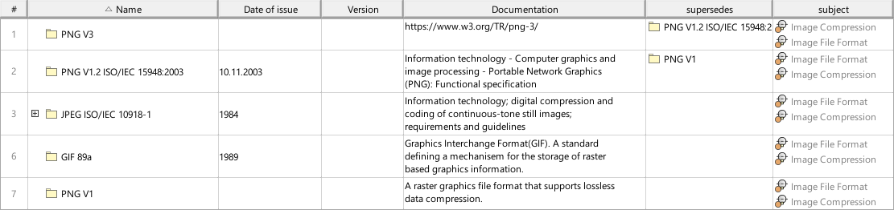
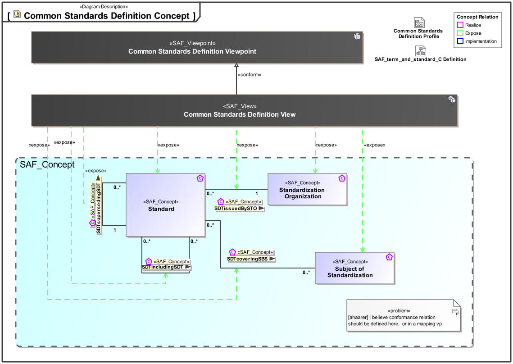
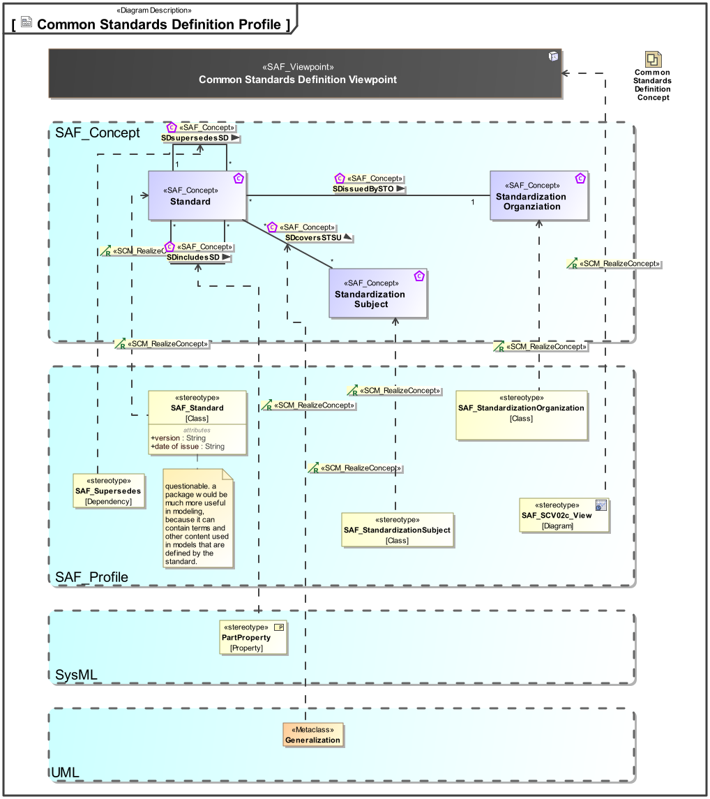

# SAF Development Documentation : Common Standards Definition Viewpoint
|**Domain**|**Aspect**|**Maturity**|
| --- | --- | --- |
|[Common](../../domains.md#Domain-Common)|[Taxonomy & Structure](../../aspects.md#Aspect-Taxonomy-&-Structure)|[proposed](../../using-saf/maturity.md#proposed)|
## Example

## Purpose
The Standards Definition Viewpoint is used to define applicable standards, e.g. format specifications, protocol specifications, regulations and engineering documents that are used throughout the model. It provides the metadata for the standards e.g. issue, version, release date and origin. The Viewpoint helps to keep track of changes to the set of applicable documents and of new versions of the applied standards. Hyperlinks should be used to refer to documents external to the model.
## Applicability
The Standards Definition Viewpoint supports [tbd].
## Presentation
A block definition diagram (BDD) featuring Standard and Relationship to issuing Organization, Standardization Subject, included and superseded standards

A table containing standard and issuing organization, Standardisation subjects, included and superseded standards.

## Stakeholder
## Concern
* [What are the relevant issues or versions of the standards to be used for the development of the system?](../../concerns.md#_2021x_2_8710274_1700821579663_211989_58619)
* [What is the complete identification of a standard or a specification?](../../concerns.md#_2021x_2_8710274_1700821607046_355547_58633)
* [Which other standards are referenced or referred to by applicable standards?](../../concerns.md#_2021x_2_8710274_1700821592720_121043_58626)
* [Which standards and specifications are applicable to the system of interest or its system elements and their interfaces and interactions?](../../concerns.md#_2021x_2_8710274_1700821558610_489259_58612)
## Profile Model Reference
The following Stereotypes / Model Elements are used in the Viewpoint:
|Stereotype | realized Concept|
|---|---|
|Generalization [UML_Standard_Profile]|[SDcoversSTSU](../concept/concepts.md#SDcoversSTSU)|
|PartProperty [MD_customization_for_SysML]|[SDincludesSD](../concept/concepts.md#SDincludesSD)|
|[SAF_SCV02c_View](../../stereotypes.md#SAF_SCV02c_View)|[Common Standards Definition Viewpoint](../concept/concepts.md#Common-Standards-Definition-Viewpoint)|
|[SAF_Standard](../../stereotypes.md#SAF_Standard)|[Standard](../concept/concepts.md#Standard)|
|[SAF_StandardizationOrganization](../../stereotypes.md#SAF_StandardizationOrganization)|[Standardization Organziation](../concept/concepts.md#Standardization-Organziation)|
|[SAF_StandardizationSubject](../../stereotypes.md#SAF_StandardizationSubject)|[Standardization Subject](../concept/concepts.md#Standardization-Subject)|
|[SAF_Supersedes](../../stereotypes.md#SAF_Supersedes)|[SDsupersedesSD](../concept/concepts.md#SDsupersedesSD)|
## Input from other Viewpoints
### Required Viewpoints
*none*
### Recommended Viewpoints
*none*
# Viewpoint Concept and Profile Diagrams
## Concept

## Profile

