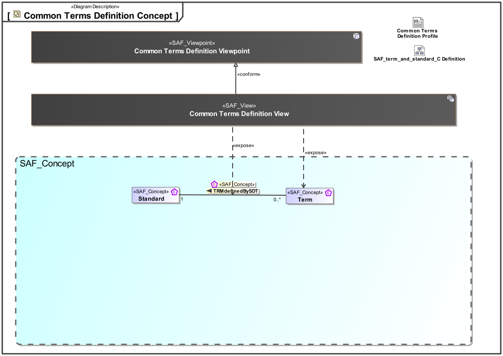
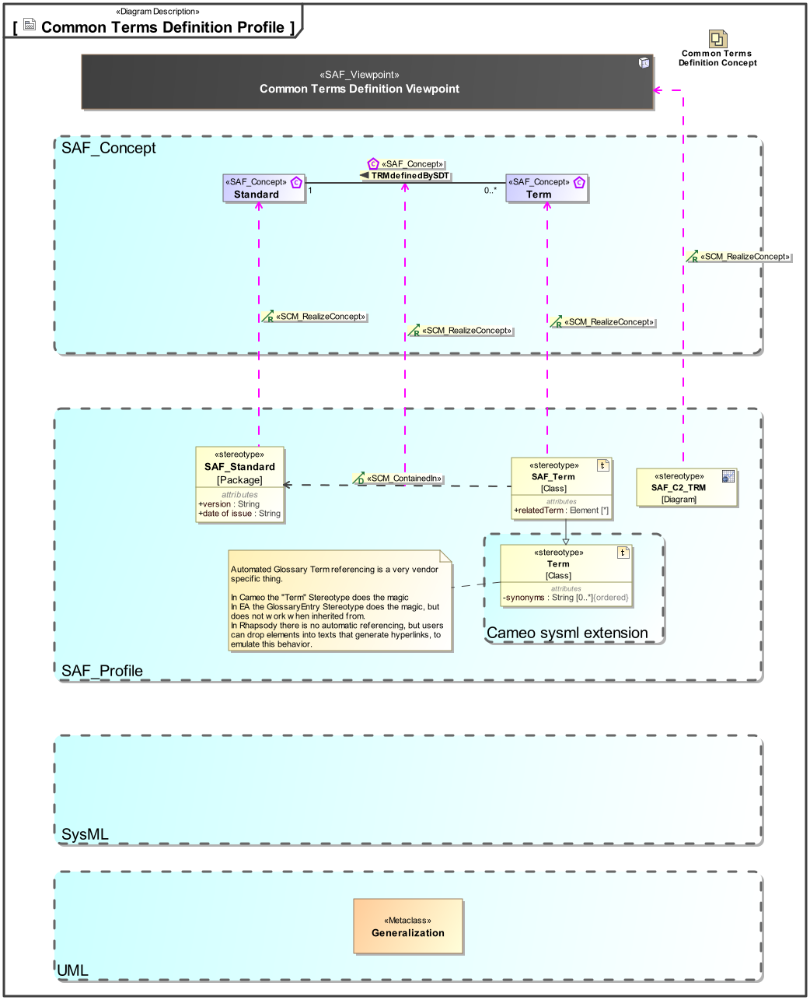

# SAF Development Documentation : **C2_TRMD** Common Terms Definition Viewpoint
|**Domain**|**Aspect**|**Maturity**|
| --- | --- | --- |
|[Common](../../domains.md#Domain-Common)|[Taxonomy & Structure](../../aspects.md#Aspect-Taxonomy-&-Structure)|[under construction](../../using-saf/maturity.md#under-construction)|
## Example

## Purpose
The Common Terms Definition Viewpoint supports the definition of applicable terms used in standards or defined during the systems engineering activities.
## Applicability
The Common Terms Definition Viewpoint supports the definition of glossaries and terms during the technical processes and according to the information management process  of the INCOSE SYSTEMS ENGINEERING HANDBOOK 2023 .
## Presentation
A table format listing terms included in glossaries, or standards if applicable.

A table format listing abbreviations included in glossaries, orstandards if applicable.

## Stakeholder
* [Hardware Developer](../../stakeholders.md#Hardware-Developer)
* [Mechanic Developer](../../stakeholders.md#Mechanic-Developer)
* [Software Developer](../../stakeholders.md#Software-Developer)
## Concern
* [What are the sources (e.g. a standard) of terms?](../../concerns.md#_2021x_2_8710274_1701365358930_669398_98281)
* [Which terms and abbreviations are applicable to the system of interest or its system elements and their interfaces and interactions?](../../concerns.md#_2021x_2_8710274_1701365325155_727486_98279)
## Profile Model Reference
The following Stereotypes / Model Elements are used in the Viewpoint:
|Stereotype | realized Concept|
|---|---|
|[SAF_C2_TRMD_Table](../../stereotypes.md#saf_c2_trmd_table)|[Common Terms Definition Viewpoint](../concept/concepts.md#Common-Terms-Definition-Viewpoint)|
|SAF_Glossary contained in SAF_Standard|[STDcontainsGY](../concept/concepts.md#STDcontainsGY)|
|[SAF_Glossary](../../stereotypes.md#saf_glossary)|[Glossary](../concept/concepts.md#Glossary)|
|[SAF_Standard](../../stereotypes.md#saf_standard)|[Standard](../concept/concepts.md#Standard)|
|SAF_Term contained in SAF_Glossary|[GYcontainsTRM](../concept/concepts.md#GYcontainsTRM)|
|SAF_Term contained in SAF_Standard|[TRMdefinedBySDT](../concept/concepts.md#TRMdefinedBySDT)|
|[SAF_Term](../../stereotypes.md#saf_term)|[Term](../concept/concepts.md#Term)|
## Input from other Viewpoints
### Required Viewpoints
*none*
### Recommended Viewpoints
* [Common Standards Definition Viewpoint](Common-Standards-Definition-Viewpoint.md)
# Viewpoint Concept and Profile Diagrams
## Concept

## Profile

