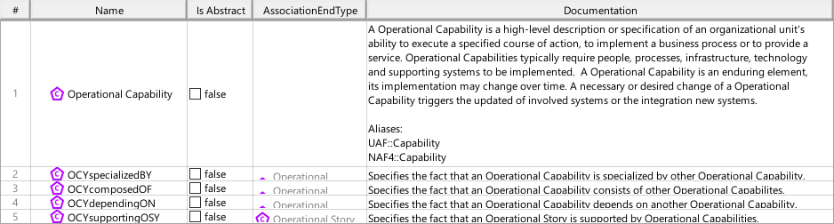
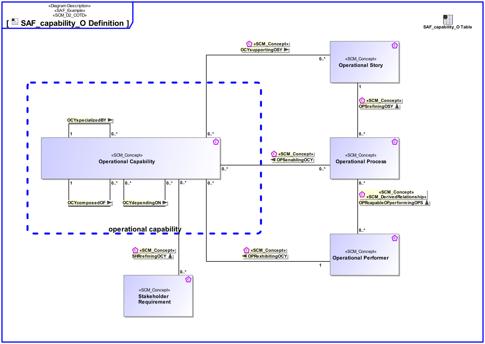
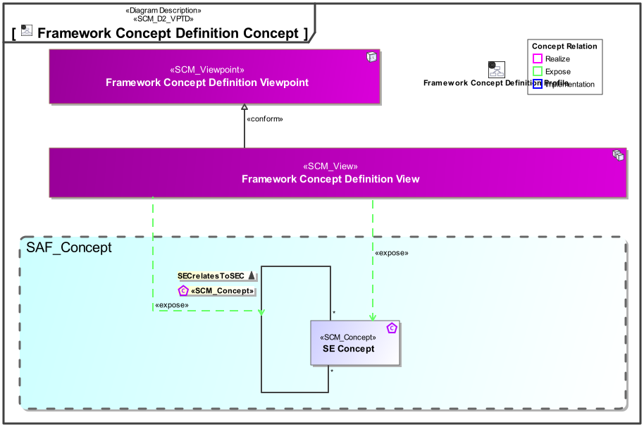
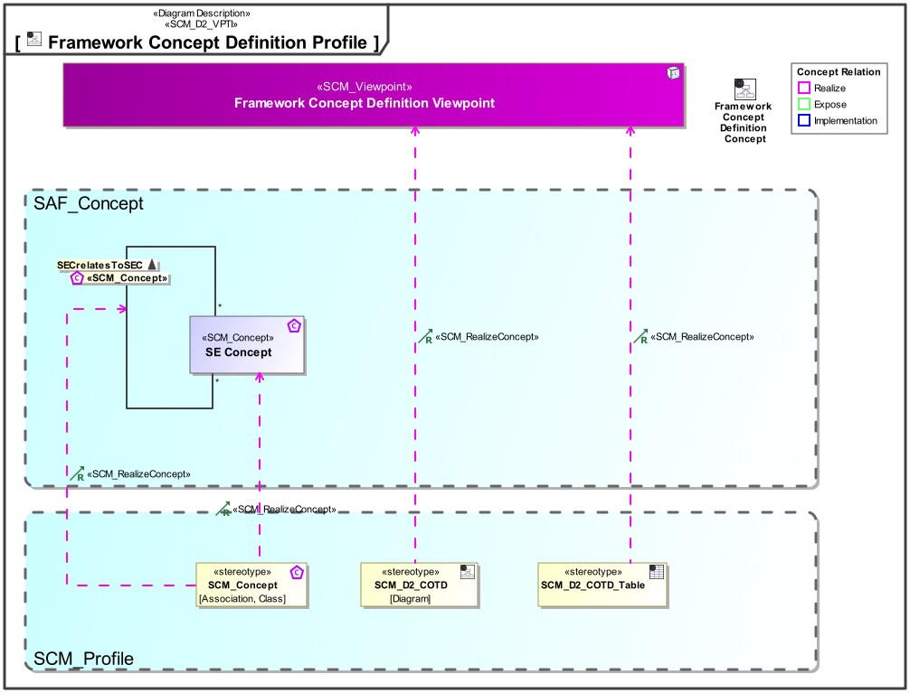

# SAF Development Documentation : **D2_COTD** Framework Concept Definition Viewpoint
|**Domain**|**Aspect**|**Maturity**|
| --- | --- | --- |
|[SAF Development](../../domains.md#Domain-SAF-Development)|[Taxonomy & Structure](../../aspects.md#Aspect-Taxonomy-&-Structure)|[under construction](../../using-saf/maturity.md#under-construction)|
## Example

## Purpose
The Framework Concept Viewpoint allows to define SE concepts and their relationships to be supported by the SAF. It shall specifiy
* the concepts with comprehensive documentation
* the relationships of concepts with comprehensive documentation and allowable multiplicities
* constraints among relations and concepts if applicable.

The viewpoint is intended to be used for development or extension of the SAF.
## Applicability
The Viewpoint supports the definition of  "Architecture description (AD) elements",   and the definition of "AD element correspondence"  and  "Specification of an architecture description framework" as defined in ISO42010:2022
## Presentation
A Block Definition Diagram (BDD)  featuring elements of SCM_Concept representing SE concepts to be supported by SAF. SCM_Concept can be classes of items and relations between items. It is also possible to create relations to relations (SCM_Concepts can be Classes, Associations and Association Classes).
For relational concepts, it is reqired to display the direction, and to define the multiplicities. See SAF Development Guide for details on concept modeling conventions

A table featuring SCM_Concepts and their descriptions. In case of relational concepts the related concepts are shown also.

## Stakeholder
* [SAF Developer](../../stakeholders.md#SAF-Developer)
* [SAF MBSE approch planer](../../stakeholders.md#SAF-MBSE-approch-planer)
## Concern
* [Which systems engineering concepts are covered by the framework?](../../concerns.md#_2024x_26f0132_1719129923965_578278_14750)
* [what are the constraints related to se concepts covered by the framework? ](../../concerns.md#_2024x_1_26f0132_1727272903091_424205_15904)
* [what are the relations between systems engineering concepts covered by the framework?](../../concerns.md#_2024x_1_26f0132_1727272724178_60816_15898)
## Profile Model Reference
The following Stereotypes / Model Elements are used in the Viewpoint:
|Stereotype | realized Concept|
|---|---|
|[SCM_Concept](../../stereotypes.md#scm_concept)|[SE Concept](../concept/concepts.md#SE-Concept)|
|[SCM_Concept](../../stereotypes.md#scm_concept)|[SECrelatesToSEC](../concept/concepts.md#SECrelatesToSEC)|
|[SCM_D2_COTD](../../stereotypes.md#scm_d2_cotd)|[Framework Concept Definition Viewpoint](../concept/concepts.md#Framework-Concept-Definition-Viewpoint)|
|[SCM_D2_COTD_Table](../../stereotypes.md#scm_d2_cotd_table)|[Framework Concept Definition Viewpoint](../concept/concepts.md#Framework-Concept-Definition-Viewpoint)|
## Input from other Viewpoints
### Required Viewpoints
*none*
### Recommended Viewpoints
* [Framework Stakeholder Definition Viewpoint](Framework-Stakeholder-Definition-Viewpoint.md)
* [Framework Concern Definition Viewpoint](Framework-Concern-Definition-Viewpoint.md)
# Viewpoint Concept and Profile Diagrams
## Concept

## Profile

