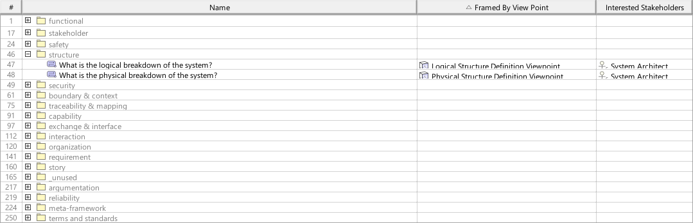
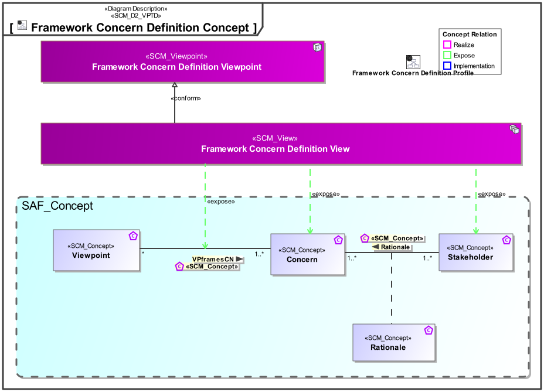
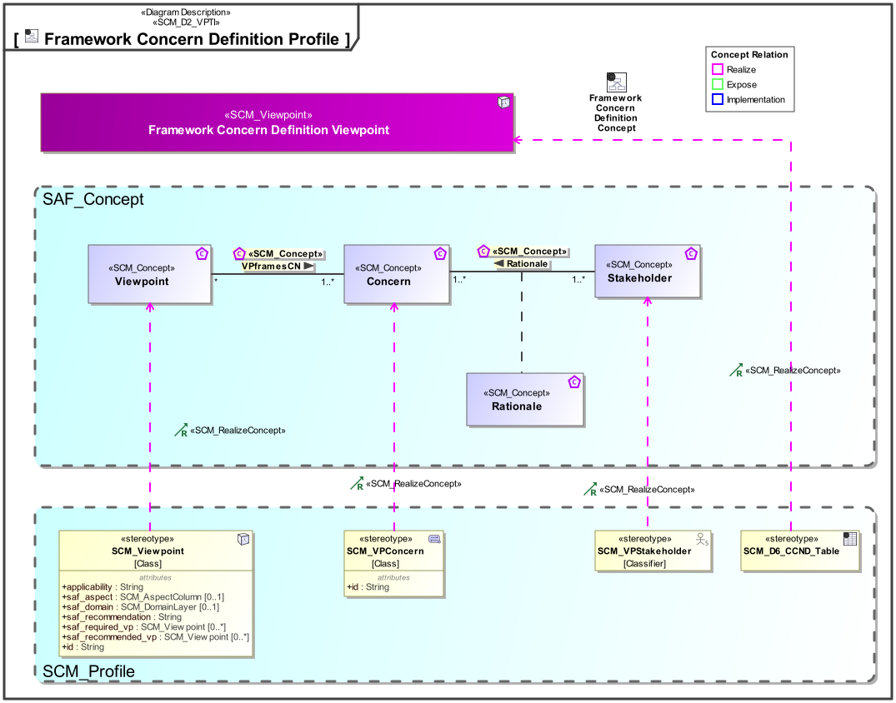

# SAF Development Documentation : **D6_CCND** Framework Concern Definition Viewpoint
|**Domain**|**Aspect**|**Maturity**|
| --- | --- | --- |
|[SAF Development](../../domains.md#Domain-SAF-Development)|[Requirement](../../aspects.md#Aspect-Requirement)|[under construction](../../using-saf/maturity.md#under-construction)|
## Example

## Purpose
The Framework Concern Definition Viewpoint allows to express the information need of Architecture Stakeholders by the definition of Concerns. The Concerns are related to stakeholders by a rationale and framed by Viewpoints.

The viewpoint is intended to be used for development or extension of the SAF.

## Applicability
The Viewpoint supports the definition of  "Stakeholders and concerns",  and  "Specification of an architecture description framework" as defined in ISO42010:2022
## Presentation
A table featuring the SCM_VPConcerns elements of the SAF, and their relations to SCM_Viewpoints and SCM_VPStakeholders

## Stakeholder
* [SAF Developer](../../stakeholders.md#SAF-Developer)
* [SAF MBSE approch planer](../../stakeholders.md#SAF-MBSE-approch-planer)
## Concern
* [What are the concerns adressed by the frameworks viewpoints?](../../concerns.md#_2024x_26f0132_1719129886772_493463_14747)
* [Which concerns are does an architecture framework stakeholder have?](../../concerns.md#_2024x_26f0132_1719129962342_738625_14755)
* [Which concerns are framed by a viewpoint of the framework?](../../concerns.md#_2024x_26f0132_1719130076292_184990_14761)
## Profile Model Reference
The following Stereotypes / Model Elements are used in the Viewpoint:
|Stereotype | realized Concept|
|---|---|
|[SCM_D6_CCND_Table](../../stereotypes.md#scm_d6_ccnd_table)|[Framework Concern Definition Viewpoint](../concept/concepts.md#Framework-Concern-Definition-Viewpoint)|
|[SCM_VPConcern](../../stereotypes.md#scm_vpconcern)|[Concern](../concept/concepts.md#Concern)|
|[SCM_VPStakeholder](../../stereotypes.md#scm_vpstakeholder)|[Stakeholder](../concept/concepts.md#Stakeholder)|
|[SCM_Viewpoint](../../stereotypes.md#scm_viewpoint)|[Viewpoint](../concept/concepts.md#Viewpoint)|
## Input from other Viewpoints
### Required Viewpoints
*none*
### Recommended Viewpoints
* [Framework Stakeholder Definition Viewpoint](Framework-Stakeholder-Definition-Viewpoint.md)
# Viewpoint Concept and Profile Diagrams
## Concept

## Profile

