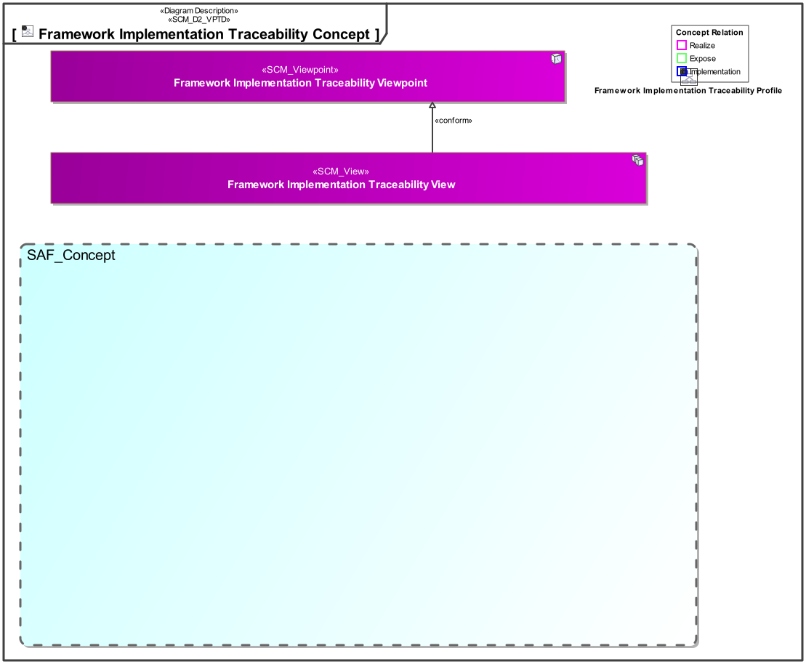
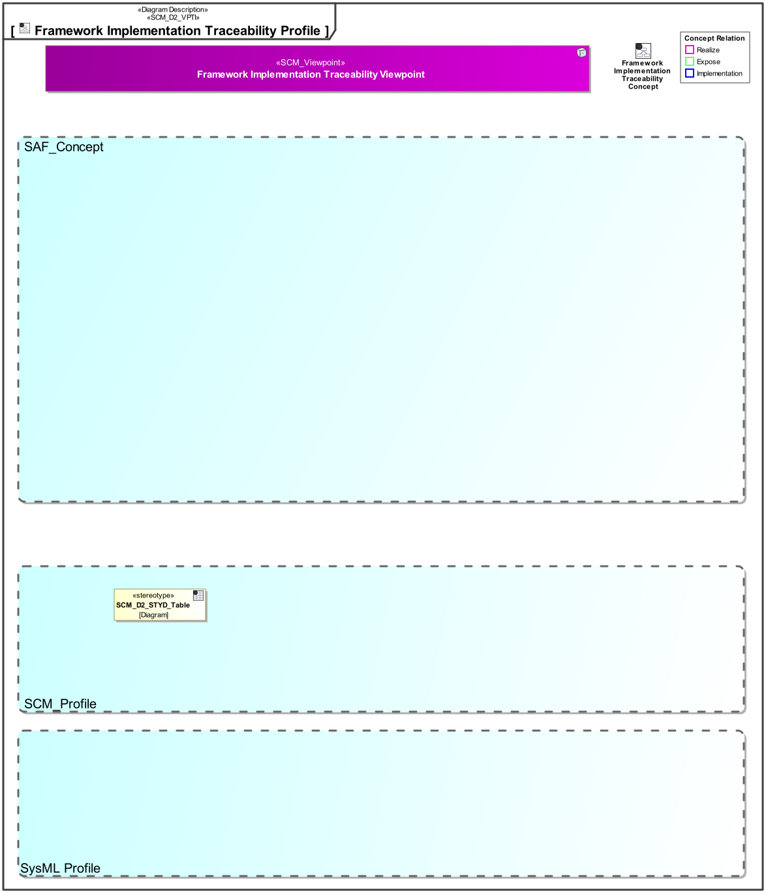

# SAF Development Documentation : **D8_STYD** Framework Implementation Traceability Viewpoint
|**Domain**|**Aspect**|**Maturity**|
| --- | --- | --- |
|[SAF Development](../../domains.md#Domain-SAF-Development)|[Traceability & Mapping](../../aspects.md#Aspect-Traceability-&-Mapping)|[proposed](../../using-saf/maturity.md#proposed)|
## Example
*none*
## Purpose
The Framework Implementation Traceability Viewpoint provides an overview about concepts and viewpoints are implemented using stereotypes or other model elements.

The viewpoint is intended to be used for development or extension of the SAF.
## Applicability
The Viewpoint supports the  "Specification of an architecture description framework" as defined in ISO42010:2022
## Presentation
A Matrix featuring the Concepts, Viewpoints and Stereotypes of the SAF profile.

## Stakeholder
* [SAF Developer](../../stakeholders.md#SAF-Developer)
* [SAF MBSE approch planer](../../stakeholders.md#SAF-MBSE-approch-planer)
* [SAF System model user](../../stakeholders.md#SAF-System-model-user)
## Concern
* [What are the frameworks model elements to be used in system models?](../../concerns.md#_2024x_26f0132_1719746308347_570628_39136)
* [What is the implementation of the frameworks concepts?](../../concerns.md#_2024x_26f0132_1719130336926_829742_14789)
## Profile Model Reference
The following Stereotypes / Model Elements are used in the Viewpoint:
|Stereotype | realized Concept|
|---|---|
## Input from other Viewpoints
### Required Viewpoints
*none*
### Recommended Viewpoints
*none*
# Viewpoint Concept and Profile Diagrams
## Concept

## Profile

