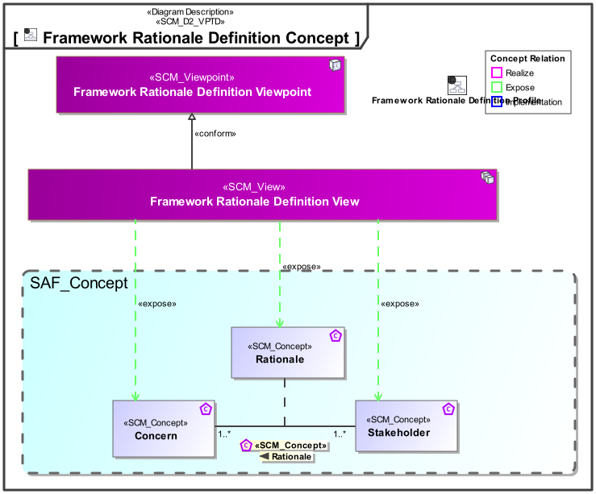
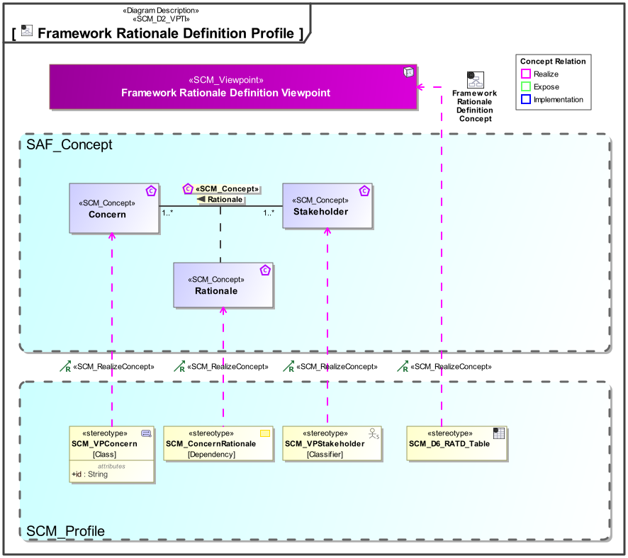

# SAF Development Documentation : **D6_RATD** Framework Rationale Definition Viewpoint
|**Domain**|**Aspect**|**Maturity**|
| --- | --- | --- |
|[SAF Development](../../domains.md#Domain-SAF-Development)|[Requirement](../../aspects.md#Aspect-Requirement)|[under construction](../../using-saf/maturity.md#under-construction)|
## Example

## Purpose
The Framework Rationale Viewpoint defines the relationship between Stakeholders and their Concerns in the context of Development of SAF. The Rationale formulates why a Stakeholder has a certain concern.

The viewpoint is intended to be used for development or extension of the SAF.
## Applicability
The Viewpoint supports the definition of  "Stakeholders and concerns", and  "Specification of an architecture description framework" as defined in ISO42010:2022
## Presentation
A matrix featuring SCM_VPStakeholder elements and SCM_VPConcern elements as rows and columns, and a marking in cells where a SCM_ConcernRationale connects a stakeholder with a concern.

A table featuring the SCM_ConcernRationales that connect SCM_VPStakeholders and SCM_VPConcerns, and the rationales documentation.

## Stakeholder
* [SAF Developer](../../stakeholders.md#SAF-Developer)
* [SAF MBSE approch planer](../../stakeholders.md#SAF-MBSE-approch-planer)
## Concern
* [Which concerns are does an architecture framework stakeholder have?](../../concerns.md#_2024x_26f0132_1719129962342_738625_14755)
* [Why does a stakeholder have this specific concern ? ](../../concerns.md#_2024x_26f0132_1719744888608_624464_37315)
## Profile Model Reference
The following Stereotypes / Model Elements are used in the Viewpoint:
|Stereotype | realized Concept|
|---|---|
|[SCM_ConcernRationale](../../stereotypes.md#scm_concernrationale)|[Rationale](../concept/concepts.md#Rationale)|
|[SCM_D6_RATD_Table](../../stereotypes.md#scm_d6_ratd_table)|[Framework Rationale Definition Viewpoint](../concept/concepts.md#Framework-Rationale-Definition-Viewpoint)|
|[SCM_VPConcern](../../stereotypes.md#scm_vpconcern)|[Concern](../concept/concepts.md#Concern)|
|[SCM_VPStakeholder](../../stereotypes.md#scm_vpstakeholder)|[Stakeholder](../concept/concepts.md#Stakeholder)|
## Input from other Viewpoints
### Required Viewpoints
*none*
### Recommended Viewpoints
*none*
# Viewpoint Concept and Profile Diagrams
## Concept

## Profile

