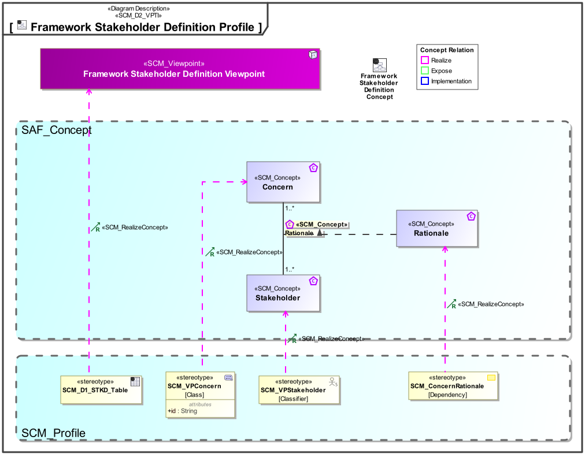

# SAF Development Documentation : **D1_STKD** Framework Stakeholder Definition Viewpoint
|**Domain**|**Aspect**|**Maturity**|
| --- | --- | --- |
|[SAF Development](../../domains.md#Domain-SAF-Development)|[Context & Exchange](../../aspects.md#Aspect-Context-&-Exchange)|[under construction](../../using-saf/maturity.md#under-construction)|
## Example

## Purpose
The Framework Stakeholder Viewpoint provides definitions for Architecture Framework Stakeholders having an interest in SAF Viewpoints. The Interest is formulated using Concerns.

The viewpoint is intended to be used for development or extension of the SAF.
## Applicability
The Viewpoint supports the definition of  "Stakeholders and concerns",  and  "Specification of an architecture description framework" as defined in ISO42010:2022
## Presentation
A Block Definition Diagram (BDD) featuring *SCM_VPStakeholder* elements, and inheritance relationships if applicable.

A table featuring *SCM_VPStakeholder* elements, their documentation, and the *SCM_VPConcern* elements representing the concerns of the stakeholders regarding to SAF Viewpoints.

## Stakeholder
* [SAF Developer](../../stakeholders.md#SAF-Developer)
* [SAF MBSE approch planer](../../stakeholders.md#SAF-MBSE-approch-planer)
## Concern
* [Which concerns are does an architecture framework stakeholder have?](../../concerns.md#_2024x_26f0132_1719129962342_738625_14755)
* [Who are the architecture framework stakeholders of the frameworks viewpoints?](../../concerns.md#_2024x_26f0132_1719129843876_724811_14744)
## Profile Model Reference
The following Stereotypes / Model Elements are used in the Viewpoint:
|Stereotype | realized Concept|
|---|---|
|[SCM_ConcernRationale](../../stereotypes.md#scm_concernrationale)|[Rationale](../concept/concepts.md#Rationale)|
|[SCM_D1_STKD_Table](../../stereotypes.md#scm_d1_stkd_table)|[Framework Stakeholder Definition Viewpoint](../concept/concepts.md#Framework-Stakeholder-Definition-Viewpoint)|
|[SCM_VPConcern](../../stereotypes.md#scm_vpconcern)|[Concern](../concept/concepts.md#Concern)|
|[SCM_VPStakeholder](../../stereotypes.md#scm_vpstakeholder)|[Stakeholder](../concept/concepts.md#Stakeholder)|
## Input from other Viewpoints
### Required Viewpoints
*none*
### Recommended Viewpoints
*none*
# Viewpoint Concept and Profile Diagrams
## Concept

## Profile

