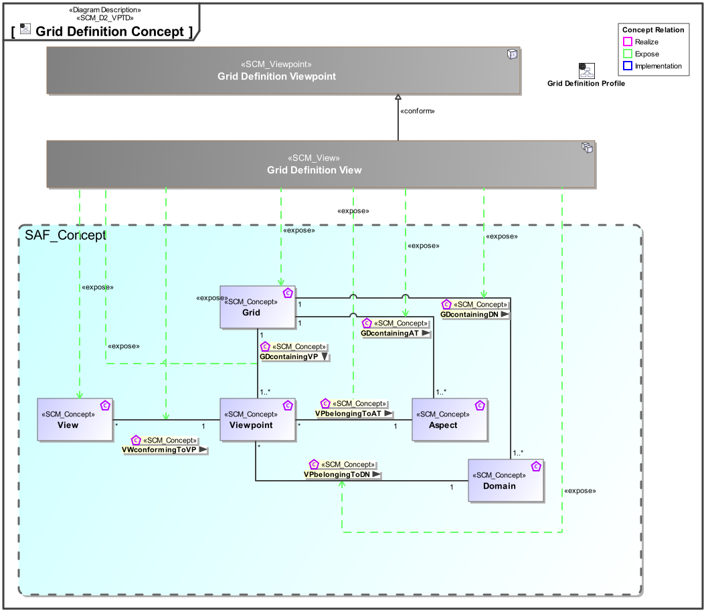
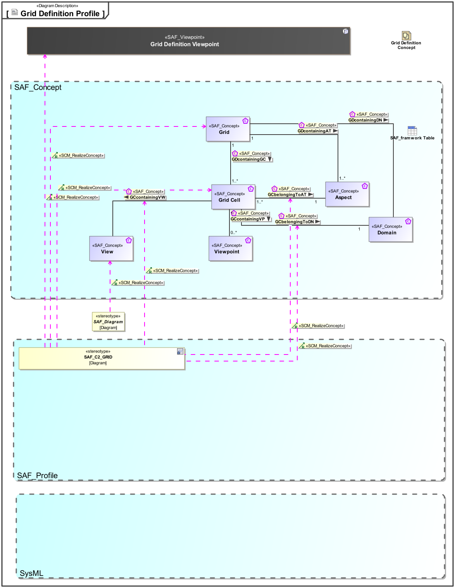

# SAF Development Documentation : Grid Definition Viewpoint
|**Domain**|**Aspect**|**Maturity**|
| --- | --- | --- |
|[Common](../../domains.md#Domain-Common)|[Taxonomy & Structure](../../aspects.md#Aspect-Taxonomy-&-Structure)|[proposed](../../using-saf/maturity.md#proposed)|
## Example

## Purpose
The Grid Definition Viewpoint serves as graphic representation of the Views present in a System Model.
## Applicability
The Viewpoint supports the "System Viewpoints, Views and Models" input/output of various Technical Processes in SEHB5.
## Presentation
A content diagram featuring a matrix view for the SAF Viewpoint conceptual model: Rows represent Domains, and columns represent Aspects, and the cells manage the Viewpoint Profiles.

## Stakeholder
## Concern
## Profile Model Reference
The following Stereotypes / Model Elements are used in the Viewpoint:
|Stereotype | realized Concept|
|---|---|
|[SAF_Diagram](../../stereotypes.md#SAF_Diagram)|[View](../concept/concepts.md#View)|
|[SAF_SCV02b_View](../../stereotypes.md#SAF_SCV02b_View)|[GCBelongsToDN](../concept/concepts.md#GCBelongsToDN)|
|[SAF_SCV02b_View](../../stereotypes.md#SAF_SCV02b_View)|[GCbelongsToAT](../concept/concepts.md#GCbelongsToAT)|
|[SAF_SCV02b_View](../../stereotypes.md#SAF_SCV02b_View)|[GCcontainsView](../concept/concepts.md#GCcontainsView)|
|[SAF_SCV02b_View](../../stereotypes.md#SAF_SCV02b_View)|[Grid](../concept/concepts.md#Grid)|
|[SAF_SCV02b_View](../../stereotypes.md#SAF_SCV02b_View)|[Grid Cell](../concept/concepts.md#Grid-Cell)|
|[SAF_SCV02b_View](../../stereotypes.md#SAF_SCV02b_View)|[Grid Definition Viewpoint](../concept/concepts.md#Grid-Definition-Viewpoint)|
## Input from other Viewpoints
### Required Viewpoints
*none*
### Recommended Viewpoints
*none*
# Viewpoint Concept and Profile Diagrams
## Concept

## Profile

