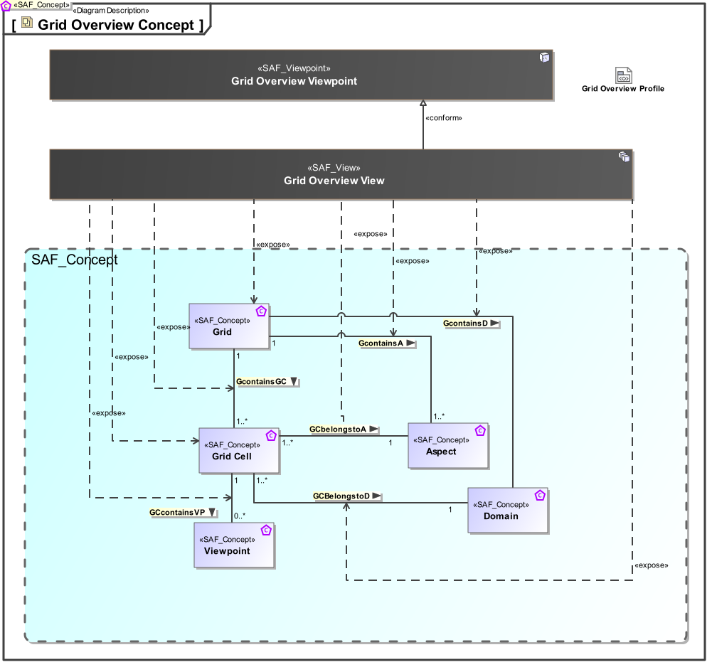

# SAF Development Documentation : Grid Overview Viewpoint
|**Domain**|**Aspect**|**Maturity**|
| --- | --- | --- |
|[Common](../../domains.md#Domain-Common)|[Taxonomy & Structure](../../aspects.md#Aspect-Taxonomy-&-Structure)|[proposed](../../using-saf/maturity.md#proposed)|
## Example

## Purpose
The grid overview viewpoint gives an overview over the used viewpoints in domain and aspect.
## Applicability
The..
## Presentation
A grid style graphical representation with rows as domains and aspects as columns. The models views (diagrams)  acording to SAF viewpoints are referenced in the cells.

## Stakeholder
## Concern
## Profile Model Reference
The following Stereotypes / Model Elements are used in the Viewpoint:
|Stereotype | realized Concept|
|---|---|
|[SAF_Diagram](../../stereotypes.md#SAF_Diagram)|[View](../concept/concepts.md#View)|
|[SAF_SCV02b_View](../../stereotypes.md#SAF_SCV02b_View)|[GCBelongstoD](../concept/concepts.md#GCBelongstoD)|
|[SAF_SCV02b_View](../../stereotypes.md#SAF_SCV02b_View)|[GCbelongstoA](../concept/concepts.md#GCbelongstoA)|
|[SAF_SCV02b_View](../../stereotypes.md#SAF_SCV02b_View)|[GCcontainsView](../concept/concepts.md#GCcontainsView)|
|[SAF_SCV02b_View](../../stereotypes.md#SAF_SCV02b_View)|[Grid](../concept/concepts.md#Grid)|
|[SAF_SCV02b_View](../../stereotypes.md#SAF_SCV02b_View)|[Grid Cell](../concept/concepts.md#Grid-Cell)|
|[SAF_SCV02b_View](../../stereotypes.md#SAF_SCV02b_View)|[Grid Overview Viewpoint](../concept/concepts.md#Grid-Overview-Viewpoint)|
## Input from other Viewpoints
### Required Viewpoints
*none*
### Recommended Viewpoints
*none*
# Viewpoint Concept and Profile Diagrams
## Concept

## Profile

