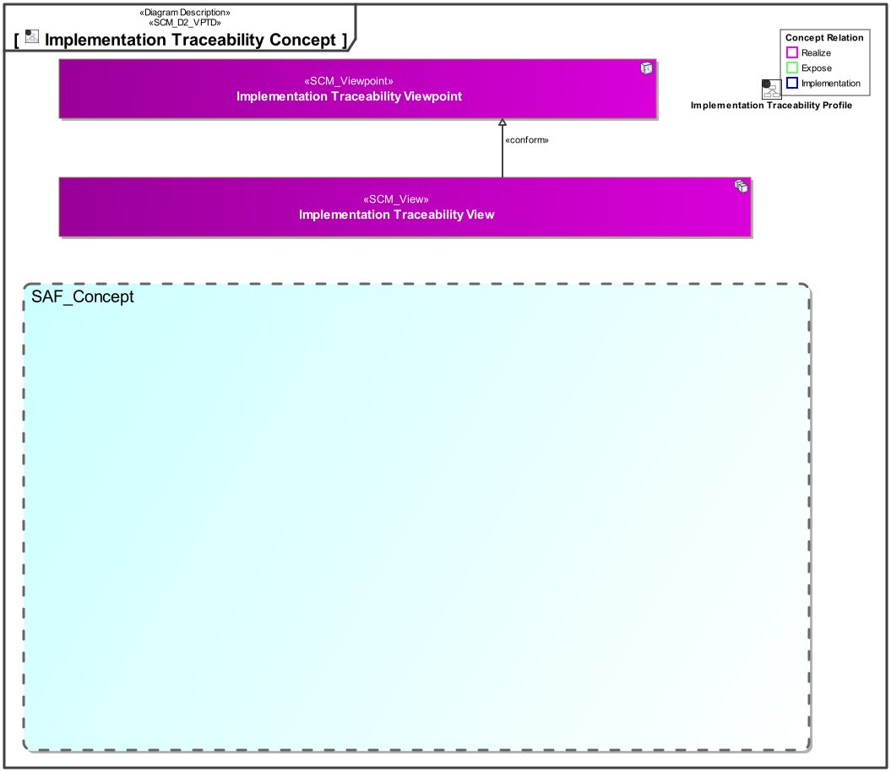
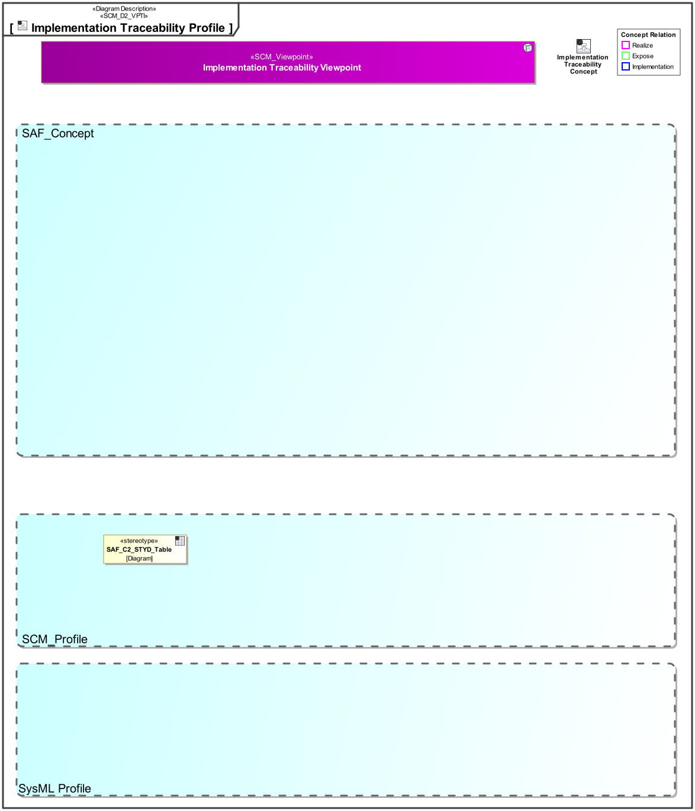

# SAF Development Documentation : **D8_STYD** Implementation Traceability Viewpoint
|**Domain**|**Aspect**|**Maturity**|
| --- | --- | --- |
|[SAF Development](../../domains.md#Domain-SAF-Development)|[Traceability & Mapping](../../aspects.md#Aspect-Traceability-&-Mapping)|[proposed](../../using-saf/maturity.md#proposed)|
## Example
*none*
## Purpose
The Implementation Traceability Viewpoint provides an overview about concepts and viewpoints are implementetd using stereotypes or other model elements..
## Applicability
The ... Viewpoint supports the ...  in INCOSE SYSTEMS ENGINEERING HANDBOOK 2023.
## Presentation
A Matrix featuring the Concepts, Viewpoints and Stereotypes of the SAF profile.

## Stakeholder
* [SAF Developer](../../stakeholders.md#SAF-Developer)
* [SAF MBSE approch planer](../../stakeholders.md#SAF-MBSE-approch-planer)
* [SAF System model user](../../stakeholders.md#SAF-System-model-user)
## Concern
* [What are the frameworks model elements to be used](../../concerns.md#_2024x_26f0132_1719746308347_570628_39136)
## Profile Model Reference
The following Stereotypes / Model Elements are used in the Viewpoint:
|Stereotype | realized Concept|
|---|---|
## Input from other Viewpoints
### Required Viewpoints
*none*
### Recommended Viewpoints
*none*
# Viewpoint Concept and Profile Diagrams
## Concept

## Profile

